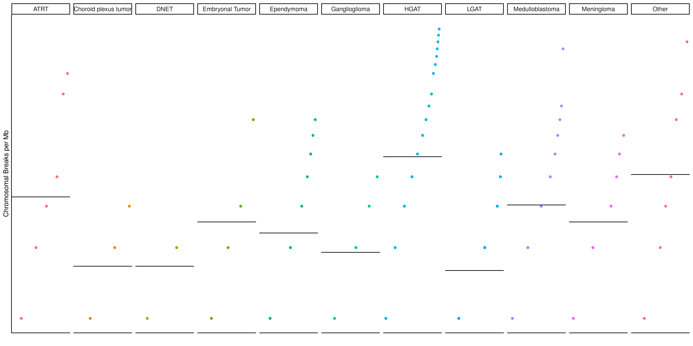

This analysis evaluates chromosomal instability by using breakpoint SV and CNV 
data that was formatted by `00-setup-breakpoint_data.R` and mapping chromosomal 
break density.
This notebook returns chromosomal break heatmaps and plots for each tumor type 
group in the `plots` directory.

### Usage

This notebook can be run via the command line from the top directory of the 
repository as follows:

```
Rscript -e "rmarkdown::render('analyses/chromosomal-instability/01-plot-chromosomal-instability.Rmd', 
                              clean = TRUE)"
```

### Set Up

```{r}
# Set seed so heatmaps turn out the same
set.seed(2020)

# Magrittr pipe
`%>%` <- dplyr::`%>%`
```

Read in the custom functions needed for this analysis. 

```{r}
source(file.path("util", "chr-break-calculate.R"))
source(file.path("util", "chr-break-plot.R"))
```

### Directories and Files

```{r}
# Path to data directory
data_dir <- file.path("..", "..", "data")
scratch_dir <- file.path("..", "..", "scratch")

# Path to output directory
plots_dir <- "plots"

# Path to tumor type plots output directory
hist_plots_dir <- file.path(plots_dir, "tumor-type")

# Create the hist_plots_dir  if it does not exist
if (!dir.exists(hist_plots_dir)) {
  dir.create(hist_plots_dir, recursive = TRUE)
}
```

### Read in data 

Set up metadata

```{r}
# Read in the metadata
metadata <- readr::read_tsv(file.path(data_dir, "pbta-histologies.tsv"))
```

Read in the intersection breaks densities TSV that was made by the 00-setup-breakpoint-data.R script. 

```{r}
breaks_densities_df <- readr::read_tsv(
  file.path("breakpoint-data", "intersection_of_breaks_densities.tsv")
) %>%
  # Add on the short histology column from the metadata for plotting purposes
  dplyr::inner_join(metadata %>% dplyr::select(Kids_First_Biospecimen_ID, short_histology),
    by = c("samples" = "Kids_First_Biospecimen_ID")
  )
```

Load in the previously formatted breakpoint data. 

```{r}
breaks_list <- readr::read_rds(file.path("breakpoint-data", "breaks_lists.RDS"))
```

Get a vector of the biospecimen IDs. 

```{r}
common_samples <- unique(breaks_list$intersection_of_breaks$samples)
```

Set up uncallable regions BED. 

```{r}
uncallable_bed <- readr::read_tsv(
  file.path(
    "..",
    "copy_number_consensus_call",
    "ref",
    "cnv_excluded_regions.bed"
  ),
  col_names = c("chrom", "start", "end")
) %>%
  # Reformat the chromosome variable to drop the "chr"
  dplyr::mutate(chrom = factor(gsub("chr", "", chrom),
    levels = c(1:22, "X", "Y")
  )) %>%
  dplyr::filter(
    !is.na(chrom),
    # Exclude the small regions
    end - start > 200000,
    # Drop sex chromosomes
    !(chrom %in% c("X", "Y", "M"))
  )
```

Set up chromosome size data. 
It just so happens that this BED file: `WGS.hg38.strelka2.unpadded.bed` is actually 
just a list of the chromosome sizes so we are using that for now. 

```{r}
# Set up Chr sizes
chr_sizes_bed <- readr::read_tsv(file.path(data_dir, "WGS.hg38.strelka2.unpadded.bed"),
  col_names = c("chrom", "start", "end")
) %>%
  # Reformat the chromosome variable to drop the "chr"
  dplyr::mutate(chrom = factor(gsub("chr", "", chrom),
    levels = c(1:22, "X", "Y", "M")
  )) %>%
  # Remove sex chromosomes
  dplyr::filter(!(chrom %in% c("X", "Y", "M")))

# Make chromosome size named vector for Heatmap annotation
chr_sizes_vector <- chr_sizes_bed$end
names(chr_sizes_vector) <- chr_sizes_bed$chrom
```

### Plot the break densities by their histology

```{r}
breaks_cdf <- breaks_densities_df %>%
  # Only plot histologies groups with more than 5 samples
  dplyr::group_by(short_histology, add = TRUE) %>%
  dplyr::filter(dplyr::n() > 5) %>%
  # Calculate histology group mean
  dplyr::mutate(
    hist_mean = mean(breaks_density),
    hist_rank = rank(breaks_density) / dplyr::n()
  ) %>%
  dplyr::ungroup() %>%
  # Now we will plot these as cummulative distribution plots
  ggplot2::ggplot(ggplot2::aes(
    x = hist_rank, y = breaks_density,
    color = short_histology
  )) +
  ggplot2::geom_point() +
  # Add summary line for mean
  ggplot2::geom_hline(ggplot2::aes(yintercept = hist_mean)) +
  # Separate by histology
  ggplot2::facet_wrap(~short_histology, nrow = 2) +
  ggplot2::theme_classic() +
  ggplot2::xlab("Rank") +
  ggplot2::ylab("Chromosomal Breaks per Mb") +
  # Transform to log10 make non-log y-axis labels
  ggplot2::scale_y_continuous(trans = "log10", breaks = c(0, 1, 10, 30)) +
  ggplot2::theme(legend.position = "none") +
  # Get rid of x-axis ticks
  ggplot2::theme(
    axis.text.x = ggplot2::element_blank(),
    axis.ticks.x = ggplot2::element_blank(),
    strip.text = ggplot2::element_text(size = 4)
  )

# Save the plot to a png
ggplot2::ggsave(file.path(plots_dir, "breaks_cdf_plot.png"),
  plot = breaks_cdf, width = 17, height = 20, unit = "cm"
)
```

Print from png so rendering is smoother.


### Co-localization of breakpoints for samples 

For each sample, we will bin the genome and count how many chromosome breaks 
occur for each bin, given the given `bin_size`.

We will run this for each sample and return a list of three `GenomicRanges` objects:  
1) `intersection_of_breaks` contains the intersection break counts for both SV and CNV break data.  
2) `cnv_breaks` contains the number of break counts for CNV.   
3) `sv_breaks` contains the number of break counts for SV.  

```{r, warning = FALSE, results='hide'}
# Change here and it will change the rest
bin_size <- 1e6

# For simplicity's sake, change the name of the intersection column we want to use
breaks_list$intersection_of_breaks <- breaks_list$intersection_of_breaks %>%
  dplyr::rename(
    chrom = sv_ranges.seqnames,
    coord = sv_ranges.start
  )

# Get a big list of break densities for each sample.
sample_densities <- lapply(common_samples, function(sample_id) {
  lapply(breaks_list, function(breaks_df) {
    break_density(breaks_df,
      sample_id = sample_id,
      start_col = "coord",
      end_col = "coord",
      window_size = bin_size,
      chr_sizes_vector = chr_sizes_vector,
      unsurveyed_bed = uncallable_bed,
      perc_cutoff = .75 # What percentage of each bin needs to be callable
      # for it not to be NA
    )
  })
})

# Bring along the sample IDs
names(sample_densities) <- common_samples
```

Save to an RDS file

```{r}
# Save to an RDS file
readr::write_rds(
  sample_densities,
  file.path(scratch_dir, "sample_breakpoint_densities.RDS")
)
```

### Set up for making heatmaps of the breakpoints

Given the `GenomicRanges` objects for each sample, create a combined plot for 
each. 

Make histology labeling `HeatmapAnnotation` object.

```{r}
# Get the histologies for the samples in this set and order them by histology
histologies <-
  data.frame(Kids_First_Biospecimen_ID = common_samples) %>%
  dplyr::inner_join(dplyr::select(metadata, Kids_First_Biospecimen_ID, short_histology)) %>%
  dplyr::mutate(short_histology = as.factor(short_histology)) %>%
  dplyr::filter(!is.na(short_histology)) %>% 
  dplyr::arrange(short_histology) %>%
  tibble::column_to_rownames("Kids_First_Biospecimen_ID") 

# Get values that can be used to make colors equi distant hues away for the 
# number of histology groups we have
col_val <- seq(from = 0, to = 1, 
               length.out = length(unique(histologies$short_histology)))

# Translate into colors
col_key <- hsv(h = col_val, s = col_val, v = 1)

# Make this named based on histology
names(col_key) <- unique(histologies$short_histology)

# Make the same order as the data.frame
col_key <-  as.character(dplyr::recode(histologies$short_histology, !!!col_key))

# Make the names 
names(col_key) <- as.character(rownames(histologies))
```

Make a color function. 

```{r}
col_fun <- circlize::colorRamp2(
  c(0, .25, .5, 1, 3),
  c("#edf8fb", "#b2e2e2", "#66c2a4", "#2ca25f", "#006d2c")
)
```

Make a function for making the heatmaps. 

```{r}
breaks_heatmap <- function(data_name) {
  # A wrapper function for making a heatmap from the samples GenomicRanges list.
  #
  # Args:
  # data_name: a character string that matches a name in the list.

  # Returns:
  # A heatmap of the chromosomal breaks

  # Pull out the total_counts
  total_counts <- lapply(sample_densities, function(granges_list) {
    granges <- granges_list[[data_name]] # We need to tack on this uncallable regions data

    # Return only the total_counts
    sample_counts <- granges@elementMetadata@listData$total_counts

    # Name with chromosome labels
    names(sample_counts) <- S4Vectors::decode(granges@seqnames)

    return(sample_counts)
  })
  # Make into a data.frame
  total_counts_df <- dplyr::bind_rows(total_counts) %>%
    dplyr::select(rownames(histologies)) %>%
    t()

  # Extract chromosome labels
  chr_labels <- names(total_counts[[1]])

  # Add chromosome labels as column names
  colnames(total_counts_df) <- chr_labels

  # Make chromosome labeling `HeatmapAnnotation` object.
  chr_labels <- paste0("chr", as.factor(names(total_counts[[1]])))

  # Make a key for assigning alternating colors to the chromosomes
  chr_colors <- rep(c("grey", "lightblue"), length.out = length(unique(chr_labels)))
  names(chr_colors) <- unique(chr_labels)

  # Create the Heatmap annotation object
  chr_annot <- ComplexHeatmap::HeatmapAnnotation(
    df = data.frame(chr_labels), 
    col = list(chr_labels = c(chr_colors)),
    name = "",
    show_legend = FALSE,
    show_annotation_name = FALSE
  )
  # Create the Heatmap annotation object
  hist_annot <- ComplexHeatmap::HeatmapAnnotation(
    df = data.frame(histologies),
    col = list(histologies = col_key), 
    which = "row",
    show_annotation_name = FALSE
  )
  # Plot on a heatmap
  heatmap <- ComplexHeatmap::Heatmap(total_counts_df,
    col = col_fun,
    heatmap_legend_param = list(title = "Count of chr breaks"),
    cluster_columns = FALSE,
    cluster_rows = FALSE,
    show_column_names = FALSE,
    show_row_names = FALSE,
    bottom_annotation = chr_annot,
    left_annotation = hist_annot,
    na_col = "#f1f1f1"
  )
  # Return plot
  return(heatmap)
}
```

## Intersection of breaks heatmap

```{r}
intersection_of_heatmap <- breaks_heatmap(data_name = "intersection_of_breaks")

# Save plot as PNG
png(file.path(plots_dir, paste0("intersection_of_breaks_heatmap.png")),
  width = 1200, height = 900, units = "px"
)
intersection_of_heatmap
dev.off()

# Print out here
intersection_of_heatmap
```

## CNV breaks heatmap

```{r}
cnv_heatmap <- breaks_heatmap(data_name = "cnv_breaks")

# Save plot as PNG
png(file.path(plots_dir, paste0("cnv_breaks_heatmap.png")),
  width = 1200, height = 900, units = "px"
)
cnv_heatmap
dev.off()

# Print out here
cnv_heatmap
```

## SV breaks heatmap

```{r}
sv_heatmap <- breaks_heatmap(data_name = "sv_breaks")

# Save plot as PNG
png(file.path(plots_dir, paste0("sv_breaks_heatmap.png")),
  width = 1200, height = 900, units = "px"
)
sv_heatmap
dev.off()

# Print out here
sv_heatmap
```

### Co-localization of breakpoints for tumor-type groups

Same as was done for each sample, now we will calculate densities for 
each tumor-type group. 

```{r}
# Change bin_size here and it will change the rest
bin_size <- 1e6

# Get a list of the tumor_types for which we have DNA-seq data
tumor_types <- metadata %>%
  dplyr::filter(!is.na(short_histology), experimental_strategy != "RNA-Seq") %>%
  dplyr::distinct(short_histology) %>%
  dplyr::pull(short_histology)
```

Run the density calculations for the groups. 

```{r}
# Get a big list of break densities for each sample.
group_densities <- lapply(tumor_types, function(tumor_type) {

  # Obtain a list of sample_ids to subset by
  sample_ids <- metadata %>%
    dplyr::filter(metadata$short_histology == tumor_type) %>%
    dplyr::pull(Kids_First_Biospecimen_ID)

  # Double check these samples are in the list
  check_samples <- (sample_ids %in% common_samples)

  # If no samples, go to next
  if (sum(check_samples) > 1) {
    message(paste("Calculating breakpoint density for", tumor_type, "samples"))
    lapply(breaks_list, function(breaks_df) {
      break_density(breaks_df,
        sample_id = sample_ids,
        start_col = "coord",
        end_col = "coord",
        window_size = bin_size,
        chr_sizes_vector = chr_sizes_vector,
        unsurveyed_bed = uncallable_bed,
        perc_cutoff = .75
      )
    })
  }
})

# Bring along the tumor-type labels
names(group_densities) <- tumor_types

# Remove tumor_types data that didn't have at least two samples
group_densities <- group_densities[!sapply(group_densities, is.null)]
```

Save to an RDS file

```{r}
# Save to an RDS file
readr::write_rds(
  group_densities,
  file.path(scratch_dir, "histology_breakpoint_densities.RDS")
)
```

### Plot the breakpoints for each tumor-type

Here we will plot median number of break points for the tumor-type group per 
each bin.

```{r}
purrr::imap(group_densities, function(.x, name = .y) {
  # Make the combo plot
  multipanel_break_plot(
    granges_list = .x,
    plot_name = name,
    y_val = "total_counts",
    y_lab = "Total Breaks per Mb",
    plot_dir = hist_plots_dir
  )
})
```

Zip up the PNG files into one file. 

```{r}
# Declare name of zip file
zip_file <- paste0(hist_plots_dir, ".zip")

# Remove any current zip_file of this name so we can overwrite it
if (file.exists(zip_file)) {
  file.remove(zip_file)
}
# Zip up the plots
zip(zip_file, hist_plots_dir)
```

### Session Info

```{r}
sessionInfo()
```

