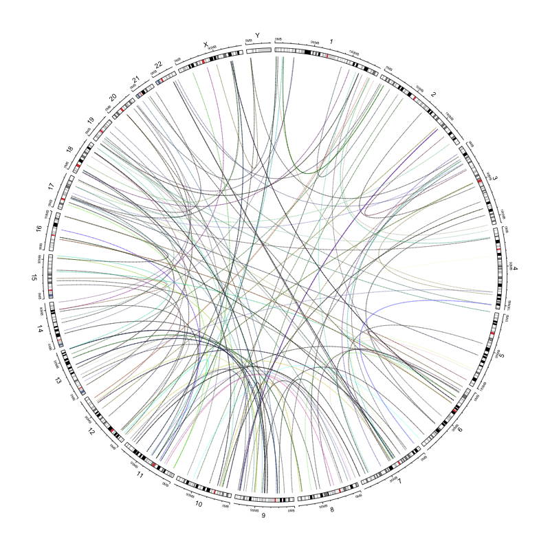

This notebook shows examples of how to use the circos_map_plot function for 
mapping data that corresponds to chromosomal coordinates.

Corresponds to [issue 397](https://github.com/AlexsLemonade/OpenPBTA-analysis/issues/397).

### Usage

This notebook can be run via the command line from the top directory of the 
repository as follows:

```
Rscript -e "rmarkdown::render('analyses/chromosomal-instability/01b-visualization-cnv-sv.Rmd', 
                              clean = TRUE)"
```

## Circular plots functions: 
To use the functions, source the functions file: `source(file.path("util", "circos-plots.R"))`
This file includes three functions, but one is internal. 

**The two functions to use:**

`circos_map_plot`: Given a data.frame with chromosomal coordinates, and a corresponding data value to plot, make a circos plot or add a circular track to an existing plot.  
`circos_map_transloc`: Given a data.frame with two sets of coordinates, map the links between those coordinates on a new or exisitng circular plot.  

## Function Arguments Descriptions

- `df`: a data.frame with the chromosomal coordinates and y value to plot.  
- `add_track`: If true, adds a track to a current plot, if `FALSE`, starts a new plot.  
- `samples_col`: a character string specifying the samples column which can be used to filter by.  
- `sample_names`: a character string that specifies values to keep from `samples_col` column. `"all"` keeps all samples in.   
- `chr_col`: a character string that specifies the chromosomes column name.  
- `start_col`: a character string that specifies the start coordinate column name.  
- `end_col`: a character string that specifies the end coordinate column name.  
- `y_val`: The column name of the value you would like to plot. 
- `color_col`: a column with color specifications for each data point. 
- `track_height`: a number between 0 and 1 that designates height, default is `.15`. 1 = the full diameter of the circular plot.  
- `type`: Type of plot the track should be. Options are `line`, `point`, `rect`.  
- `rect_height`: The added height (plus and minus y_val) that should be plotted. 
- `cytoband`: `TRUE/FALSE` indicating whether you want a cytoband on the 
outermost of the plot. Default is TRUE.  
- `single_color`: A single color to choose. An alternative to `color_col`.

### Set Up

```{r}
# Set seed so plots turn out the same
set.seed(2020)

# Magrittr pipe
`%>%` <- dplyr::`%>%`
```

Read in the custom functions.

```{r}
source(file.path("util", "circos-plots.R"))
```

### Directories and Files

```{r}
# Path to data directory
data_dir <- file.path("..", "..", "data")

# Path to output directory
plots_dir <- "plots"
```

### Read in data 

Set up metadata

```{r}
# Read in the metadata
metadata <- readr::read_tsv(file.path(data_dir, "pbta-histologies.tsv"))
```

Read in the CNV data. 

```{r}
# TODO: update file path when consensus is added to data release
cnv_df <- data.table::fread(
  file.path("..", 
            "copy_number_consensus_call", 
            "results",
            "pbta-cnv-consensus.seg.gz"),
  data.table = FALSE
) 
```

Create a status variable based on copy number and tumor ploidy. 
This is logic was borrowed from [`focal-cn-file-preparation` module](https://github.com/AlexsLemonade/OpenPBTA-analysis/blob/86bd634a928db3f460328210e38c7dc1797d1304/analyses/focal-cn-file-preparation/02-add-ploidy-consensus.Rmd#L74).

```{r}
cnv_df <- cnv_df %>% 
  # Only keep data that has values for copy.num
  dplyr::filter(!is.na(copy.num)) %>%
  # Tack on the ploidy and sex estimate information from metadata
  dplyr::inner_join(
    dplyr::select(metadata, 
                  Kids_First_Biospecimen_ID, 
                  tumor_ploidy,
                  germline_sex_estimate), 
             by = c("ID" = "Kids_First_Biospecimen_ID")) %>%
  # Create a status variable
  dplyr::mutate(status = dplyr::case_when(
    # when the copy number is less than inferred ploidy, mark this as a loss
    copy.num < tumor_ploidy ~ "loss",
    # if copy number is higher than ploidy, mark as a gain
    copy.num > tumor_ploidy ~ "gain",
    copy.num == tumor_ploidy ~ "neutral"
  ), 
  status = factor(status, levels = c("loss", "neutral", "gain")))
```

Read in the SV data. 

```{r}
sv_df <- data.table::fread(
  file.path(data_dir, "pbta-sv-manta.tsv.gz"),
  data.table = FALSE
)
```

Make a translocation data.frame where both sets of coordinates for the translocation are in the same row.

```{r}
transloc_df <- sv_df %>%
  dplyr::filter(SV.type == "BND") %>%
  dplyr::mutate(
    match_id = stringr::str_sub(ID, 0, -3),
    pair_num = stringr::str_sub(ID, -1)
  ) %>%
  dplyr::select(
    biospecimen_id = Kids.First.Biospecimen.ID.Tumor,
    chrom = SV.chrom,
    start = SV.start,
    end = SV.end,
    width = SV.length,
    match_id,
    pair_num
  )

transloc_df <- transloc_df %>%
  dplyr::filter(pair_num == 0) %>%
  dplyr::inner_join(dplyr::filter(transloc_df, pair_num == 1),
    by = "match_id",
    suffix = c("1", "2")
  )
```

Let's get some sample IDs to play with in these examples. 

```{r}
samples_for_examples <- sample(cnv_df$ID, 5)
```

## Making color keys examples
The `circos_map_plot` functions take columns that specify the colors for each data row. 
Here are some examples of how to set up color columns that can be passed to the circos
functions as the `color_col` argument. 

**Numerically based color key:** 

```{r}
# Make color palette based on 5 colors
palette_col <- RColorBrewer::brewer.pal(5, 
                                        name = "Accent" # Can change this palette 
                                        # Use RColorBrewer::display.brewer.all() to see options
                                        )

# Make color ramp function based on quantiles of seg.mean and palette
color_fun <- circlize::colorRamp2(
  breaks = quantile(cnv_df$seg.mean, 
                    c(0.15, 0.35, 0.5, 0.65, 0.85), na.rm = TRUE), 
  colors = palette_col)
```

Add numerically based color column to `cnv_df`.

```{r}
cnv_df <- cnv_df %>%
  # Make column that specifies the color for each value
  dplyr::mutate(num_color_key = color_fun(copy.num))
```

Can run this to see other palettes besides `Accent`.

```{r}
RColorBrewer::display.brewer.all()
```

**Factor-based color keys:** 
Here we will add a column to `cnv_df` that color codes based on the `status` 
column which has three categories. 

```{r}
# Let's determine how many levels this factor column has
n_levels <- length(levels(cnv_df$status))

# Set up a palette based on number of factor levels
palette_col <- RColorBrewer::brewer.pal(n_levels, name = "Accent")

# Let's make a key to recode by based on levels
palette_key <- palette_col

# Have the factor levels be the names
names(palette_key) <- levels(cnv_df$status)

# Preview this
palette_key
```

Add factor based color column to cnv_df

```{r}
cnv_df <- cnv_df %>%
  # Make column that specifies the color for each factor level
  dplyr::mutate(fac_color_key = dplyr::recode(status, !!!palette_key))
```

## Example uses of `circos_map_plot`

**Example 1** making a circular scatter plot for a single sample.

```{r}
circos_map_plot(
  df = cnv_df,
  add_track = FALSE, # If set to TRUE we would add to an exisiting plot.
  samples_col = "ID", # Designate what columns of `cnv_df` hold the sample IDs.
  sample_names = samples_for_examples[1], # What sample we are plotting.
  chr_col = "chrom", # Designate what columns of `cnv_df` hold the coordinates.
  start_col = "loc.start",
  end_col = "loc.end",
  y_val = "copy.num", # This is the data we want to map
  track_height = .15, # This is the default
  type = "point", # type is set to point
  color_col = "fac_color_key"
  )
```

**Example 2** making a plot with rectangles for a multiple samples and color code by numeric value and without the cytoband.

```{r}
circos_map_plot(
  df = cnv_df,
  add_track = FALSE,
  samples_col = "ID",
  sample_names = samples_for_examples[1:3], # What samples we are plotting.
  chr_col = "chrom",
  start_col = "loc.start",
  end_col = "loc.end",
  y_val = "copy.num",
  track_height = .15,
  type = "rect", # Changed this to rect
  rect_height = .2, # Optionally can change height with this argument. Default is +_ 0.4
  color_col = "num_color_key", 
  cytoband = FALSE # Turning off the cytoband here. Default is TRUE
)
```

**Example 3** Adding layers to the same plot.
Here we will plot two samples, each with their own track, and a different color for each. 

```{r}
# This first part is the same as Example 3, but we will add an extra layer and change the color palette
circos_map_plot(
  df = cnv_df,
  add_track = FALSE,
  samples_col = "ID",
  sample_names = samples_for_examples[1], # One sample here
  chr_col = "chrom",
  start_col = "loc.start",
  end_col = "loc.end",
  y_val = "copy.num",
  type = "point",
  single_color = "red" # A singular color
)
# We'll change the color though for fun
# Add rect layer
circos_map_plot(
  df = cnv_df,
  add_track = TRUE, # Set to TRUE so adds to plot called above.
  samples_col = "ID",
  sample_names = samples_for_examples[2], # Second sample here. 
  chr_col = "chrom", 
  start_col = "loc.start",
  end_col = "loc.end",
  y_val = "copy.num",
  type = "point", 
  single_color = "blue" # A different singular color
)
```

**Example 4** making a translocation plot. 

```{r}
circos_map_transloc(transloc_df,
  add_track = FALSE, # We change this to true to add on to our already existing plot
  sample_names = samples_for_examples[1],
  samples_col = "biospecimen_id1",
  chr_col_1 = "chrom1", # Need to specify which column is the first and second location for each
  chr_col_2 = "chrom2",
  start_col_1 = "start1",
  start_col_2 = "start2",
  end_col_1 = "end1",
  end_col_2 = "end2"
)
```

**Example 5** Saving a plot. 

```{r}
# Open up PNG file
png(file.path(plots_dir, "transloc_circos_plot.png"), width = 800, height = 800)
# Run function per usual
circos_map_transloc(transloc_df,
  add_track = FALSE,
  sample_names = samples_for_examples[1],
  samples_col = "biospecimen_id1",
  chr_col_1 = "chrom1",
  chr_col_2 = "chrom2",
  start_col_1 = "start1",
  start_col_2 = "start2",
  end_col_1 = "end1",
  end_col_2 = "end2"
)
dev.off() # Turn off png dev
```



### Session Info

```{r}
sessionInfo()
```

