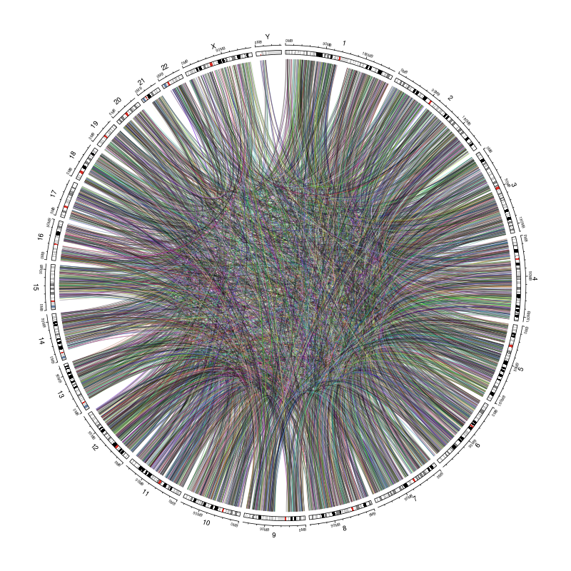

This notebook shows examples of how to use the circos_map_plot function for 
mapping data that corresponds to chromosomal coordinates.

Corresponds to [issue 397](https://github.com/AlexsLemonade/OpenPBTA-analysis/issues/397).

### Usage

This notebook can be run via the command line from the top directory of the 
repository as follows:

```
Rscript -e "rmarkdown::render('analyses/chromosomal-instability/01b-visualization-cnv-sv.Rmd', 
                              clean = TRUE)"
```

## circular plots functions: 
To use the functions, source the functions file: `source(file.path("util", "circos-plots.R"))`
This file includes three functions, but one is internal. 

**The two functions to use:**

`circos_map_plot`: Given a data.frame with chromosomal coordinates, and a corresponding data value to plot, make a circos plot or add a circular track to an existing plot. 
`circos_map_transloc`: Given a data.frame with two sets of coordinates, map the links between those coordinates on a new or exisitng circular plot. 

## Function Arguments Descriptions

- `df`: a data.frame with the chromosomal coordinates and y value to plot.  
- `add_track`: If true, adds a track to a current plot, if `FALSE`, starts a new plot.  
- `samples_col`: a character string specifying the samples column which can be used to filter by.  
- `sample_names`: a character string that specifies values to keep from `samples_col` column. `"all"` keeps all samples in.   
- `chr_col`: a character string that specifies the chromosomes column name.  
- `start_col`: a character string that specifies the start coordinate column name.  
- `end_col`: a character string that specifies the end coordinate column name.  
- `y_val`: The column name of the value you would like to plot. 
- `track_height`: a number between 0 and 1 that designates height, default is `.15`. 1 = the full diameter of the circular plot.  
- `type`: Type of plot the track should be. Options are `line`, `point`, `rect`.  
- `colour_key`: a character string designating a column that contains information to color by. Can be `numeric` or a `factor`.  
- `palette`: the color brewer palette you would like to be used. Run `RColorBrewer::display.brewer.all()` to see options.  

### Set Up

```{r}
# Set seed so heatmaps turn out the same
set.seed(2020)

# Magrittr pipe
`%>%` <- dplyr::`%>%`
```

Read in the custom functions.

```{r}
source(file.path("util", "circos-plots.R"))
```

### Directories and Files

```{r}
# Path to data directory
data_dir <- file.path("..", "..", "data")

# Path to output directory
plots_dir <- "plots"
```

### Read in data 

Set up metadata

```{r}
# Read in the metadata
metadata <- readr::read_tsv(file.path(data_dir, "pbta-histologies.tsv"))
```

Read in the CNV data. 

```{r}
cnv_df <- data.table::fread(
  file.path(data_dir, "pbta-cnv-cnvkit.seg.gz"),
  data.table = FALSE
) %>%
  # Let's make a variable that specifies whether the data is a deletion or amplication.
  dplyr::mutate(
    direction = dplyr::case_when(
      seg.mean < 0 ~ "del",
      seg.mean > 0 ~ "amp",
      seg.mean == 0 ~ "neutral"
    ),
    direction = as.factor(direction)
  )
```

Read in the SV data. 

```{r}
sv_df <- data.table::fread(
  file.path(data_dir, "pbta-sv-manta.tsv.gz"),
  data.table = FALSE
)
```

Make a translocation data.frame where both sets of coordinates for the translocation are in the same row.

```{r}
transloc_df <- sv_df %>%
  dplyr::filter(SV.type == "BND") %>%
  dplyr::mutate(
    match_id = substr(ID, 0, nchar(ID) - 2),
    pair_num = substr(ID, nchar(ID), nchar(ID))
  ) %>%
  dplyr::select(
    biospecimen_id = Kids.First.Biospecimen.ID.Tumor,
    chrom = SV.chrom,
    start = SV.start,
    end = SV.end,
    width = SV.length,
    match_id,
    pair_num
  )

transloc_df <- transloc_df %>%
  dplyr::filter(pair_num == 0) %>%
  dplyr::inner_join(dplyr::filter(transloc_df, pair_num == 1),
    by = "match_id",
    suffix = c("1", "2")
  )
```

## Example uses of `circos_map_plot`

**Example 1** making a circular scatter plot for a single sample.

```{r}
circos_map_plot(
  df = cnv_df,
  add_track = FALSE, # If set to TRUE we would add to an exisiting plot.
  samples_col = "ID", # Designate what columns of `cnv_df` hold the sample IDs.
  sample_names = "BS_007JTNB8", # What sample we are plotting.
  chr_col = "chrom", # Designate what columns of `cnv_df` hold the coordinates.
  start_col = "loc.start",
  end_col = "loc.end",
  y_val = "copy.num", # This is the data we want to map
  track_height = .15, # This is the default
  type = "point", # type is set to point
  colour_key = "direction", # We are color coding by Amp or Del
  palette = "Accent"
) # This is the color brewer palette we'll use.
```

**Example 2** making a line plot for a multiple samples and color code by samples.

```{r}
circos_map_plot(
  df = cnv_df,
  add_track = FALSE,
  samples_col = "ID",
  sample_names = c("BS_007JTNB8", "BS_CGXTFM67", "BS_XEVMEYFS"), # What samples we are plotting.
  chr_col = "chrom",
  start_col = "loc.start",
  end_col = "loc.end",
  y_val = "copy.num",
  track_height = .15,
  type = "line", # type is set to line
  colour_key = "ID", # This is set to the ID column so its color coded by sample
  palette = "YlGnBu"
)
```

**Example 3** making a plot with rectangles for a multiple samples and color code by numeric values

```{r}
circos_map_plot(
  df = cnv_df,
  add_track = FALSE,
  samples_col = "ID",
  sample_names = c("BS_007JTNB8", "BS_CGXTFM67", "BS_XEVMEYFS"), # What samples we are plotting.
  chr_col = "chrom",
  start_col = "loc.start",
  end_col = "loc.end",
  y_val = "copy.num",
  track_height = .15,
  type = "rect", 
  colour_key = "ID", # This is set to the ID column so its color coded by sample
  palette = "Accent"
)
```

**Example 4** Adding layers to the same plot.

```{r}
# This first part is the same as Example 3, but we will add an extra layer and change the color palette
circos_map_plot(
  df = cnv_df,
  add_track = FALSE,
  samples_col = "ID",
  sample_names = c("BS_007JTNB8", "BS_CGXTFM67", "BS_XEVMEYFS"),
  chr_col = "chrom",
  start_col = "loc.start",
  end_col = "loc.end",
  y_val = "copy.num",
  track_height = .15,
  type = "line",
  colour_key = "ID",
  palette = "Set1"
)
# We'll change the color though for fun
# Add rect layer
circos_map_plot(
  df = cnv_df,
  add_track = TRUE, # Set to TRUE so adds to plot called above.
  samples_col = "ID",
  sample_names = c("BS_007JTNB8", "BS_CGXTFM67", "BS_XEVMEYFS"),
  chr_col = "chrom", #
  start_col = "loc.start",
  end_col = "loc.end",
  y_val = "copy.num",
  track_height = .15,
  type = "rect", # Making rectangles
  colour_key = "direction",
  palette = "Accent"
)
```

**Example 4** making a translocation plot. 

```{r}
circos_map_transloc(transloc_df,
  add_track = FALSE, # We change this to true to add on to our already existing plot
  sample_names = "BS_007JTNB8",
  samples_col = "biospecimen_id1",
  chr_col_1 = "chrom1", # Need to specify which column is the first and second location for each
  chr_col_2 = "chrom2",
  start_col_1 = "start1",
  start_col_2 = "start2",
  end_col_1 = "end1",
  end_col_2 = "end2"
)
```

**Example 5** Saving a plot. 

```{r}
# Open up PNG file
png(file.path(plots_dir, "transloc_circos_plot.png"), width = 800, height = 800)
# Run function per usual
circos_map_transloc(transloc_df,
  add_track = FALSE,
  sample_names = "BS_007JTNB8",
  samples_col = "biospecimen_id1",
  chr_col_1 = "chrom1",
  chr_col_2 = "chrom2",
  start_col_1 = "start1",
  start_col_2 = "start2",
  end_col_1 = "end1",
  end_col_2 = "end2"
)
dev.off() # Turn off png dev
```



### Session Info

```{r}
sessionInfo()
```

