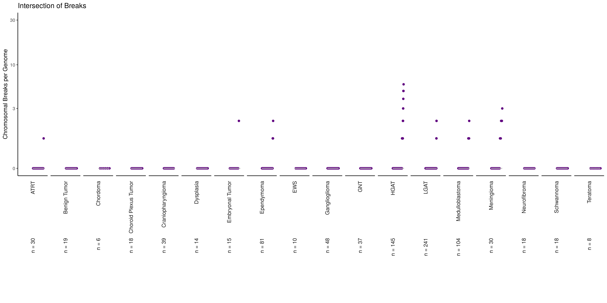
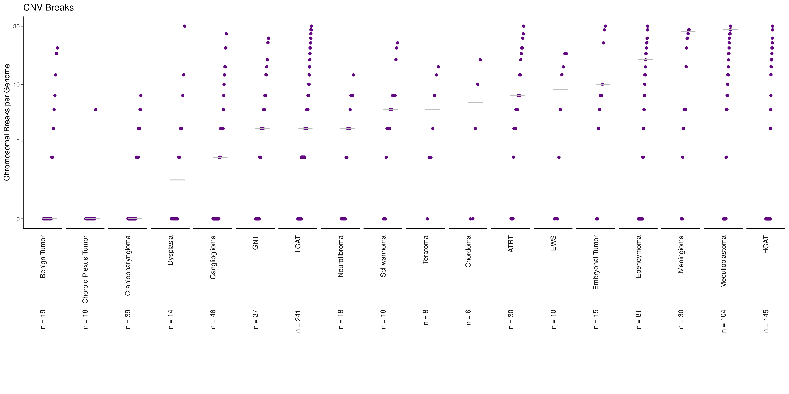
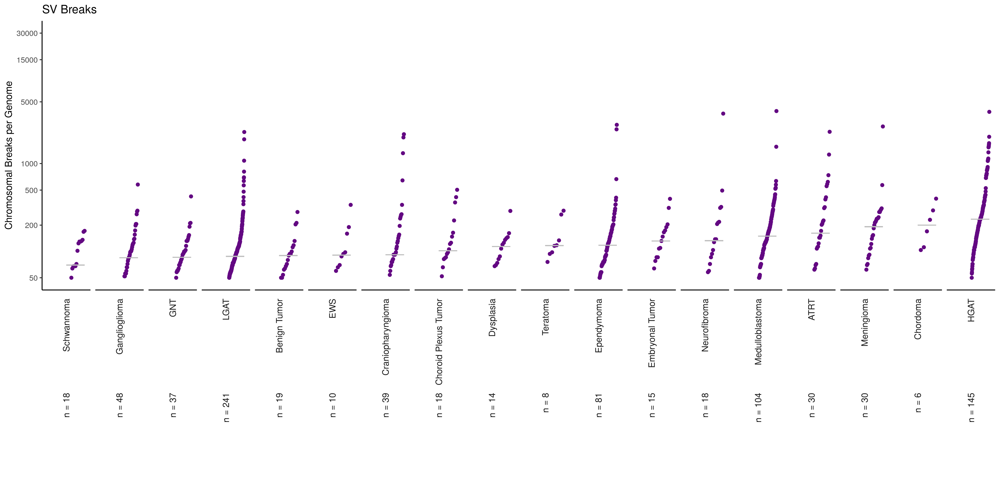

This analysis evaluates chromosomal instability by using breakpoint SV and CNV 
data that was co-localized by histology in `01-localization-of-breakpoints.Rmd`. 
This notebook returns a CDF plot and genome map plots for each `short_histology` 
group in the `plots/tumor-type` directory.

### Usage

This notebook can be run via the command line from the top directory of the 
repository as follows:

```
Rscript -e "rmarkdown::render('analyses/chromosomal-instability/02b-plot-chr-instability-by-histology.Rmd', 
                              clean = TRUE)"
```

### Set Up

```{r}
# Set seed so heatmaps turn out the same
set.seed(2020)

# Magrittr pipe
`%>%` <- dplyr::`%>%`

# Need the plotting functions
source(file.path("util", "chr-break-plot.R"))

# Using the CDF plotting function
source(file.path("..", 
                 "tmb-compare-tcga", 
                 "util", 
                 "cdf-plot-function.R"))
```

Tiny custom function for setting up each of the density files and joining the 
`short_histology` metadata to them. 

```{r}
# Read in the breaks file
read_n_join <- function(density_file, 
                        metadata_df) {
  # Given a genome wide breaks density file path, join the metadata's 
  # short_histology group to it based on `Kids_First_Biospecimen_ID`.
  #
  # Args:
  #   density_file: a chromosomal breaks density file path where each sample is
  #                 a row with `samples` and `breaks_count` columns. 
  #   metadata_df: a data.frame with Kids_First_Biospecimen_ID, short_histology
  #                columns
  #   
  # Returns:
  #  set up data.frame with `short_histology`
  readr::read_tsv(density_file) %>%
    # Add on the short histology column from the metadata for plotting purposes
    dplyr::inner_join(metadata_df %>%
                        dplyr::select(Kids_First_Biospecimen_ID, 
                                      short_histology),
                      by = c("samples" = "Kids_First_Biospecimen_ID")
    )
}
```

Set up option for how many samples minimum we need to include in CDF plot. 
Borrowed this type of logic from @sjspielman in the [gene-set-enrichment analysis.](https://github.com/AlexsLemonade/OpenPBTA-analysis/blob/ee1283991d30237a6a04be8fc6fec7672844133b/analyses/gene-set-enrichment-analysis/02-model-gsea.Rmd#L55)

```{r}
# Let's check if this is numeric
if (!(is.numeric(params$min_samples))) {
  warning("The parameter min_samples should be numeric. Trying to coerce to numeric.")
  params$min_samples <- as.numeric(params$min_samples)
} 
```

### Directories and Files

```{r}
# Path to data directory
data_dir <- file.path("..", "..", "data")

# Path to output directory
plots_dir <- "plots"

# Path to tumor type plots output directory
hist_plots_dir <- file.path(plots_dir, "tumor-type")

# Create the hist_plots_dir  if it does not exist
if (!dir.exists(hist_plots_dir)) {
  dir.create(hist_plots_dir, recursive = TRUE)
}
```

Here's all the input files we will need: 

```{r}
metadata_file <- file.path(data_dir, "pbta-histologies.tsv")
hist_binned_breaks_file <- file.path("breakpoint-data", 
                                     "histology_breakpoint_binned_counts.RDS")
intersection_densities_file <- file.path("breakpoint-data", 
                                         "intersection_of_breaks_densities.tsv")
cnv_densities_file <- file.path("breakpoint-data", 
                                "cnv_breaks_densities.tsv")
sv_densities_file <- file.path("breakpoint-data", 
                               "sv_breaks_densities.tsv")
```

Output plots: 

```{r}
intersection_cdf_plot_file <- file.path(plots_dir, 
                                        "intersection_breaks_cdf_plot.png")
cnv_cdf_plot_file <- file.path(plots_dir, "cnv_breaks_cdf_plot.png")
sv_cdf_plot_file <- file.path(plots_dir, "sv_breaks_cdf_plot.png")
```

### Read in data 

Set up metadata

```{r}
# Read in the metadata
metadata <- readr::read_tsv(metadata_file, guess_max = 10000)
```

Load in the localized by histology breakpoint data. 

```{r}
hist_break_local <- readr::read_rds(hist_binned_breaks_file)
```

## Plot CDF plot by histology

Parameters that will be constant for each plot produced by `cdf_plot`

```{r}
cdf_num_col <- "breaks_count"
cdf_group_col <- "short_histology"
point_color <- "#630882"
min_num_samples <- params$min_samples
xlimits <- c(-1.2, 1.2)
ylimits <- c(0, 30)
xlabel <- ""
ylabel <- "Chromosomal Breaks per Genome"
yaxis_breaks <- c(0, 3, 10, 30)
```

#### Intersection breaks density plot. 

```{r}
intersection_plot <- read_n_join(density_file = intersection_densities_file, 
                                 metadata_df = metadata) %>% 
  cdf_plot(plot_title = "Intersection of Breaks",
           num_col = cdf_num_col,
           group_col = cdf_group_col,
           color = point_color,
           n_group = min_num_samples,
           x_lim = xlimits,
           y_lim = ylimits,
           x_lab = xlabel,
           y_lab = ylabel, 
           breaks = yaxis_breaks)

# Save plot
ggplot2::ggsave(intersection_cdf_plot_file, width = 40, height = 20, units = "cm")
```


#### CNV breaks density plot. 

```{r}
cnv_plot <- read_n_join(density_file = cnv_densities_file, 
                        metadata_df = metadata) %>% 
  cdf_plot(plot_title = "CNV Breaks",
           num_col = cdf_num_col,
           group_col = cdf_group_col,
           color = point_color,
           n_group = min_num_samples,
           x_lim = xlimits,
           y_lim = ylimits,
           x_lab = xlabel,
           y_lab = ylabel, 
           breaks = yaxis_breaks)

# Save plot
ggplot2::ggsave(cnv_cdf_plot_file, width = 40, height = 20, units = "cm")
```



#### SV breaks density plot. 

SV breaks has a very different distribution from the CNV and intersection breaks data. 
The `breaks` and `y_lim` arguments had to be set differently here. 

```{r}
sv_plot <- read_n_join(density_file = sv_densities_file, 
                       metadata_df = metadata) %>% 
  cdf_plot(plot_title = "SV Breaks",
           num_col = cdf_num_col,
           group_col = cdf_group_col,
           color = point_color,
           n_group = min_num_samples,
           x_lim = xlimits,
           y_lim = c(50, 30000),
           x_lab = xlabel,
           y_lab = ylabel, 
           breaks = c(50, 200, 500, 1000, 5000, 15000, 30000))

# Save plot
ggplot2::ggsave(sv_cdf_plot_file, width = 40, height = 20, units = "cm")
```



### Plot the breakpoints for each tumor-type

Here we will plot total number of break points for the tumor-type group per 
each bin.

```{r, message=FALSE, results=FALSE}
purrr::imap(hist_break_local, function(.x, name = .y) {
  # Make the combo plot
  multipanel_break_plot(
    granges_list = .x,
    plot_name = name,
    y_val = "total_counts",
    y_lab = "Total Breaks per Mb",
    plot_dir = hist_plots_dir
  )
})
```

Zip up the PNG files into one file. 

```{r}
# Declare name of zip file
zip_file <- paste0(hist_plots_dir, ".zip")

# Remove any current zip_file of this name so we can overwrite it
if (file.exists(zip_file)) {
  file.remove(zip_file)
}
# Zip up the plots
zip(zip_file, hist_plots_dir, extras = "-j")
```

### Session Info

```{r}
sessionInfo()
```
