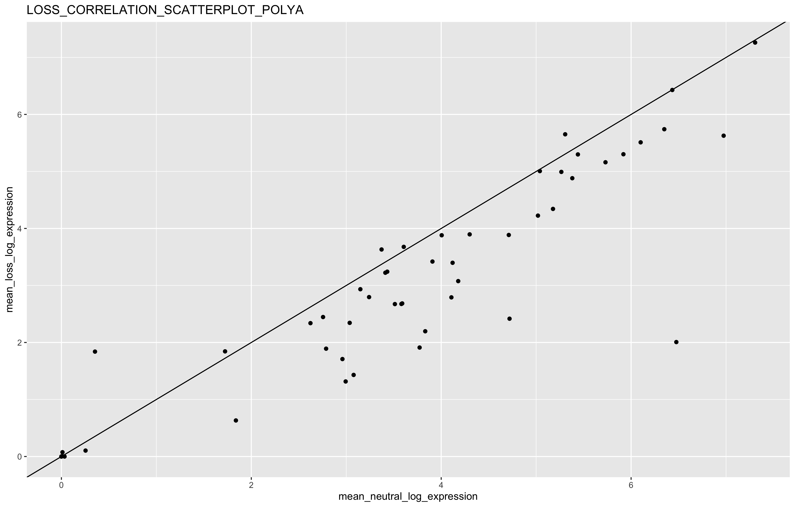
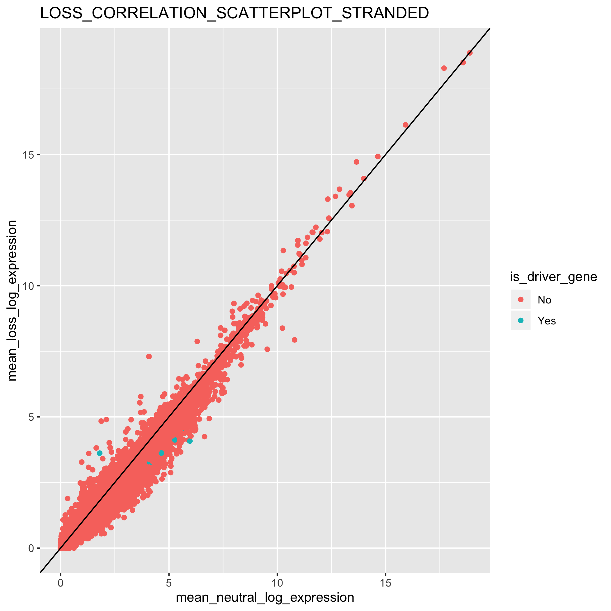
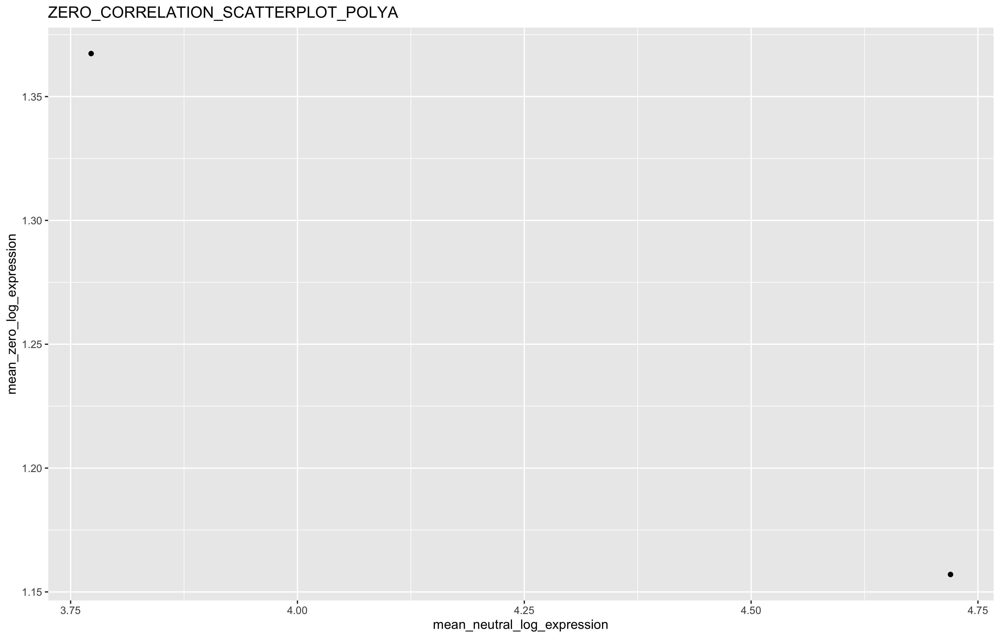
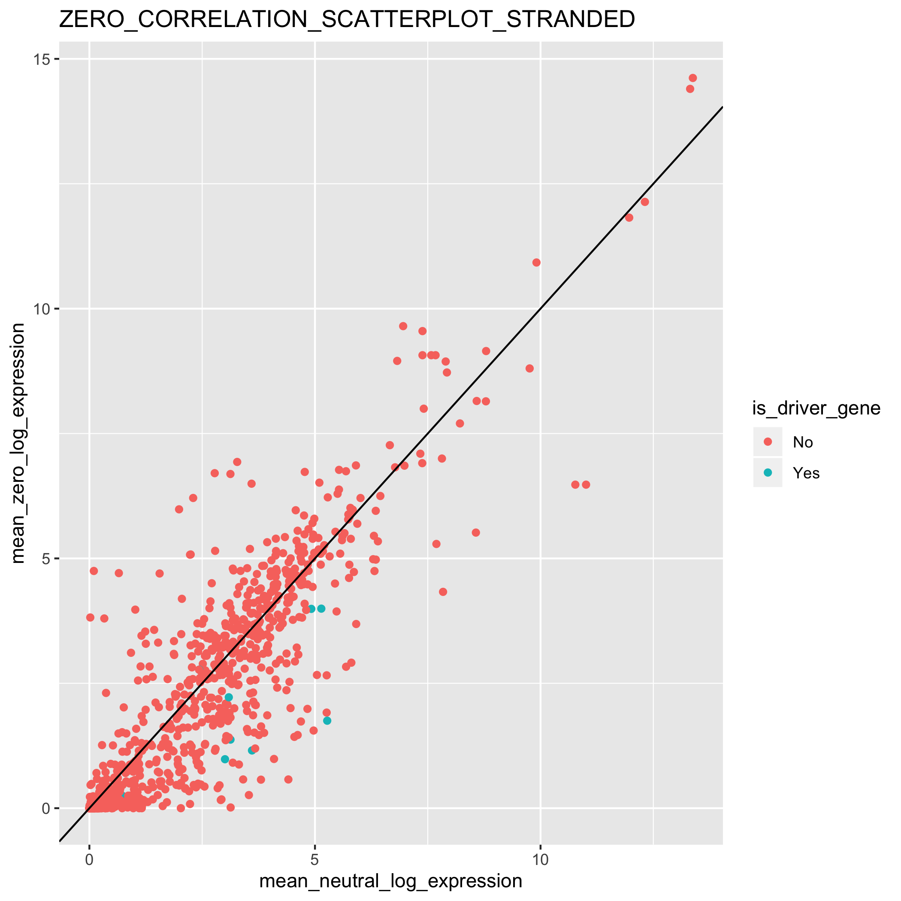
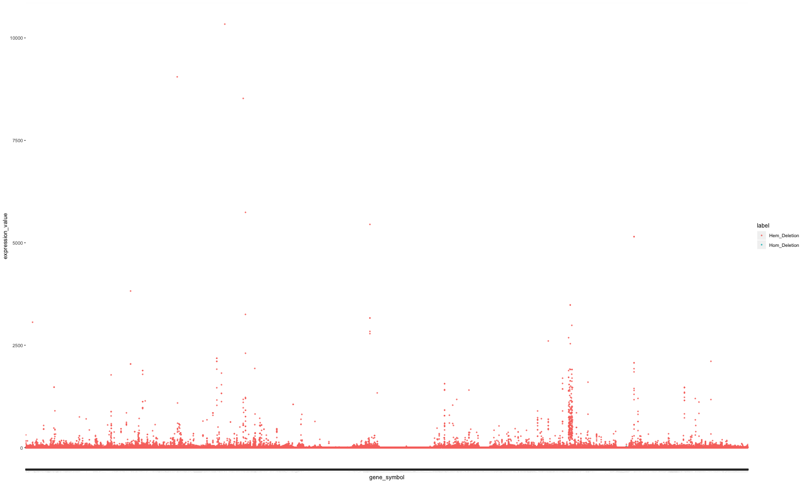
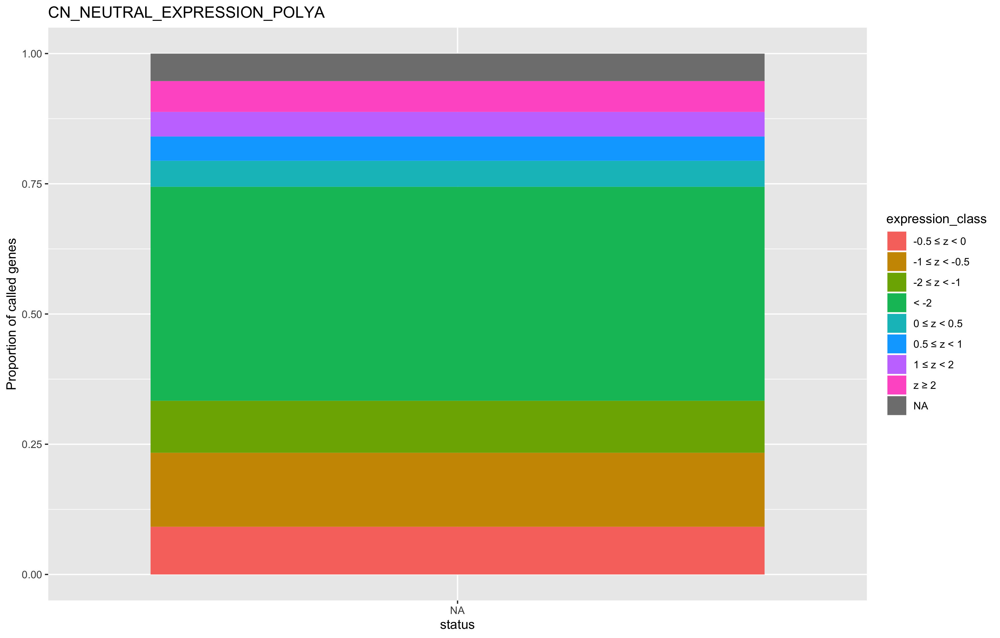
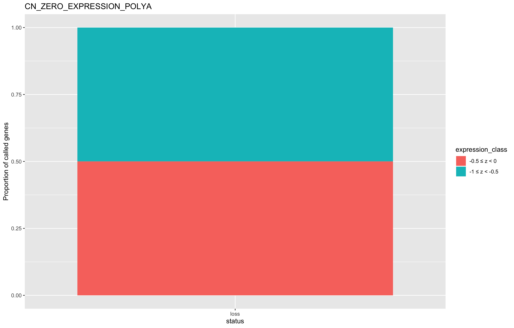
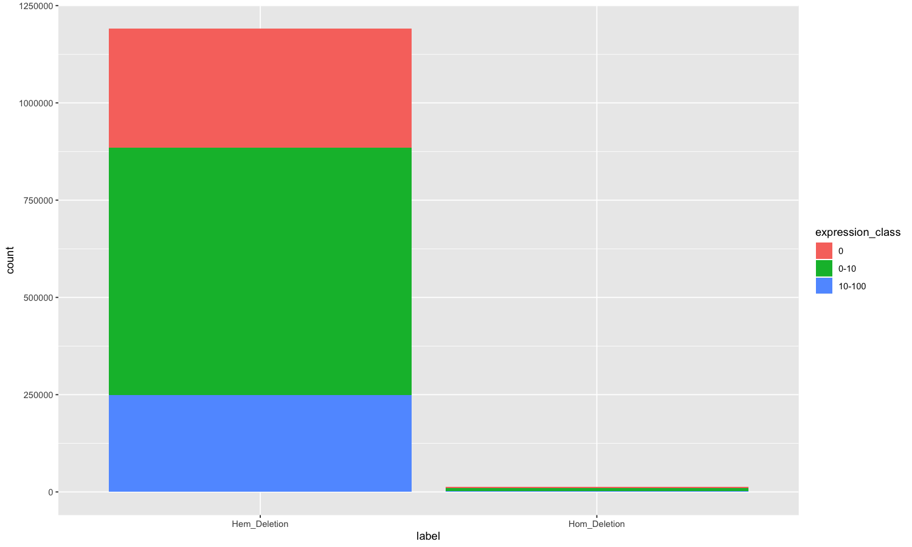
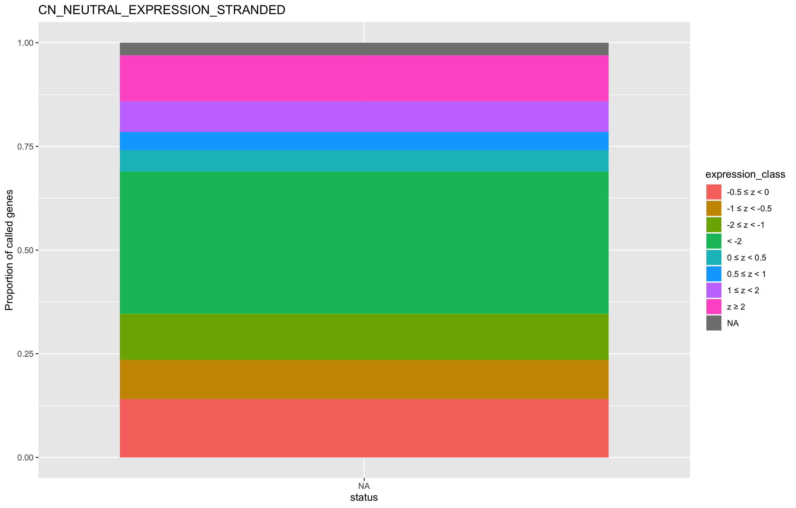
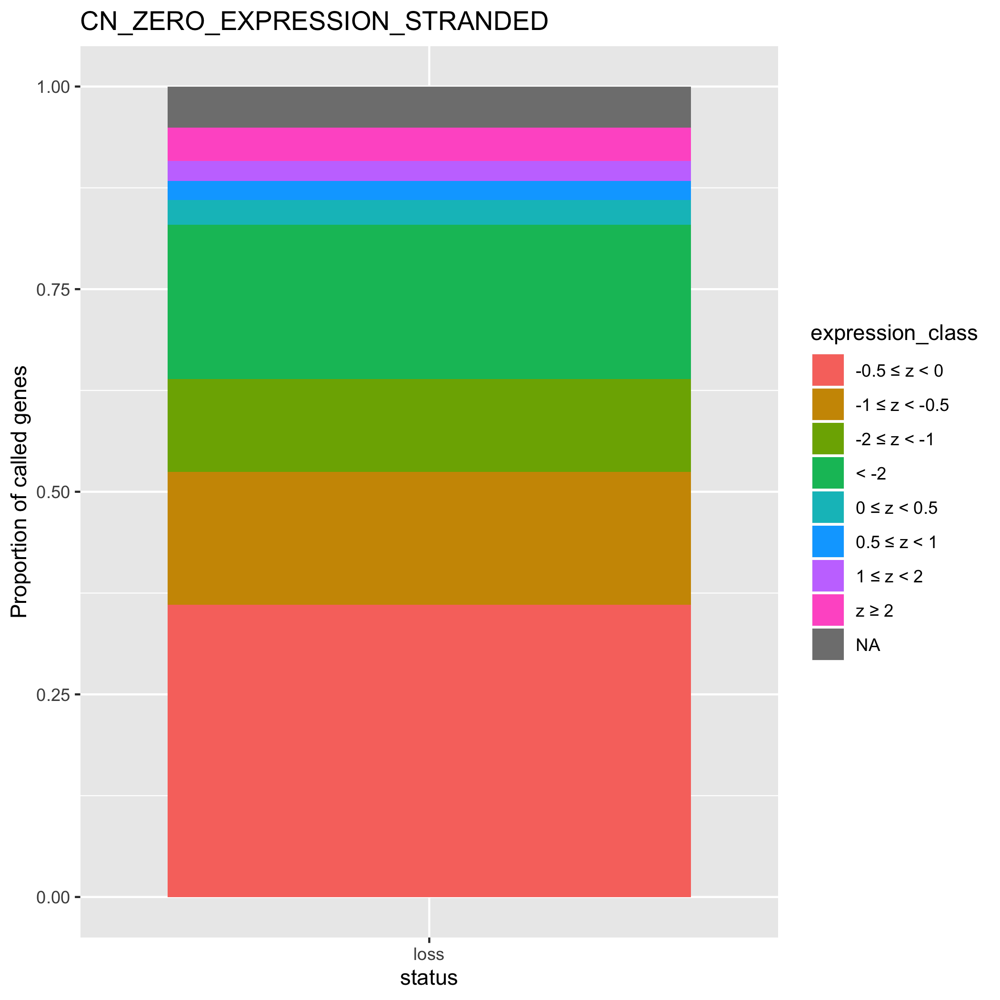

## This markdown displays the plots produced in the `rna-expression-validation.R` script of this module. 

##### The scatterplots below show the correlation between the mean expression of loss and neutral CN calls across genes, separated by polyA and stranded RNA expression data. 

Loss/neutral calls correlation plot using polyA RSEM expression data:

Loss/neutral calls correlation plot using stranded RSEM expression data:

##### The scatterplots below show the correlation between the mean expression of loss CN calls and instances where CN equals to zero across genes, separated by polyA and stranded RNA expression data. 

Zero/neutral calls correlation plot using polyA RSEM expression data:

Zero/neutral calls correlation plot using stranded RSEM expression data:

##### The stacked barplots below show the proportion of RNA expression classes across genes. 

The plot using the polyA RSEM expression data is below:

The plot using the stranded RSEM expression data is below:

