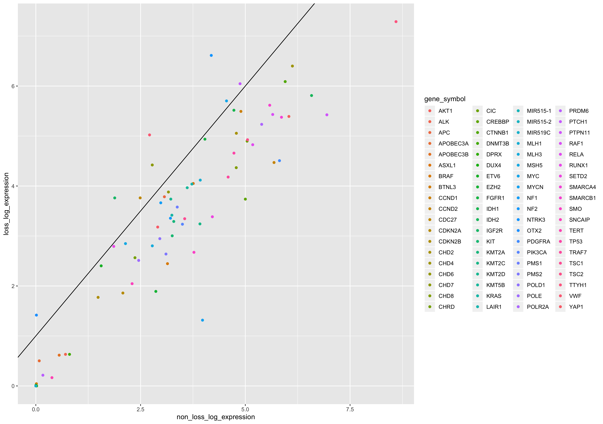
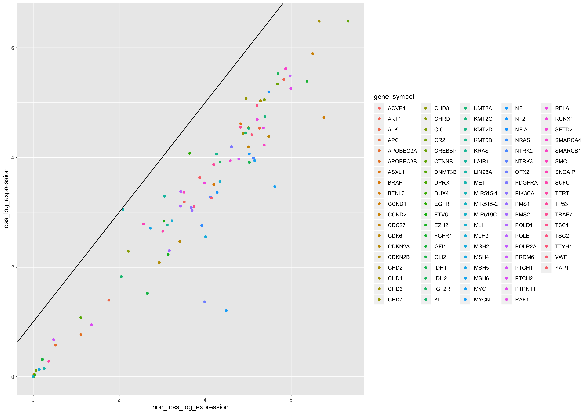
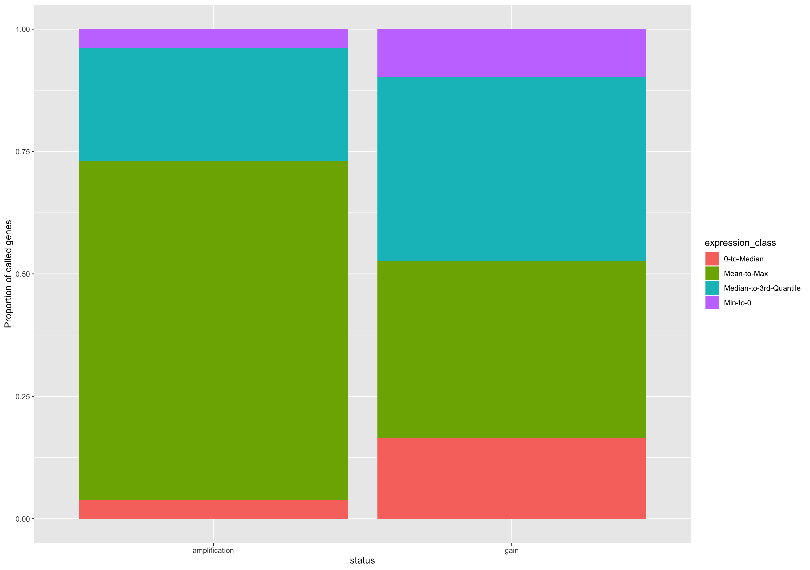
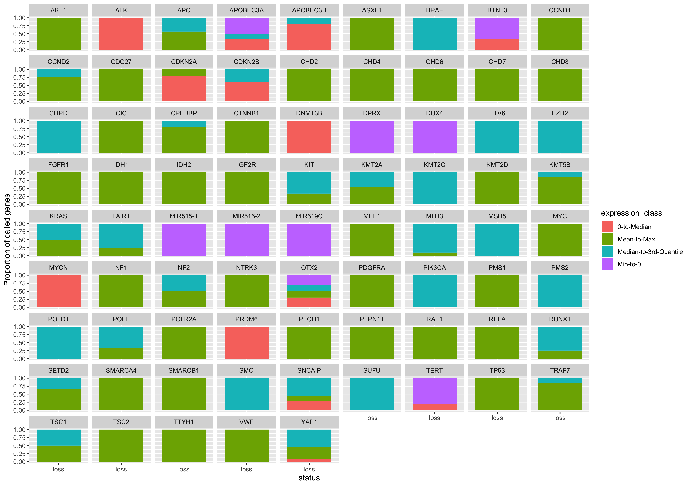
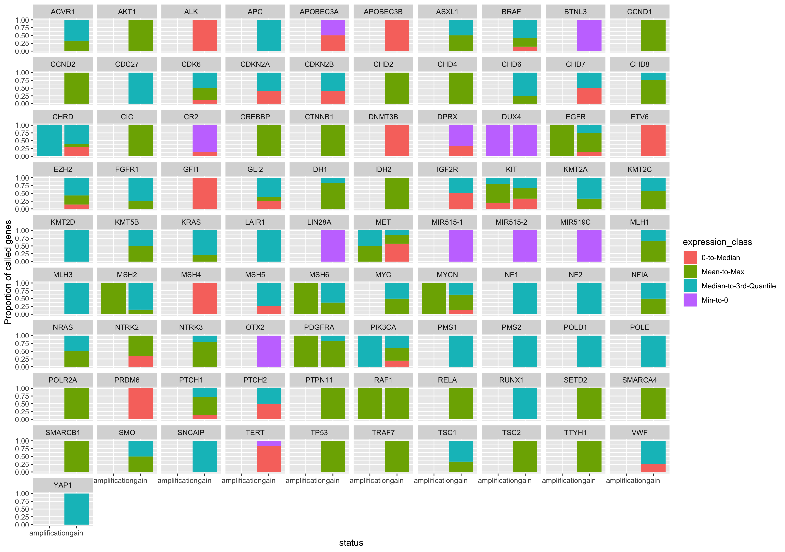
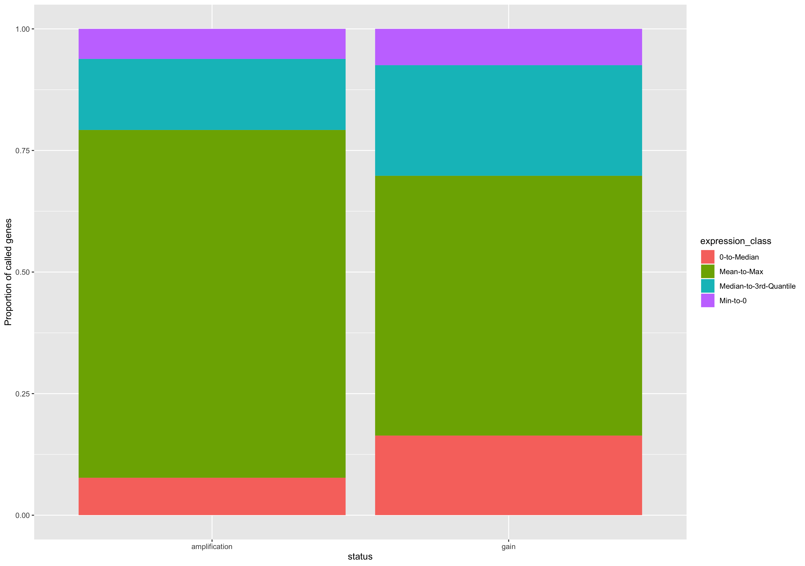
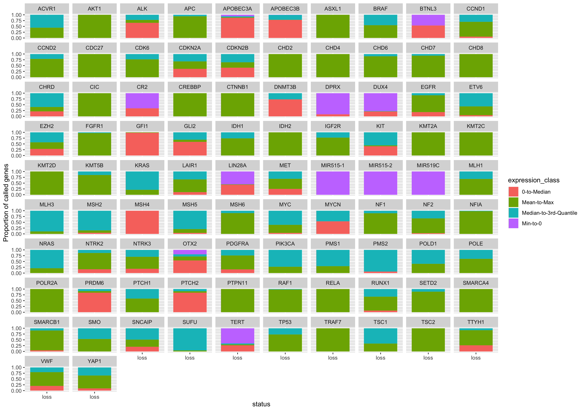
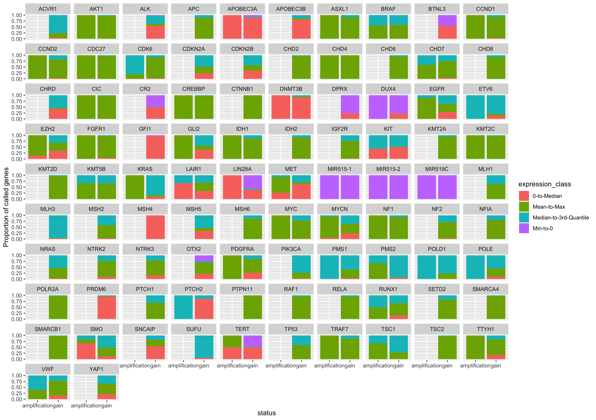

## This markdown displays the plots produced in the `rna-expression-validation.R` script of this module. 

##### The scatterplots below show the correlation between the mean expression of loss and non-loss CN calls across genes, separated by polyA and stranded RNA expression data. 

Correlation plot using polyA RSEM expression data:

Correlation plot using stranded RSEM expression data:

##### The stacked barplots below show the proportion of RNA expression classes across genes. 

The plot using the polyA RSEM expression data is below:

The facetted plot displaying the polyA RSEM expression data per gene is below:

The plot using the stranded RSEM expression data is below:

The facetted plot displaying the stranded RSEM expression data per gene is below:

