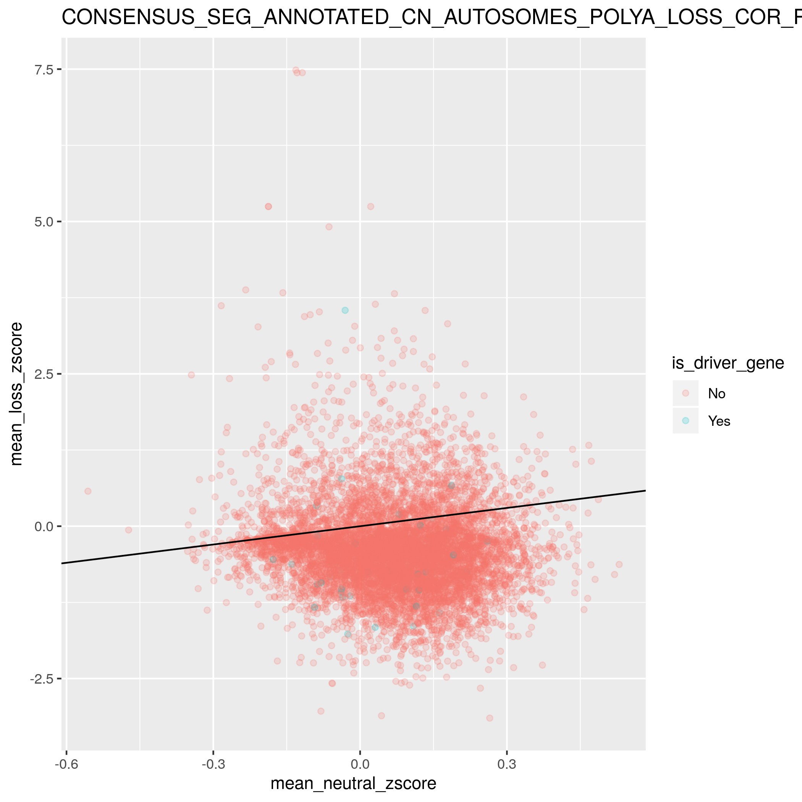
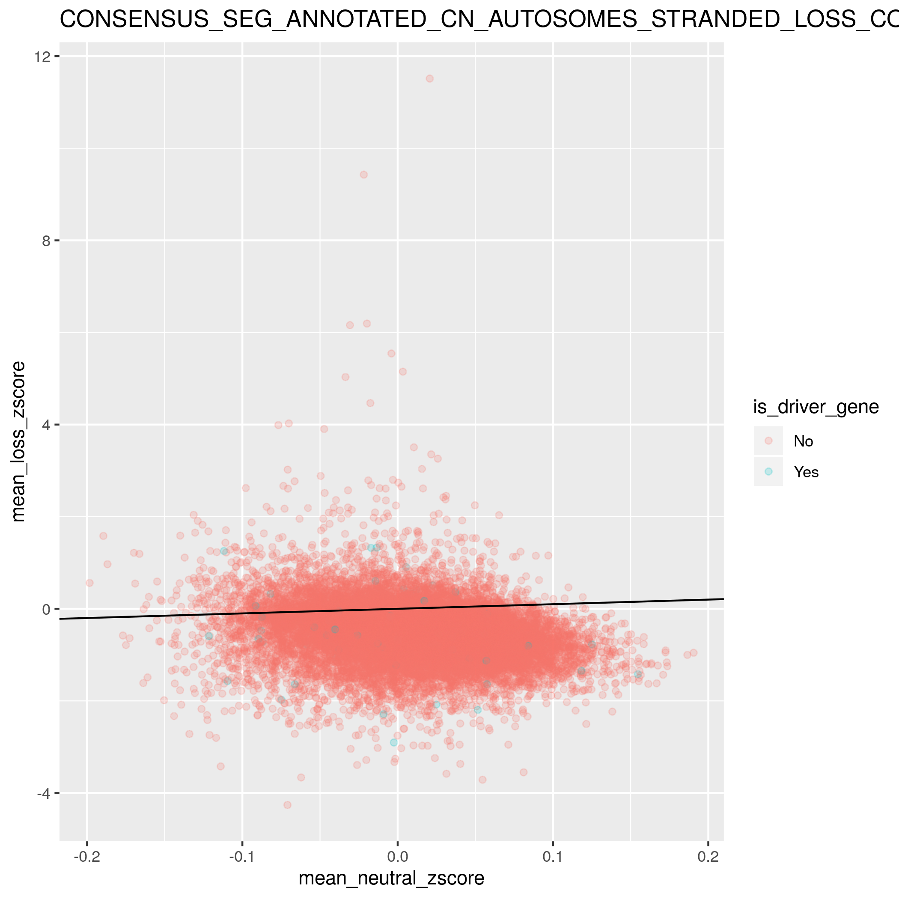
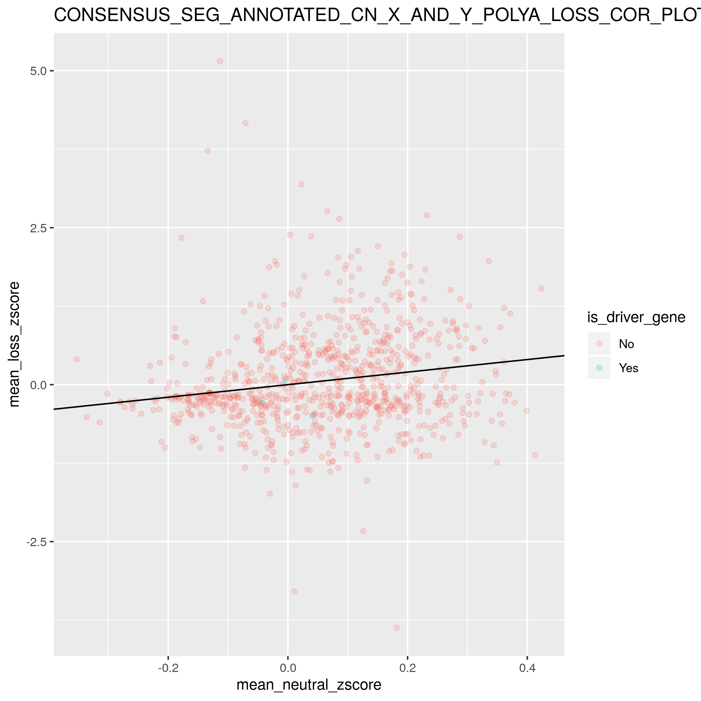
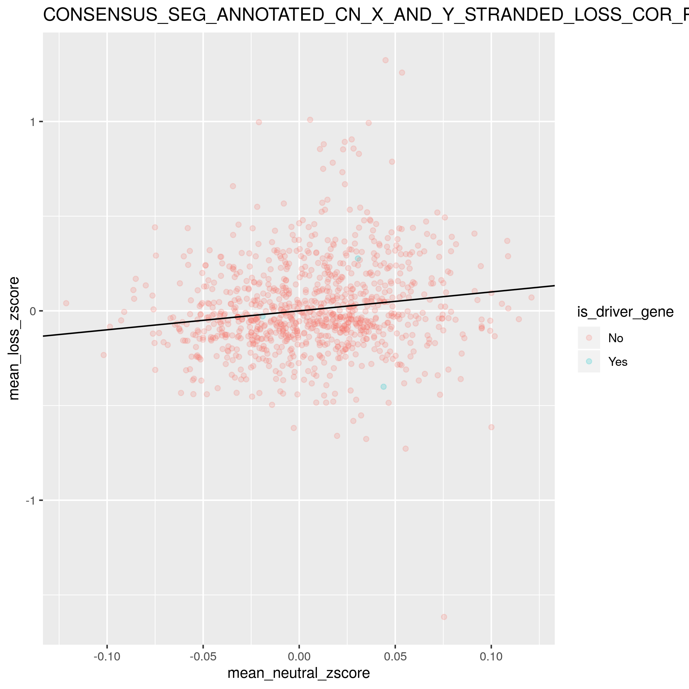
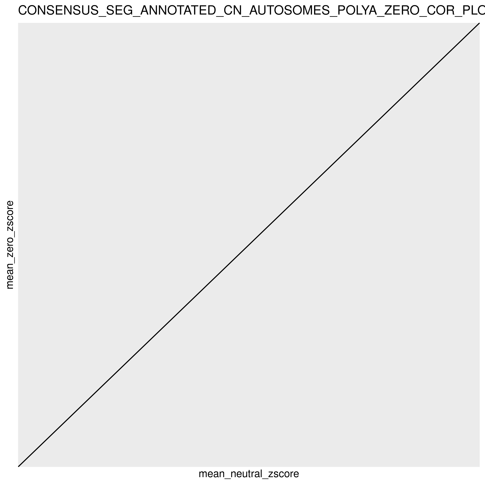
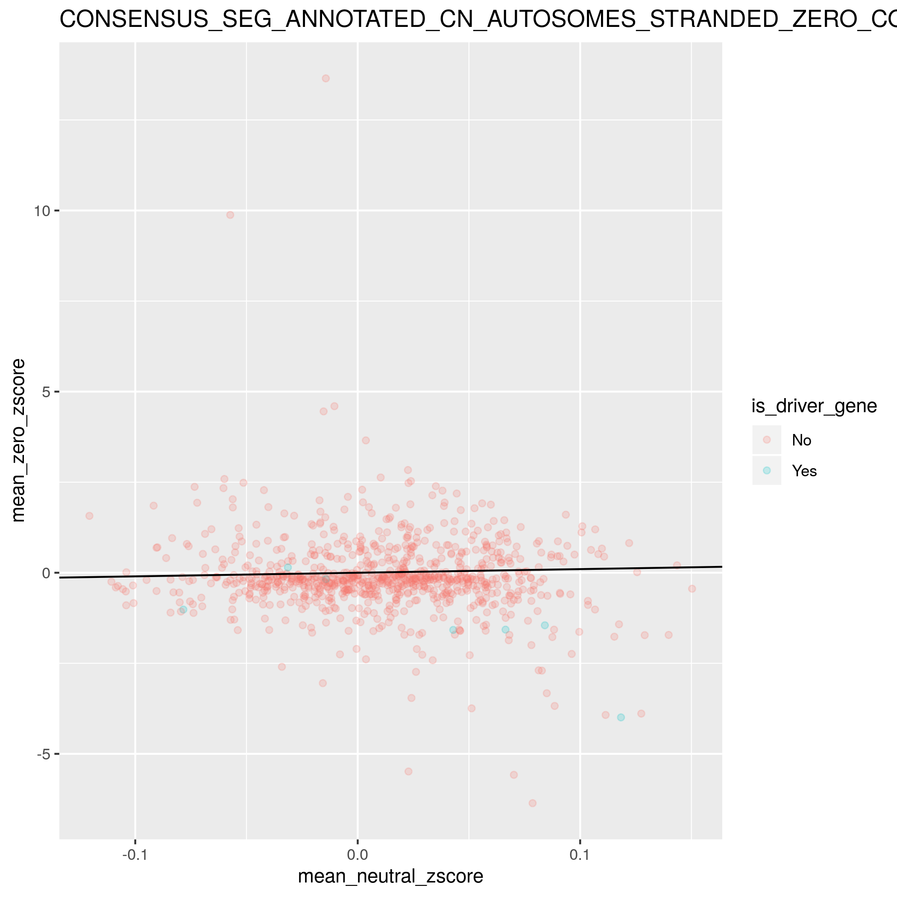
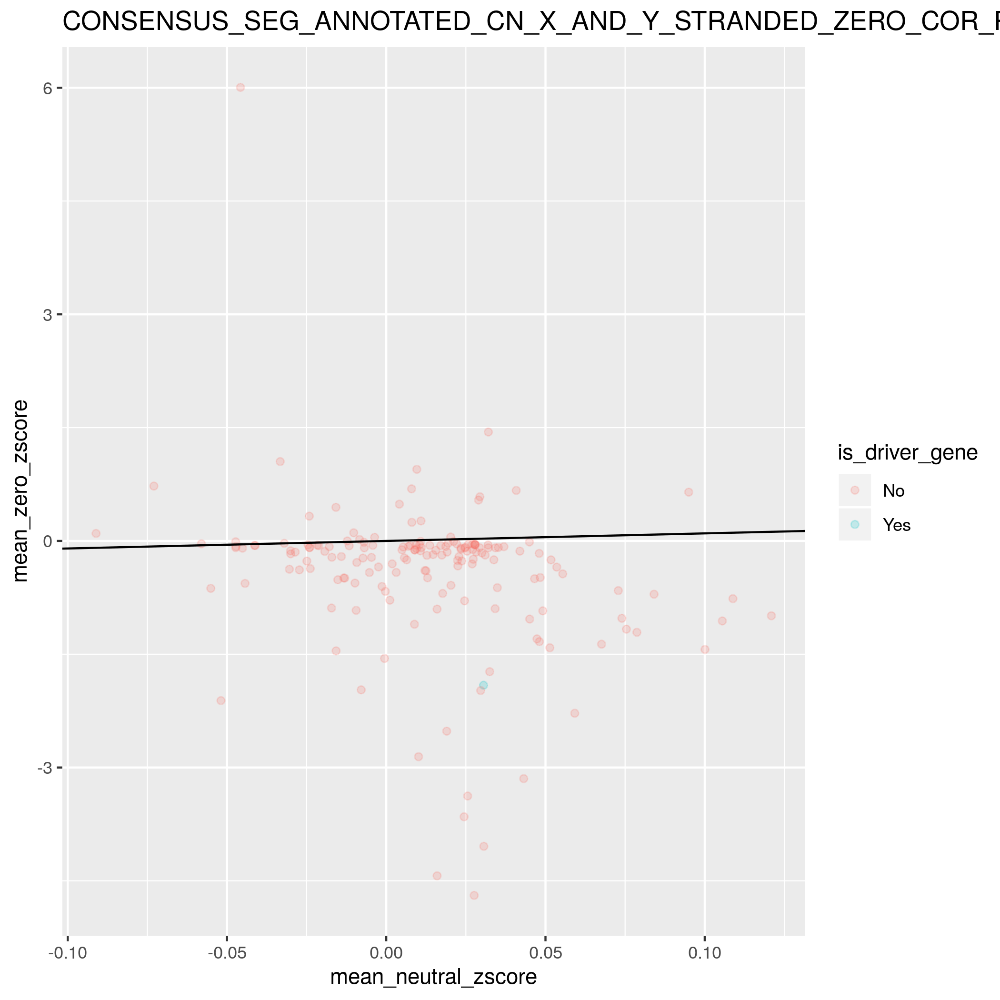
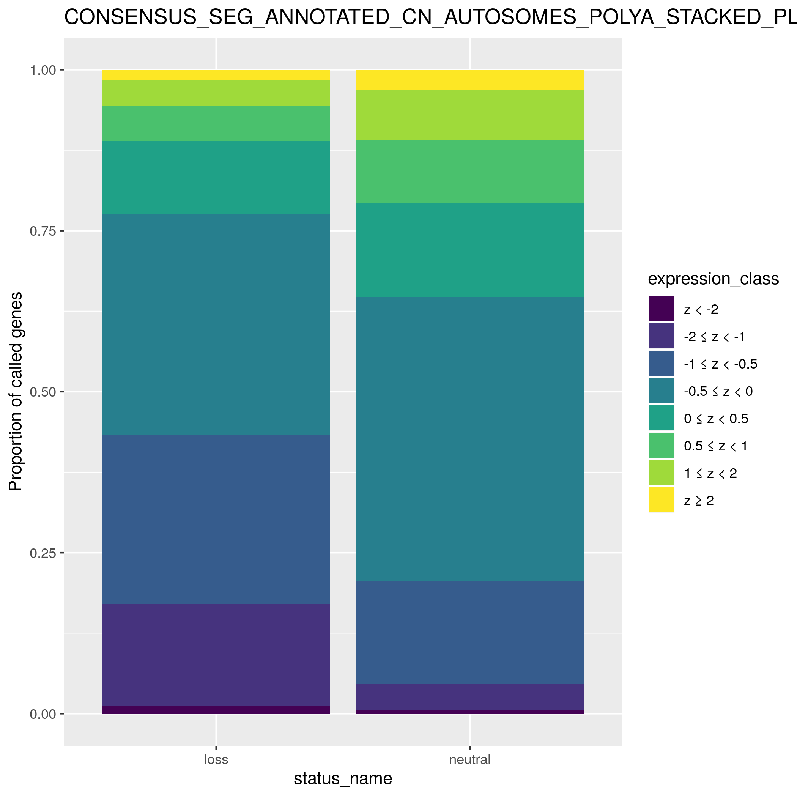
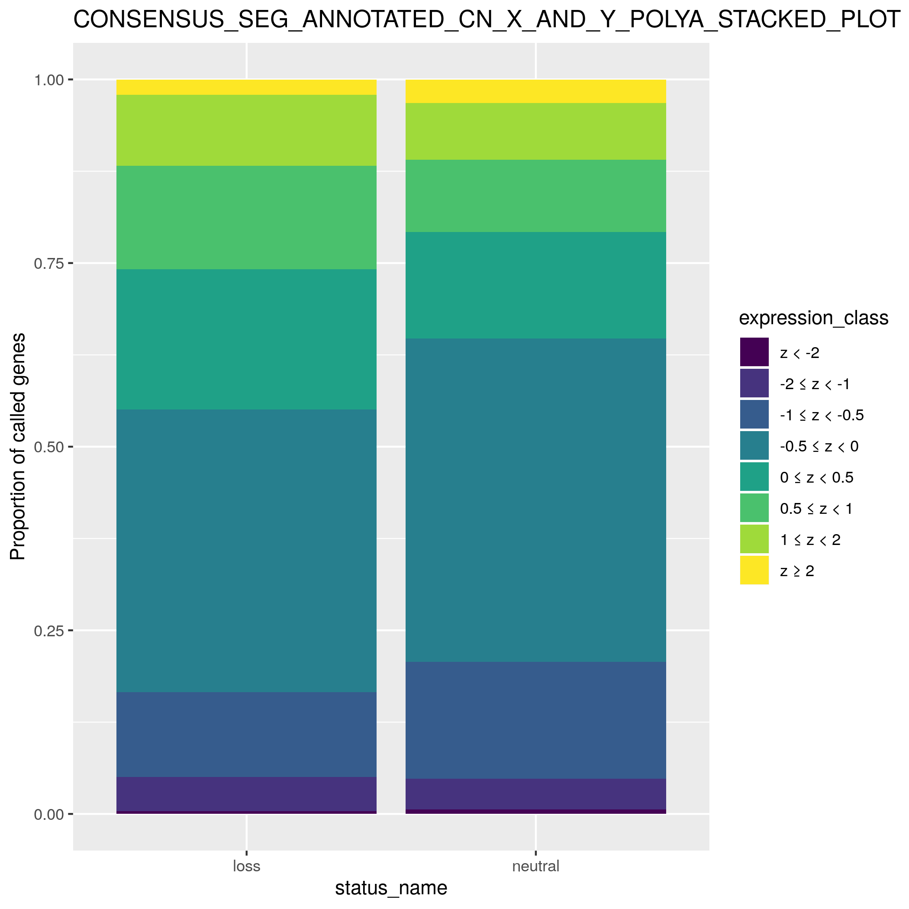
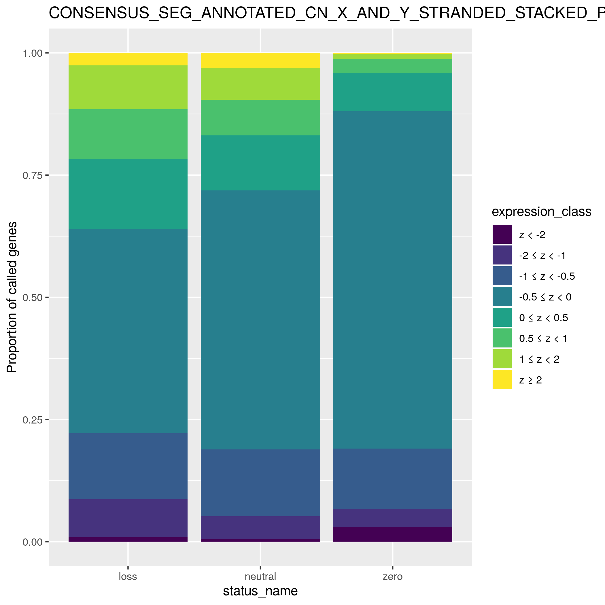

## This markdown displays the plots produced in the `rna-expression-validation.R` script of this module using the consensus SEG copy number file and collapsed RSEM expression files. 

##### The scatterplots below show the correlation between the mean z-scored expression of loss and neutral CN calls across genes, separated by polyA and stranded RNA expression data. 

Loss/neutral consensus calls correlation plot using polyA RSEM expression data (autosomes only):

Loss/neutral consensus calls correlation plot using stranded RSEM expression data (autosomes only):

Loss/neutral consensus calls correlation plot using polyA RSEM expression data (X and Y chromosomes only):

Loss/neutral consensus calls correlation plot using stranded RSEM expression data (X and Y chromosomes only):

##### The scatterplots below show the correlation between the mean z-scored expression of loss CN calls and instances where CN equals to zero across genes, separated by polyA and stranded RNA expression data. 

Zero/neutral calls correlation plot using polyA RSEM expression data (autosomes only):

Zero/neutral calls correlation plot using stranded RSEM expression data (autosomes only):

Zero/neutral calls correlation plot using polyA RSEM expression data (X and Y chromosomes only):

Zero/neutral calls correlation plot using stranded RSEM expression data (X and Y chromosomes only):

##### The stacked barplots below show the proportion of RNA expression classes across genes. 

The plot using the polyA RSEM expression data is below (autosomes only):

The plot using the stranded RSEM expression data is below (autosomes only):

The plot using the polyA RSEM expression data is below (X and Y chromosomes only):

The plot using the stranded RSEM expression data is below (X and Y chromosomes only):

