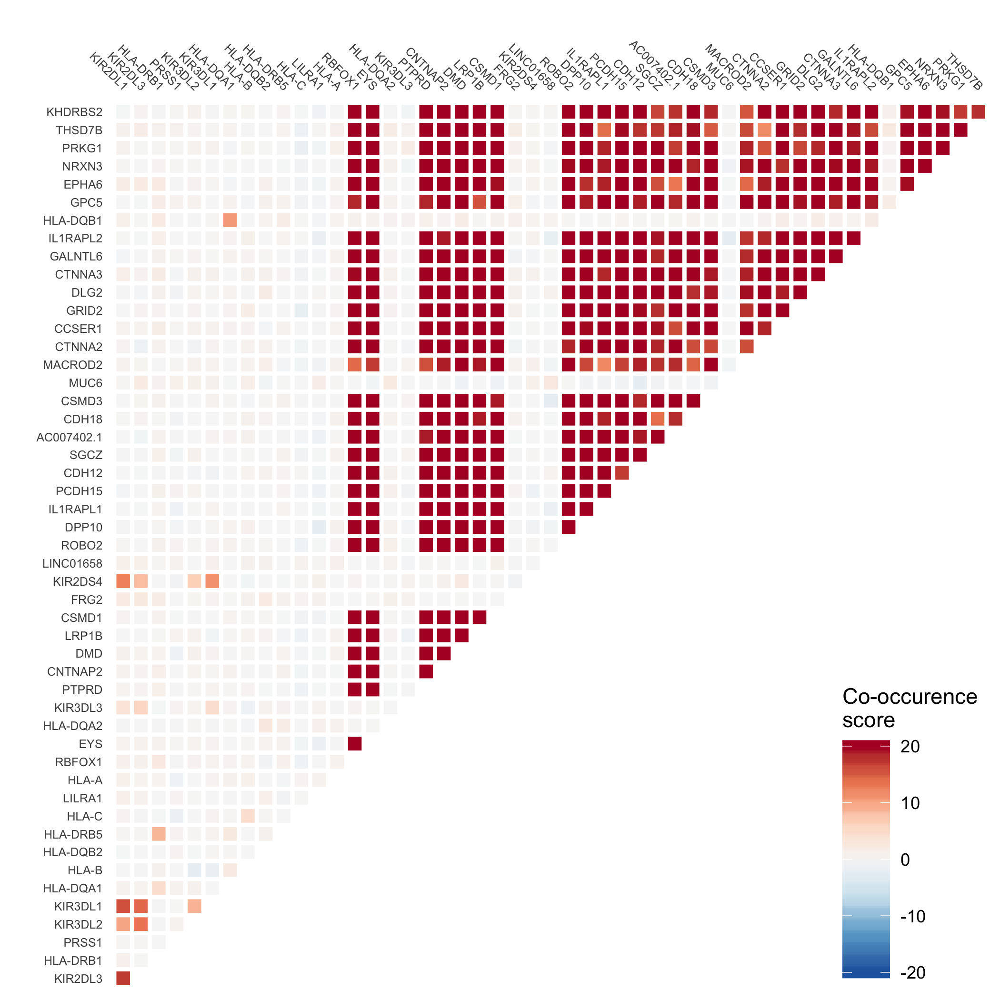

# Mutation interaction plot (co-occurence and mutual exclusivity) generation

The scripts in this directory create a plot to display co-occurence and mutual exclusivity of mutations across tumors.

Currently this is done across all tumor types, with all available individuals for which whole genome sequences are available for at least one tumor.
Importantly, only a single sequencing sample from each individual is used. 
The analyses and plots created include information from the top 50 most mutated genes.

Future analyses will include creating plots by tumor type, and for specific lists of genes of interest.


### Example plot



## Usage

To run a basic analysis and create a co-occurence plot:
```
sh analyses/interaction-plots/01-create-interaction-plots.sh
```
