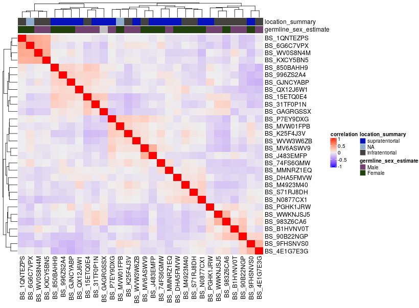
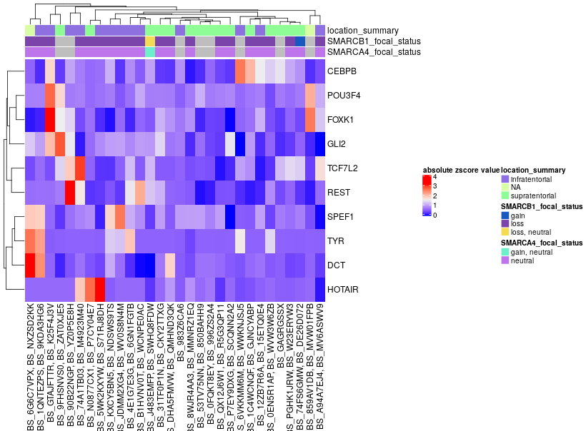

# Molecular Subtyping ATRT

## Usage

To run all of the Rscripts in this module from the command line sequentially, use:

```
bash run-molecular-subtyping-ATRT.sh
```

`run-molecular-subtyping-ATRT.sh` is designed to be run as if it was called from this module directory even when called from outside of this directory.


## Folder content

This folder contains scripts tasked to molecularly subtype ATRT samples in the PBTA dataset.

`01-ATRT-molecular-subtyping-data-prep.Rmd` is a notebook written to prepare the RNA expression, copy number, ssGSEA pathway, structural variant, and tumor mutation burden data that are relevant to the ATRT samples. This notebook produces a final results table found at `results/ATRT_molecular_subtypes.tsv.gz`. 

`02-ATRT-molecular-subtyping-plotting.R` is a script written to plot heatmaps displaying the data prepared in `01-ATRT-molecular-subtyping-data-prep.Rmd`. This script produces two heatmaps in the `plots` directory of this module and are displayed below.

The initial heatmap displaying the expression data of the ATRT samples in our data:


The final annotated heatmap displaying expression data of the ATRT samples, along with copy number, tumor mutation burden, and ssGSEA pathway data:


## Folder structure 

The structure of this folder is as follows:

```
molecular-subtyping-ATRT
├── 01-ATRT-molecular-subtyping-data-prep.Rmd
├── 01-ATRT-molecular-subtyping-data-prep.nb.html
├── 02-ATRT-molecular-subtyping-plotting.R
├── README.md
├── plots
│   ├── final_annotated_heatmap.png
│   └── initial_heatmap.png
├── results
│   └── ATRT_molecular_subtypes.tsv.gz
└── run-molecular-subtyping-ATRT.sh