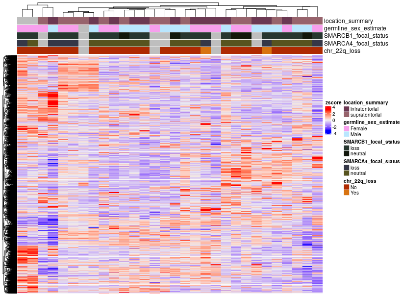
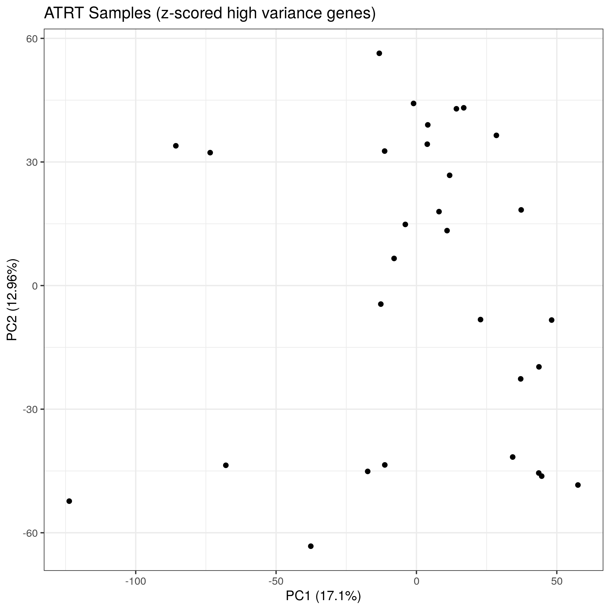

# Molecular Subtyping ATRT

**Note: The files in the `atrt-subset` directory were generated via `00-subset-files-for-ATRT.R` using the the files in the [version 12 data release](https://github.com/AlexsLemonade/OpenPBTA-analysis/pull/293).
When re-running this module, you may want to regenerate the ATRT subset files using the most recent data release.**

## Usage

To run all of the Rscripts in this module from the command line sequentially, use:

```
bash run-molecular-subtyping-ATRT.sh
```

When run in this manner, `00-subset-files-for-ATRT.R` will generate subset files using whichever files are symlinked in `data` on your local machine.

`run-molecular-subtyping-ATRT.sh` is designed to be run as if it was called from this module directory even when called from outside of this directory.

## Folder content

This folder contains scripts tasked to molecularly subtype ATRT samples in the PBTA dataset.

`00-subset-files-for-ATRT.R` selects data for ATRT samples and saves the files in `atrt-subset`.

`01-ATRT-molecular-subtyping-data-prep.Rmd` is a notebook written to prepare the RNA expression, copy number, GSVA pathway scores, structural variant, and tumor mutation burden data that are relevant for molecular subtyping. This notebook produces a final results table found at `results/ATRT_molecular_subtypes.tsv`. 

`02-ATRT-molecular-subtyping-plotting.R` is a script written to generate a heatmap and PCA plot saved in the `plots` directory of this module and displayed below.

#### Heatmap



#### PCA



## Folder structure 

The structure of this folder is as follows:

```
├── 00-subset-files-for-ATRT.R
├── 01-ATRT-molecular-subtyping-data-prep.Rmd
├── 01-ATRT-molecular-subtyping-data-prep.nb.html
├── 02-ATRT-molecular-subtyping-plotting.R
├── README.md
├── atrt-subset
│   ├── atrt_focal_cn.tsv.gz
│   ├── atrt_gistic_broad_values.tsv
│   ├── atrt_gsva.tsv
│   ├── atrt_log_expression.RDS
│   └── atrt_tmb.tsv
├── plots
│   ├── atrt_expression_pca.png
│   └── atrt_heatmap.png
├── results
│   ├── ATRT_molecular_subtypes.tsv
│   ├── final_heatmap_annotation.RDS
│   └── initial_heatmap_annotation.RDS
└── run-molecular-subtyping-ATRT.sh
```
