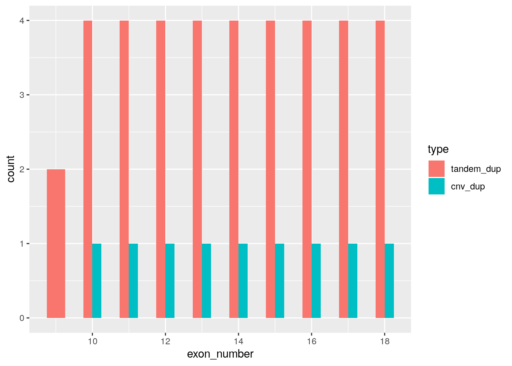

<!-- rnb-text-begin -->

---
title: "Gather CNV changes to subtype LGAT biospecimens"
author: "K S Gaonkar (D3B)"
output: html_notebook

---

In this notebook, we will look for the following CNV changes that define subtypes of LGAT
 - LGG, FGFR
 harbors FGFR1 TKD (tyrosine kinase domain tandem duplication)
 
 - LGG, CDKN2A/B
 harbors focal CDKN2A and/or CDKN2B deletion

### Setup

<!-- rnb-text-end -->


<!-- rnb-chunk-begin -->


<!-- rnb-source-begin eyJkYXRhIjoibGlicmFyeShcInRpZHl2ZXJzZVwiKSJ9 -->

```r
library("tidyverse")
```


<!-- rnb-source-end -->

<!-- rnb-message-begin eyJkYXRhIjoi4pSA4pSAIEF0dGFjaGluZyBwYWNrYWdlcyDilIDilIDilIDilIDilIDilIDilIDilIDilIDilIDilIDilIDilIDilIDilIDilIDilIDilIDilIDilIDilIDilIDilIDilIDilIDilIDilIDilIDilIDilIDilIDilIDilIDilIAgdGlkeXZlcnNlIDEuMi4xIOKUgOKUgFxuIn0= -->

```
── Attaching packages ────────────────────────────────── tidyverse 1.2.1 ──
```


<!-- rnb-message-end -->

<!-- rnb-message-begin eyJkYXRhIjoi4pyUIGdncGxvdDIgMy4yLjAgICAgIOKclCBwdXJyciAgIDAuMy4yXG7inJQgdGliYmxlICAyLjEuMyAgICAg4pyUIGRwbHlyICAgMC44LjNcbuKclCB0aWR5ciAgIDAuOC4zICAgICDinJQgc3RyaW5nciAxLjQuMFxu4pyUIHJlYWRyICAgMS4zLjEgICAgIOKclCBmb3JjYXRzIDAuNC4wXG4ifQ== -->

```
✔ ggplot2 3.2.0     ✔ purrr   0.3.2
✔ tibble  2.1.3     ✔ dplyr   0.8.3
✔ tidyr   0.8.3     ✔ stringr 1.4.0
✔ readr   1.3.1     ✔ forcats 0.4.0
```


<!-- rnb-message-end -->

<!-- rnb-message-begin eyJkYXRhIjoi4pSA4pSAIENvbmZsaWN0cyDilIDilIDilIDilIDilIDilIDilIDilIDilIDilIDilIDilIDilIDilIDilIDilIDilIDilIDilIDilIDilIDilIDilIDilIDilIDilIDilIDilIDilIDilIDilIDilIDilIDilIDilIDilIDilIAgdGlkeXZlcnNlX2NvbmZsaWN0cygpIOKUgOKUgFxu4pyWIGRwbHlyOjpmaWx0ZXIoKSBtYXNrcyBzdGF0czo6ZmlsdGVyKClcbuKcliBkcGx5cjo6bGFnKCkgICAgbWFza3Mgc3RhdHM6OmxhZygpXG4ifQ== -->

```
── Conflicts ───────────────────────────────────── tidyverse_conflicts() ──
✖ dplyr::filter() masks stats::filter()
✖ dplyr::lag()    masks stats::lag()
```


<!-- rnb-message-end -->

<!-- rnb-source-begin eyJkYXRhIjoibGlicmFyeShcIkdlbm9taWNSYW5nZXNcIikifQ== -->

```r
library("GenomicRanges")
```


<!-- rnb-source-end -->

<!-- rnb-message-begin eyJkYXRhIjoiTG9hZGluZyByZXF1aXJlZCBwYWNrYWdlOiBzdGF0czRcbiJ9 -->

```
Loading required package: stats4
```


<!-- rnb-message-end -->

<!-- rnb-message-begin eyJkYXRhIjoiTG9hZGluZyByZXF1aXJlZCBwYWNrYWdlOiBCaW9jR2VuZXJpY3NcbiJ9 -->

```
Loading required package: BiocGenerics
```


<!-- rnb-message-end -->

<!-- rnb-message-begin eyJkYXRhIjoiTG9hZGluZyByZXF1aXJlZCBwYWNrYWdlOiBwYXJhbGxlbFxuIn0= -->

```
Loading required package: parallel
```


<!-- rnb-message-end -->

<!-- rnb-message-begin eyJkYXRhIjoiXG5BdHRhY2hpbmcgcGFja2FnZTogJ0Jpb2NHZW5lcmljcydcbiJ9 -->

```

Attaching package: 'BiocGenerics'
```


<!-- rnb-message-end -->

<!-- rnb-message-begin eyJkYXRhIjoiVGhlIGZvbGxvd2luZyBvYmplY3RzIGFyZSBtYXNrZWQgZnJvbSAncGFja2FnZTpwYXJhbGxlbCc6XG5cbiAgICBjbHVzdGVyQXBwbHksIGNsdXN0ZXJBcHBseUxCLCBjbHVzdGVyQ2FsbCwgY2x1c3RlckV2YWxRLFxuICAgIGNsdXN0ZXJFeHBvcnQsIGNsdXN0ZXJNYXAsIHBhckFwcGx5LCBwYXJDYXBwbHksIHBhckxhcHBseSxcbiAgICBwYXJMYXBwbHlMQiwgcGFyUmFwcGx5LCBwYXJTYXBwbHksIHBhclNhcHBseUxCXG4ifQ== -->

```
The following objects are masked from 'package:parallel':

    clusterApply, clusterApplyLB, clusterCall, clusterEvalQ,
    clusterExport, clusterMap, parApply, parCapply, parLapply,
    parLapplyLB, parRapply, parSapply, parSapplyLB
```


<!-- rnb-message-end -->

<!-- rnb-message-begin eyJkYXRhIjoiVGhlIGZvbGxvd2luZyBvYmplY3RzIGFyZSBtYXNrZWQgZnJvbSAncGFja2FnZTpkcGx5cic6XG5cbiAgICBjb21iaW5lLCBpbnRlcnNlY3QsIHNldGRpZmYsIHVuaW9uXG4ifQ== -->

```
The following objects are masked from 'package:dplyr':

    combine, intersect, setdiff, union
```


<!-- rnb-message-end -->

<!-- rnb-message-begin eyJkYXRhIjoiVGhlIGZvbGxvd2luZyBvYmplY3RzIGFyZSBtYXNrZWQgZnJvbSAncGFja2FnZTpzdGF0cyc6XG5cbiAgICBJUVIsIG1hZCwgc2QsIHZhciwgeHRhYnNcbiJ9 -->

```
The following objects are masked from 'package:stats':

    IQR, mad, sd, var, xtabs
```


<!-- rnb-message-end -->

<!-- rnb-message-begin eyJkYXRhIjoiVGhlIGZvbGxvd2luZyBvYmplY3RzIGFyZSBtYXNrZWQgZnJvbSAncGFja2FnZTpiYXNlJzpcblxuICAgIGFueUR1cGxpY2F0ZWQsIGFwcGVuZCwgYXMuZGF0YS5mcmFtZSwgYmFzZW5hbWUsIGNiaW5kLFxuICAgIGNvbG5hbWVzLCBkaXJuYW1lLCBkby5jYWxsLCBkdXBsaWNhdGVkLCBldmFsLCBldmFscSwgRmlsdGVyLFxuICAgIEZpbmQsIGdldCwgZ3JlcCwgZ3JlcGwsIGludGVyc2VjdCwgaXMudW5zb3J0ZWQsIGxhcHBseSwgTWFwLFxuICAgIG1hcHBseSwgbWF0Y2gsIG1nZXQsIG9yZGVyLCBwYXN0ZSwgcG1heCwgcG1heC5pbnQsIHBtaW4sXG4gICAgcG1pbi5pbnQsIFBvc2l0aW9uLCByYW5rLCByYmluZCwgUmVkdWNlLCByb3duYW1lcywgc2FwcGx5LFxuICAgIHNldGRpZmYsIHNvcnQsIHRhYmxlLCB0YXBwbHksIHVuaW9uLCB1bmlxdWUsIHVuc3BsaXQsIHdoaWNoLFxuICAgIHdoaWNoLm1heCwgd2hpY2gubWluXG4ifQ== -->

```
The following objects are masked from 'package:base':

    anyDuplicated, append, as.data.frame, basename, cbind,
    colnames, dirname, do.call, duplicated, eval, evalq, Filter,
    Find, get, grep, grepl, intersect, is.unsorted, lapply, Map,
    mapply, match, mget, order, paste, pmax, pmax.int, pmin,
    pmin.int, Position, rank, rbind, Reduce, rownames, sapply,
    setdiff, sort, table, tapply, union, unique, unsplit, which,
    which.max, which.min
```


<!-- rnb-message-end -->

<!-- rnb-message-begin eyJkYXRhIjoiTG9hZGluZyByZXF1aXJlZCBwYWNrYWdlOiBTNFZlY3RvcnNcbiJ9 -->

```
Loading required package: S4Vectors
```


<!-- rnb-message-end -->

<!-- rnb-message-begin eyJkYXRhIjoiXG5BdHRhY2hpbmcgcGFja2FnZTogJ1M0VmVjdG9ycydcbiJ9 -->

```

Attaching package: 'S4Vectors'
```


<!-- rnb-message-end -->

<!-- rnb-message-begin eyJkYXRhIjoiVGhlIGZvbGxvd2luZyBvYmplY3RzIGFyZSBtYXNrZWQgZnJvbSAncGFja2FnZTpkcGx5cic6XG5cbiAgICBmaXJzdCwgcmVuYW1lXG4ifQ== -->

```
The following objects are masked from 'package:dplyr':

    first, rename
```


<!-- rnb-message-end -->

<!-- rnb-message-begin eyJkYXRhIjoiVGhlIGZvbGxvd2luZyBvYmplY3QgaXMgbWFza2VkIGZyb20gJ3BhY2thZ2U6dGlkeXInOlxuXG4gICAgZXhwYW5kXG4ifQ== -->

```
The following object is masked from 'package:tidyr':

    expand
```


<!-- rnb-message-end -->

<!-- rnb-message-begin eyJkYXRhIjoiVGhlIGZvbGxvd2luZyBvYmplY3QgaXMgbWFza2VkIGZyb20gJ3BhY2thZ2U6YmFzZSc6XG5cbiAgICBleHBhbmQuZ3JpZFxuIn0= -->

```
The following object is masked from 'package:base':

    expand.grid
```


<!-- rnb-message-end -->

<!-- rnb-message-begin eyJkYXRhIjoiTG9hZGluZyByZXF1aXJlZCBwYWNrYWdlOiBJUmFuZ2VzXG4ifQ== -->

```
Loading required package: IRanges
```


<!-- rnb-message-end -->

<!-- rnb-message-begin eyJkYXRhIjoiXG5BdHRhY2hpbmcgcGFja2FnZTogJ0lSYW5nZXMnXG4ifQ== -->

```

Attaching package: 'IRanges'
```


<!-- rnb-message-end -->

<!-- rnb-message-begin eyJkYXRhIjoiVGhlIGZvbGxvd2luZyBvYmplY3RzIGFyZSBtYXNrZWQgZnJvbSAncGFja2FnZTpkcGx5cic6XG5cbiAgICBjb2xsYXBzZSwgZGVzYywgc2xpY2VcbiJ9 -->

```
The following objects are masked from 'package:dplyr':

    collapse, desc, slice
```


<!-- rnb-message-end -->

<!-- rnb-message-begin eyJkYXRhIjoiVGhlIGZvbGxvd2luZyBvYmplY3QgaXMgbWFza2VkIGZyb20gJ3BhY2thZ2U6cHVycnInOlxuXG4gICAgcmVkdWNlXG4ifQ== -->

```
The following object is masked from 'package:purrr':

    reduce
```


<!-- rnb-message-end -->

<!-- rnb-message-begin eyJkYXRhIjoiTG9hZGluZyByZXF1aXJlZCBwYWNrYWdlOiBHZW5vbWVJbmZvRGJcbiJ9 -->

```
Loading required package: GenomeInfoDb
```


<!-- rnb-message-end -->

<!-- rnb-chunk-end -->


<!-- rnb-text-begin -->


### Input

<!-- rnb-text-end -->


<!-- rnb-chunk-begin -->


<!-- rnb-source-begin eyJkYXRhIjpbIiMgTG9vayBmb3IgZ2l0IHJvb3QgZm9sZGVyIiwicm9vdF9kaXIgPC0gcnByb2pyb290OjpmaW5kX3Jvb3QocnByb2pyb290OjpoYXNfZGlyKFwiLmdpdFwiKSkiLCIiLCIjIGdldCBzdWJzZXQgZm9sZGVyIiwic3Vic2V0X2RpciA8LSBmaWxlLnBhdGgoXG4gIHJvb3RfZGlyLFxuICBcImFuYWx5c2VzXCIsXG4gIFwibW9sZWN1bGFyLXN1YnR5cGluZy1MR0FUXCIsXG4gIFwibGdhdC1zdWJzZXRcIlxuKSIsIiIsIiMgY3JlYXRlIGlmIGRvZXNuJ3QgZXhpc3QiLCJpZiAoIWRpci5leGlzdHMoc3Vic2V0X2RpcikpIHtcbiAgZGlyLmNyZWF0ZShzdWJzZXRfZGlyKVxufSIsIiIsIiMgbWFudGEgY2FsbHMiLCJtYW50YSA8LSByZWFkX3RzdihmaWxlLnBhdGgoXG4gIHJvb3RfZGlyLFxuICBcImRhdGFcIixcbiAgXCJwYnRhLXN2LW1hbnRhLnRzdi5nelwiXG4pKSJdfQ== -->

```r
# Look for git root folder
root_dir <- rprojroot::find_root(rprojroot::has_dir(".git"))

# get subset folder
subset_dir <- file.path(
  root_dir,
  "analyses",
  "molecular-subtyping-LGAT",
  "lgat-subset"
)

# create if doesn't exist
if (!dir.exists(subset_dir)) {
  dir.create(subset_dir)
}

# manta calls
manta <- read_tsv(file.path(
  root_dir,
  "data",
  "pbta-sv-manta.tsv.gz"
))
```


<!-- rnb-source-end -->

<!-- rnb-message-begin eyJkYXRhIjoiUGFyc2VkIHdpdGggY29sdW1uIHNwZWNpZmljYXRpb246XG5jb2xzKFxuICAuZGVmYXVsdCA9IGNvbF9jaGFyYWN0ZXIoKSxcbiAgU1Yuc3RhcnQgPSBjb2xfZG91YmxlKCksXG4gIFNWLmVuZCA9IGNvbF9kb3VibGUoKSxcbiAgU1YubGVuZ3RoID0gY29sX2RvdWJsZSgpLFxuICBOTSA9IGNvbF9sb2dpY2FsKCksXG4gIENEUy5sZW5ndGggPSBjb2xfbG9naWNhbCgpLFxuICB0eC5sZW5ndGggPSBjb2xfbG9naWNhbCgpLFxuICBsb2NhdGlvbiA9IGNvbF9sb2dpY2FsKCksXG4gIGludGVyc2VjdFN0YXJ0ID0gY29sX2xvZ2ljYWwoKSxcbiAgaW50ZXJzZWN0RW5kID0gY29sX2xvZ2ljYWwoKSxcbiAgREdWX0dBSU5fbl9zYW1wbGVzX3dpdGhfU1YgPSBjb2xfZG91YmxlKCksXG4gIERHVl9HQUlOX25fc2FtcGxlc190ZXN0ZWQgPSBjb2xfZG91YmxlKCksXG4gIERHVl9HQUlOX0ZyZXF1ZW5jeSA9IGNvbF9kb3VibGUoKSxcbiAgREdWX0xPU1Nfbl9zYW1wbGVzX3dpdGhfU1YgPSBjb2xfZG91YmxlKCksXG4gIERHVl9MT1NTX25fc2FtcGxlc190ZXN0ZWQgPSBjb2xfZG91YmxlKCksXG4gIERHVl9MT1NTX0ZyZXF1ZW5jeSA9IGNvbF9kb3VibGUoKSxcbiAgWDEwMDBnX0FGID0gY29sX2RvdWJsZSgpLFxuICBYMTAwMGdfbWF4X0FGID0gY29sX2RvdWJsZSgpLFxuICBJTUhfQUYgPSBjb2xfZG91YmxlKCksXG4gIEdDY29udGVudF9sZWZ0ID0gY29sX2RvdWJsZSgpLFxuICBHQ2NvbnRlbnRfcmlnaHQgPSBjb2xfZG91YmxlKClcbiAgIyAuLi4gd2l0aCAxOSBtb3JlIGNvbHVtbnNcbilcbiJ9 -->

```
Parsed with column specification:
cols(
  .default = col_character(),
  SV.start = col_double(),
  SV.end = col_double(),
  SV.length = col_double(),
  NM = col_logical(),
  CDS.length = col_logical(),
  tx.length = col_logical(),
  location = col_logical(),
  intersectStart = col_logical(),
  intersectEnd = col_logical(),
  DGV_GAIN_n_samples_with_SV = col_double(),
  DGV_GAIN_n_samples_tested = col_double(),
  DGV_GAIN_Frequency = col_double(),
  DGV_LOSS_n_samples_with_SV = col_double(),
  DGV_LOSS_n_samples_tested = col_double(),
  DGV_LOSS_Frequency = col_double(),
  X1000g_AF = col_double(),
  X1000g_max_AF = col_double(),
  IMH_AF = col_double(),
  GCcontent_left = col_double(),
  GCcontent_right = col_double()
  # ... with 19 more columns
)
```


<!-- rnb-message-end -->

<!-- rnb-message-begin eyJkYXRhIjoiU2VlIHNwZWMoLi4uKSBmb3IgZnVsbCBjb2x1bW4gc3BlY2lmaWNhdGlvbnMuXG4ifQ== -->

```
See spec(...) for full column specifications.
```


<!-- rnb-message-end -->

<!-- rnb-warning-begin eyJkYXRhIjoiV2FybmluZzogMTg4MCBwYXJzaW5nIGZhaWx1cmVzLlxuIHJvdyAgICAgICAgICAgICBjb2wgICAgICAgICAgICAgICBleHBlY3RlZCAgIGFjdHVhbCAgICAgICAgICAgICAgICAgICAgICAgICAgICAgICAgICAgICAgICAgICAgICAgZmlsZVxuMTAyOCBHQ2NvbnRlbnRfbGVmdCAgbm8gdHJhaWxpbmcgY2hhcmFjdGVycyAgKDU2IE4pICAnL2hvbWUvcnN0dWRpby9PcGVuUEJUQS9kYXRhL3BidGEtc3YtbWFudGEudHN2Lmd6J1xuMTM1MSBHQ2NvbnRlbnRfbGVmdCAgbm8gdHJhaWxpbmcgY2hhcmFjdGVycyAgKDIwIE4pICAnL2hvbWUvcnN0dWRpby9PcGVuUEJUQS9kYXRhL3BidGEtc3YtbWFudGEudHN2Lmd6J1xuMTM1MSBHQ2NvbnRlbnRfcmlnaHQgbm8gdHJhaWxpbmcgY2hhcmFjdGVycyAgKDIwIE4pICAnL2hvbWUvcnN0dWRpby9PcGVuUEJUQS9kYXRhL3BidGEtc3YtbWFudGEudHN2Lmd6J1xuMTU2NiBHQ2NvbnRlbnRfbGVmdCAgbm8gdHJhaWxpbmcgY2hhcmFjdGVycyAgKDE5NiBOKSAnL2hvbWUvcnN0dWRpby9PcGVuUEJUQS9kYXRhL3BidGEtc3YtbWFudGEudHN2Lmd6J1xuMTU2NiBHQ2NvbnRlbnRfcmlnaHQgbm8gdHJhaWxpbmcgY2hhcmFjdGVycyAgKDE5NSBOKSAnL2hvbWUvcnN0dWRpby9PcGVuUEJUQS9kYXRhL3BidGEtc3YtbWFudGEudHN2Lmd6J1xuLi4uLiAuLi4uLi4uLi4uLi4uLi4gLi4uLi4uLi4uLi4uLi4uLi4uLi4uLiAuLi4uLi4uLiAuLi4uLi4uLi4uLi4uLi4uLi4uLi4uLi4uLi4uLi4uLi4uLi4uLi4uLi4uLi4uLi4uLlxuU2VlIHByb2JsZW1zKC4uLikgZm9yIG1vcmUgZGV0YWlscy5cbiJ9 -->

```
Warning: 1880 parsing failures.
 row             col               expected   actual                                               file
1028 GCcontent_left  no trailing characters  (56 N)  '/home/rstudio/OpenPBTA/data/pbta-sv-manta.tsv.gz'
1351 GCcontent_left  no trailing characters  (20 N)  '/home/rstudio/OpenPBTA/data/pbta-sv-manta.tsv.gz'
1351 GCcontent_right no trailing characters  (20 N)  '/home/rstudio/OpenPBTA/data/pbta-sv-manta.tsv.gz'
1566 GCcontent_left  no trailing characters  (196 N) '/home/rstudio/OpenPBTA/data/pbta-sv-manta.tsv.gz'
1566 GCcontent_right no trailing characters  (195 N) '/home/rstudio/OpenPBTA/data/pbta-sv-manta.tsv.gz'
.... ............... ...................... ........ ..................................................
See problems(...) for more details.
```


<!-- rnb-warning-end -->

<!-- rnb-source-begin eyJkYXRhIjpbIiMgY29uc2Vuc3VzIHNlZyBjYWxscyIsImNudiA8LSByZWFkX3RzdihmaWxlLnBhdGgoXG4gIHJvb3RfZGlyLFxuICBcImFuYWx5c2VzXCIsXG4gIFwiY29weV9udW1iZXJfY29uc2Vuc3VzX2NhbGxcIixcbiAgXCJyZXN1bHRzXCIsXG4gIFwicGJ0YS1jbnYtY29uc2Vuc3VzLnNlZy5nelwiXG4pKSJdfQ== -->

```r
# consensus seg calls
cnv <- read_tsv(file.path(
  root_dir,
  "analyses",
  "copy_number_consensus_call",
  "results",
  "pbta-cnv-consensus.seg.gz"
))
```


<!-- rnb-source-end -->

<!-- rnb-message-begin eyJkYXRhIjoiUGFyc2VkIHdpdGggY29sdW1uIHNwZWNpZmljYXRpb246XG5jb2xzKFxuICBJRCA9IGNvbF9jaGFyYWN0ZXIoKSxcbiAgY2hyb20gPSBjb2xfY2hhcmFjdGVyKCksXG4gIGxvYy5zdGFydCA9IGNvbF9kb3VibGUoKSxcbiAgbG9jLmVuZCA9IGNvbF9kb3VibGUoKSxcbiAgbnVtLm1hcmsgPSBjb2xfbG9naWNhbCgpLFxuICBzZWcubWVhbiA9IGNvbF9kb3VibGUoKSxcbiAgY29weS5udW0gPSBjb2xfZG91YmxlKClcbilcbiJ9 -->

```
Parsed with column specification:
cols(
  ID = col_character(),
  chrom = col_character(),
  loc.start = col_double(),
  loc.end = col_double(),
  num.mark = col_logical(),
  seg.mean = col_double(),
  copy.num = col_double()
)
```


<!-- rnb-message-end -->

<!-- rnb-source-begin eyJkYXRhIjpbIiMgY29uc2Vuc3VzIHNlZyBhbm5vdGF0ZWQgd2l0aCBnZW5lIiwiY252X2Fubm8gPC0gcmVhZF90c3YoZmlsZS5wYXRoKFxuICByb290X2RpcixcbiAgXCJhbmFseXNlc1wiLFxuICBcImZvY2FsLWNuLWZpbGUtcHJlcGFyYXRpb25cIixcbiAgXCJyZXN1bHRzXCIsXG4gIFwiY29uc2Vuc3VzX3NlZ19hbm5vdGF0ZWRfY25fYXV0b3NvbWVzLnRzdi5nelwiXG4pKSJdfQ== -->

```r
# consensus seg annotated with gene
cnv_anno <- read_tsv(file.path(
  root_dir,
  "analyses",
  "focal-cn-file-preparation",
  "results",
  "consensus_seg_annotated_cn_autosomes.tsv.gz"
))
```


<!-- rnb-source-end -->

<!-- rnb-message-begin eyJkYXRhIjoiUGFyc2VkIHdpdGggY29sdW1uIHNwZWNpZmljYXRpb246XG5jb2xzKFxuICBiaW9zcGVjaW1lbl9pZCA9IGNvbF9jaGFyYWN0ZXIoKSxcbiAgc3RhdHVzID0gY29sX2NoYXJhY3RlcigpLFxuICBjb3B5X251bWJlciA9IGNvbF9kb3VibGUoKSxcbiAgcGxvaWR5ID0gY29sX2RvdWJsZSgpLFxuICBlbnNlbWJsID0gY29sX2NoYXJhY3RlcigpLFxuICBnZW5lX3N5bWJvbCA9IGNvbF9jaGFyYWN0ZXIoKSxcbiAgY3l0b2JhbmQgPSBjb2xfY2hhcmFjdGVyKClcbilcbiJ9 -->

```
Parsed with column specification:
cols(
  biospecimen_id = col_character(),
  status = col_character(),
  copy_number = col_double(),
  ploidy = col_double(),
  ensembl = col_character(),
  gene_symbol = col_character(),
  cytoband = col_character()
)
```


<!-- rnb-message-end -->

<!-- rnb-source-begin eyJkYXRhIjpbIiMgR2VuZSBsb2NhdGlvbiBhbmQgZG9tYWluIG92ZXJsYXAgZmlsZSIsIiMgSW5wdXQgZmlsZXMgdXNlZCBmb3IgcGZhbSBpbmZvIChoZzM4KSIsIiMgaHR0cDovL2hnZG93bmxvYWQuc29lLnVjc2MuZWR1L2dvbGRlblBhdGgvaGczOC9kYXRhYmFzZS9wZmFtRGVzYy50eHQuZ3oiLCIjIGh0dHA6Ly9oZ2Rvd25sb2FkLnNvZS51Y3NjLmVkdS9nb2xkZW5QYXRoL2hnMzgvZGF0YWJhc2UvdWNzY0dlbmVQZmFtLnR4dC5neiIsIiMgYmlvbWFSdCBnZW5lL3BmYW0gbG9jYXRpb25zIGNhbGwgKGhnMzgpIiwiIyBoc2FwaWVuc19nZW5lX2Vuc2VtYmwgPT0gSHVtYW4gZ2VuZXMgKEdSQ2gzOC5wMTMpIDEwdGggRmViIDIwMjAiLCIjIGVuc2VtYmwgPC0gYmlvbWFSdDo6dXNlTWFydChiaW9tYXJ0ID0gXCJFTlNFTUJMX01BUlRfRU5TRU1CTFwiLGRhdGFzZXQgPSBcImhzYXBpZW5zX2dlbmVfZW5zZW1ibFwiLGhvc3Q9XCJlbnNlbWJsLm9yZ1wiKSIsIiMgQ29kZSB1c2VkIHRvIGdlbmVyYXRlIHBmYW1EYXRhQmlvTWFydC5SRFMgaW4gaHR0cHM6Ly9naXN0LmdpdGh1Yi5jb20va2dhb25rYXI2LzAyYjNmYmNmZWVkZGZhMjgyYTFjZGY0ODAzNzA0Nzk0IiwiIiwiYmlvTWFydERhdGFQZmFtRkdGUjEgPC1cbiAgcmVhZFJEUyhzeXN0ZW0uZmlsZShcImV4dGRhdGFcIiwgXCJwZmFtRGF0YUJpb01hcnQuUkRTXCIsIHBhY2thZ2UgPSBcImFubm9GdXNlXCIpKSAlPiVcbiAgIyB0byBjaGVjayBpZiBiaW9zcGVjaW1lbiBoYXJib3JzIEZHRlIxIFRLRCAodHlyb3NpbmUga2luYXNlIGRvbWFpbiB0YW5kZW0gZHVwbGljYXRpb24pXG4gIGRwbHlyOjpmaWx0ZXIoXG4gICAgaGduY19zeW1ib2wgPT0gXCJGR0ZSMVwiLFxuICAgIERFU0MgPT0gXCJQcm90ZWluIHR5cm9zaW5lIGtpbmFzZVwiXG4gICkiXX0= -->

```r
# Gene location and domain overlap file
# Input files used for pfam info (hg38)
# http://hgdownload.soe.ucsc.edu/goldenPath/hg38/database/pfamDesc.txt.gz
# http://hgdownload.soe.ucsc.edu/goldenPath/hg38/database/ucscGenePfam.txt.gz
# biomaRt gene/pfam locations call (hg38)
# hsapiens_gene_ensembl == Human genes (GRCh38.p13) 10th Feb 2020
# ensembl <- biomaRt::useMart(biomart = "ENSEMBL_MART_ENSEMBL",dataset = "hsapiens_gene_ensembl",host="ensembl.org")
# Code used to generate pfamDataBioMart.RDS in https://gist.github.com/kgaonkar6/02b3fbcfeeddfa282a1cdf4803704794

bioMartDataPfamFGFR1 <-
  readRDS(system.file("extdata", "pfamDataBioMart.RDS", package = "annoFuse")) %>%
  # to check if biospecimen harbors FGFR1 TKD (tyrosine kinase domain tandem duplication)
  dplyr::filter(
    hgnc_symbol == "FGFR1",
    DESC == "Protein tyrosine kinase"
  )
```


<!-- rnb-source-end -->

<!-- rnb-chunk-end -->


<!-- rnb-text-begin -->


### Gather lgat subset


<!-- rnb-text-end -->


<!-- rnb-chunk-begin -->


<!-- rnb-source-begin eyJkYXRhIjpbIiMgRmlsZSBmcm9tIDAwLUxHQVQtc2VsZWN0LXBhdGhvbG9neS1keCB0aGF0IGlzIHVzZWQgZm9yIHRoZSBwYXRob2xvZ3kgZGlhZ25vc2lzIiwiIyB3YXMgdXNlZCB0byBzdWJzZXQgY2xpbmljYWwgZmlsZSIsImxnYXRfc3BlY2ltZW5zX2RmIDwtIHJlYWRfdHN2KGZpbGUucGF0aChzdWJzZXRfZGlyLCBcImxnYXRfbWV0YWRhdGEudHN2XCIpKSJdfQ== -->

```r
# File from 00-LGAT-select-pathology-dx that is used for the pathology diagnosis
# was used to subset clinical file
lgat_specimens_df <- read_tsv(file.path(subset_dir, "lgat_metadata.tsv"))
```


<!-- rnb-source-end -->

<!-- rnb-message-begin eyJkYXRhIjoiUGFyc2VkIHdpdGggY29sdW1uIHNwZWNpZmljYXRpb246XG5jb2xzKFxuICAuZGVmYXVsdCA9IGNvbF9jaGFyYWN0ZXIoKSxcbiAgYWxpcXVvdF9pZCA9IGNvbF9kb3VibGUoKSxcbiAgaW50ZWdyYXRlZF9kaWFnbm9zaXMgPSBjb2xfbG9naWNhbCgpLFxuICBOb3RlcyA9IGNvbF9sb2dpY2FsKCksXG4gIE9TX2RheXMgPSBjb2xfZG91YmxlKCksXG4gIGFnZV9sYXN0X3VwZGF0ZV9kYXlzID0gY29sX2RvdWJsZSgpLFxuICBtb2xlY3VsYXJfc3VidHlwZSA9IGNvbF9sb2dpY2FsKCksXG4gIG5vcm1hbF9mcmFjdGlvbiA9IGNvbF9kb3VibGUoKSxcbiAgdHVtb3JfZnJhY3Rpb24gPSBjb2xfZG91YmxlKCksXG4gIHR1bW9yX3Bsb2lkeSA9IGNvbF9kb3VibGUoKVxuKVxuIn0= -->

```
Parsed with column specification:
cols(
  .default = col_character(),
  aliquot_id = col_double(),
  integrated_diagnosis = col_logical(),
  Notes = col_logical(),
  OS_days = col_double(),
  age_last_update_days = col_double(),
  molecular_subtype = col_logical(),
  normal_fraction = col_double(),
  tumor_fraction = col_double(),
  tumor_ploidy = col_double()
)
```


<!-- rnb-message-end -->

<!-- rnb-message-begin eyJkYXRhIjoiU2VlIHNwZWMoLi4uKSBmb3IgZnVsbCBjb2x1bW4gc3BlY2lmaWNhdGlvbnMuXG4ifQ== -->

```
See spec(...) for full column specifications.
```


<!-- rnb-message-end -->

<!-- rnb-source-begin eyJkYXRhIjpbIiMgRmlsdGVyIHRvIFJOQS1TZXEgc2FtcGxlcyIsImxnYXRfd2dzX2Jpb3NwZWNpbWVuX2lkcyA8LSBsZ2F0X3NwZWNpbWVuc19kZiAlPiVcbiAgZHBseXI6OmZpbHRlcihleHBlcmltZW50YWxfc3RyYXRlZ3kgPT0gXCJXR1NcIikgJT4lXG4gIGRwbHlyOjpwdWxsKEtpZHNfRmlyc3RfQmlvc3BlY2ltZW5fSUQpIiwiIiwiIyBGaWx0ZXIgQ05WIGNhbGxzIiwibWFudGFfbGdhdCA8LSBtYW50YSAlPiVcbiAgZHBseXI6OmZpbHRlcihLaWRzLkZpcnN0LkJpb3NwZWNpbWVuLklELlR1bW9yICVpbiUgbGdhdF93Z3NfYmlvc3BlY2ltZW5faWRzKSIsIiIsImNudl9sZ2F0IDwtIGNudiAlPiVcbiAgZHBseXI6OmZpbHRlcihJRCAlaW4lIGxnYXRfd2dzX2Jpb3NwZWNpbWVuX2lkcykiXX0= -->

```r
# Filter to RNA-Seq samples
lgat_wgs_biospecimen_ids <- lgat_specimens_df %>%
  dplyr::filter(experimental_strategy == "WGS") %>%
  dplyr::pull(Kids_First_Biospecimen_ID)

# Filter CNV calls
manta_lgat <- manta %>%
  dplyr::filter(Kids.First.Biospecimen.ID.Tumor %in% lgat_wgs_biospecimen_ids)

cnv_lgat <- cnv %>%
  dplyr::filter(ID %in% lgat_wgs_biospecimen_ids)
```


<!-- rnb-source-end -->

<!-- rnb-chunk-end -->


<!-- rnb-text-begin -->


### Overlap tandem duplication in FGFR1 with exons 10-18 which make up the kinase domain, per [comment](https://github.com/AlexsLemonade/OpenPBTA-analysis/issues/790#issuecomment-729229244).

First, create genomic ranges objects for CNV seg file and gene.


<!-- rnb-text-end -->


<!-- rnb-chunk-begin -->


<!-- rnb-source-begin eyJkYXRhIjpbIiMgR2Vub21pYyByYW5nZSBmb3IgY252IHNlZyBmaWxlIiwiY252X2dyIDwtIGNudiAlPiVcbiAgIyBmb3JtYXRcbiAgZHBseXI6OnJlbmFtZShcbiAgICBjaHIgPSBjaHJvbSwgc3RhcnQgPSBsb2Muc3RhcnQsIGVuZCA9IGxvYy5lbmQsXG4gICAgY29weV9udW1iZXIgPSBjb3B5Lm51bVxuICApICU+JVxuICAjIHdlIGFyZSBsb29raW5nIGZvciBkdXBsaWNhdGlvbiBldmVudHMgXG4gICMgc28gZmlsdGVyaW5nIGZvciBncmVhdGVyIHRoYW4gMiBjb3B5X251bWJlciBoZXJlXG4gIGZpbHRlcihjb3B5X251bWJlciA+MikgJT4lXG4gIGRwbHlyOjpzZWxlY3QoLW51bS5tYXJrLCAtc2VnLm1lYW4pICU+JVxuICAjIG1ha2UgZ2Vub21pYyByYW5nZXNcbiAgR2Vub21pY1Jhbmdlczo6bWFrZUdSYW5nZXNGcm9tRGF0YUZyYW1lKFxuICAgIGtlZXAuZXh0cmEuY29sdW1ucyA9IFRSVUUsXG4gICAgc3RhcnRzLmluLmRmLmFyZS4wYmFzZWQgPSBGQUxTRVxuICApIiwiIiwiIyBHZW5vbWljIHJhbmdlIGZvciBnZW5lIGxvY2F0aW9uIGFuZCBkb21haW4gb3ZlcmxhcCBmaWxlIiwiZG9tYWluX2dyIDwtIGJpb01hcnREYXRhUGZhbUZHRlIxICU+JVxuICAjIGtlZXAgb25seSBkb21haW4gaW5mb1xuICBkcGx5cjo6ZmlsdGVyKCFpcy5uYShkb21haW5fc3RhcnQpLCAhaXMubmEoZG9tYWluX2VuZCkpICU+JVxuICAjIGZvcm1hdFxuICBkcGx5cjo6bXV0YXRlKFxuICAgIHN0cmFuZCA9IGlmX2Vsc2Uoc3RyYW5kID09IFwiLTFcIiwgXCItXCIsIFwiK1wiKSxcbiAgICBkb21haW5fY2hyID0gcGFzdGUwKFwiY2hyXCIsIGRvbWFpbl9jaHIpXG4gICkgJT4lXG4gIGRwbHlyOjpyZW5hbWUoY2hyID0gZG9tYWluX2Nociwgc3RhcnQgPSBkb21haW5fc3RhcnQsIGVuZCA9IGRvbWFpbl9lbmQpICU+JVxuICAjIG1ha2UgZ2Vub21pYyByYW5nZXNcbiAgR2Vub21pY1Jhbmdlczo6bWFrZUdSYW5nZXNGcm9tRGF0YUZyYW1lKFxuICAgIGtlZXAuZXh0cmEuY29sdW1ucyA9IFRSVUUsXG4gICAgc3RhcnRzLmluLmRmLmFyZS4wYmFzZWQgPSBGQUxTRSxcbiAgICBzZXFuYW1lcy5maWVsZCA9IFwiY2hyXCJcbiAgKSJdfQ== -->

```r
# Genomic range for cnv seg file
cnv_gr <- cnv %>%
  # format
  dplyr::rename(
    chr = chrom, start = loc.start, end = loc.end,
    copy_number = copy.num
  ) %>%
  # we are looking for duplication events 
  # so filtering for greater than 2 copy_number here
  filter(copy_number >2) %>%
  dplyr::select(-num.mark, -seg.mean) %>%
  # make genomic ranges
  GenomicRanges::makeGRangesFromDataFrame(
    keep.extra.columns = TRUE,
    starts.in.df.are.0based = FALSE
  )

# Genomic range for gene location and domain overlap file
domain_gr <- bioMartDataPfamFGFR1 %>%
  # keep only domain info
  dplyr::filter(!is.na(domain_start), !is.na(domain_end)) %>%
  # format
  dplyr::mutate(
    strand = if_else(strand == "-1", "-", "+"),
    domain_chr = paste0("chr", domain_chr)
  ) %>%
  dplyr::rename(chr = domain_chr, start = domain_start, end = domain_end) %>%
  # make genomic ranges
  GenomicRanges::makeGRangesFromDataFrame(
    keep.extra.columns = TRUE,
    starts.in.df.are.0based = FALSE,
    seqnames.field = "chr"
  )
```


<!-- rnb-source-end -->

<!-- rnb-chunk-end -->


<!-- rnb-text-begin -->


### Distribution of manta SV
SV should be annotated as tandem duplicate and overlap 
"Protein tyrosine kinase" domain of FGFR1 in biospecimens


<!-- rnb-text-end -->


<!-- rnb-chunk-begin -->


<!-- rnb-source-begin eyJkYXRhIjpbIiMgR2Vub21pYyByYW5nZSBmb3IgbWFudGEgZmlsZSIsIm1hbnRhX2dyIDwtIG1hbnRhX2xnYXQgJT4lXG4gICMgZm9ybWF0XG4gIGRwbHlyOjpyZW5hbWUoXG4gICAgY2hyID0gU1YuY2hyb20sIHN0YXJ0ID0gU1Yuc3RhcnQsIGVuZCA9IFNWLmVuZCxcbiAgICBBTFQgPSBBTFRcbiAgKSAlPiVcbiAgZmlsdGVyKEdlbmUubmFtZSA9PSBcIkZHRlIxXCIgLFxuICAjIGZpbHRlciBmb3IgdGFuZGVtIGR1cGxpY2F0aW9uXG4gIEFMVCA9PSBcIjxEVVA6VEFOREVNPlwiKSAlPiVcbiAgIyBmb3JtYXQgd2l0aCBjaHIgdG8gbWF0Y2ggdG8gY252XG4gIGRwbHlyOjptdXRhdGUoY2hyID0gcGFzdGUwKFwiY2hyXCIsIGNocikpICU+JVxuICAjIG1ha2UgZ2Vub21pYyByYW5nZXNcbiAgR2Vub21pY1Jhbmdlczo6bWFrZUdSYW5nZXNGcm9tRGF0YUZyYW1lKFxuICAgIGtlZXAuZXh0cmEuY29sdW1ucyA9IFRSVUUsXG4gICAgc3RhcnRzLmluLmRmLmFyZS4wYmFzZWQgPSBGQUxTRVxuICApIiwiIiwiIyBvdmVybGFwIG1hbnRhIGFuZCBkb21haW4iLCJvdmVybGFwc19tYW50YV9mZ2ZyIDwtIElSYW5nZXM6OnN1YnNldEJ5T3ZlcmxhcHMobWFudGFfZ3IsIGRvbWFpbl9ncixtaW5vdmVybGFwID0gd2lkdGgocmFuZ2VzKGRvbWFpbl9ncikpKSIsIiIsIm92ZXJsYXBzX21hbnRhX2ZnZnJfZGYgPC0gZGF0YS5mcmFtZShcbiAgYmlvc3BlY2ltZW5faWQgPSBvdmVybGFwc19tYW50YV9mZ2ZyJEtpZHMuRmlyc3QuQmlvc3BlY2ltZW4uSUQuVHVtb3IsXG4gIEFMVCA9IG92ZXJsYXBzX21hbnRhX2ZnZnIkQUxULFxuICAjIGFubm5vdGF0aW9uIGZvciBkdXAgdGFuZGVtXG4gIEZHRlJfRFVQX1RBTkRFTSA9IFwiWWVzXCIsXG4gIHN0cmluZ3NBc0ZhY3RvcnMgPSBGQUxTRVxuKSIsIiIsIm92ZXJsYXBzX21hbnRhX2ZnZnJfZGYiXX0= -->

```r
# Genomic range for manta file
manta_gr <- manta_lgat %>%
  # format
  dplyr::rename(
    chr = SV.chrom, start = SV.start, end = SV.end,
    ALT = ALT
  ) %>%
  filter(Gene.name == "FGFR1" ,
  # filter for tandem duplication
  ALT == "<DUP:TANDEM>") %>%
  # format with chr to match to cnv
  dplyr::mutate(chr = paste0("chr", chr)) %>%
  # make genomic ranges
  GenomicRanges::makeGRangesFromDataFrame(
    keep.extra.columns = TRUE,
    starts.in.df.are.0based = FALSE
  )

# overlap manta and domain
overlaps_manta_fgfr <- IRanges::subsetByOverlaps(manta_gr, domain_gr,minoverlap = width(ranges(domain_gr)))

overlaps_manta_fgfr_df <- data.frame(
  biospecimen_id = overlaps_manta_fgfr$Kids.First.Biospecimen.ID.Tumor,
  ALT = overlaps_manta_fgfr$ALT,
  # annnotation for dup tandem
  FGFR_DUP_TANDEM = "Yes",
  stringsAsFactors = FALSE
)

overlaps_manta_fgfr_df
```


<!-- rnb-source-end -->
<div data-pagedtable="false">
  <script data-pagedtable-source type="application/json">
{"columns":[{"label":["biospecimen_id"],"name":[1],"type":["chr"],"align":["left"]},{"label":["ALT"],"name":[2],"type":["chr"],"align":["left"]},{"label":["FGFR_DUP_TANDEM"],"name":[3],"type":["chr"],"align":["left"]}],"data":[{"1":"BS_3108RS7G","2":"<DUP:TANDEM>","3":"Yes"},{"1":"BS_ETTZM63Y","2":"<DUP:TANDEM>","3":"Yes"},{"1":"BS_R726FKHP","2":"<DUP:TANDEM>","3":"Yes"},{"1":"BS_MW6YMRBJ","2":"<DUP:TANDEM>","3":"Yes"}],"options":{"columns":{"min":{},"max":[10]},"rows":{"min":[10],"max":[10]},"pages":{}}}
  </script>
</div>

<!-- rnb-chunk-end -->


<!-- rnb-text-begin -->

4 biospecimens have tandem duplication that overlap tyrosine kinase domain in FGFR1


### Distribution of copy number
CNV that are within FGFR1 gene region only and overlap "Protein tyrosine kinase" domain in FGFR1 in biospecimens


<!-- rnb-text-end -->


<!-- rnb-chunk-begin -->


<!-- rnb-source-begin eyJkYXRhIjpbIiMgZ2VuZSByZWdpb24gb3ZlcmxhcCIsImZnZnJfZ2VuZSA8LSBHZW5vbWljUmFuZ2VzOjpHUmFuZ2VzKFxuICBzZXFuYW1lcyA9IHBhc3RlMChcImNoclwiLCBkb21haW5fZ3IkY2hyb21vc29tZV9uYW1lKSxcbiAgcmFuZ2VzID0gSVJhbmdlczo6SVJhbmdlcyhzdGFydCA9IGRvbWFpbl9nciRnZW5lX3N0YXJ0LCBlbmQgPSBkb21haW5fZ3IkZ2VuZV9lbmQpXG4pIiwiIiwiIyBzdWJzZXQgY252K2RvbWFpbiBncmFuZ2UgdG8gYmUgd2l0aGluIEZHRlIxIGdlbmUgcmVnaW9uICIsImNudl9mZ2ZyX2dyIDwtIElSYW5nZXM6OnN1YnNldEJ5T3ZlcmxhcHMoXG4gIGNudl9ncixcbiAgZmdmcl9nZW5lLFxuICAjIHdpdGhpbiBGR0ZSMSBnZW5lXG4gIHR5cGUgPSBcIndpdGhpblwiLFxuICAjIG1heCBnYXAgaXMgc2hvdWxkIGJlIHdpZHRoIG9mIGdlbmUgbWludXMgd2lkdGggb2YgZG9tYWluIFxuICBtYXhnYXAgPSB3aWR0aChmZ2ZyX2dlbmUpIC0gd2lkdGgocmFuZ2VzKGRvbWFpbl9ncikpKSIsIiIsIiMgZGF0YWZyYW1lIiwib3ZlcmxhcHNfY252X2RmIDwtIGRhdGEuZnJhbWUoXG4gIGJpb3NwZWNpbWVuX2lkID0gY252X2ZnZnJfZ3IkSUQsXG4gIGNvcHlfbnVtYmVyID0gY252X2ZnZnJfZ3IkY29weV9udW1iZXIsXG4gIHN0cmluZ3NBc0ZhY3RvcnMgPSBGQUxTRVxuKSAlPiVcbiAgZHBseXI6OmRpc3RpbmN0KCkgJT4lXG4gICMga2VlcCBjb3B5X251bWJlciA+IDJcbiAgZHBseXI6Om11dGF0ZShGR0ZSX0RVUCA9IGlmX2Vsc2UoY29weV9udW1iZXIgPiAyLCBcIlllc1wiLCBcIk5vXCIpKSIsIiIsIm92ZXJsYXBzX2Nudl9kZiJdfQ== -->

```r
# gene region overlap
fgfr_gene <- GenomicRanges::GRanges(
  seqnames = paste0("chr", domain_gr$chromosome_name),
  ranges = IRanges::IRanges(start = domain_gr$gene_start, end = domain_gr$gene_end)
)

# subset cnv+domain grange to be within FGFR1 gene region 
cnv_fgfr_gr <- IRanges::subsetByOverlaps(
  cnv_gr,
  fgfr_gene,
  # within FGFR1 gene
  type = "within",
  # max gap is should be width of gene minus width of domain 
  maxgap = width(fgfr_gene) - width(ranges(domain_gr)))

# dataframe
overlaps_cnv_df <- data.frame(
  biospecimen_id = cnv_fgfr_gr$ID,
  copy_number = cnv_fgfr_gr$copy_number,
  stringsAsFactors = FALSE
) %>%
  dplyr::distinct() %>%
  # keep copy_number > 2
  dplyr::mutate(FGFR_DUP = if_else(copy_number > 2, "Yes", "No"))

overlaps_cnv_df
```


<!-- rnb-source-end -->
<div data-pagedtable="false">
  <script data-pagedtable-source type="application/json">
{"columns":[{"label":["biospecimen_id"],"name":[1],"type":["chr"],"align":["left"]},{"label":["copy_number"],"name":[2],"type":["dbl"],"align":["right"]},{"label":["FGFR_DUP"],"name":[3],"type":["chr"],"align":["left"]}],"data":[{"1":"BS_M2MSWKBC","2":"3","3":"Yes"}],"options":{"columns":{"min":{},"max":[10]},"rows":{"min":[10],"max":[10]},"pages":{}}}
  </script>
</div>

<!-- rnb-chunk-end -->


<!-- rnb-text-begin -->

5 samples have copy_number changes > 2 that overlap with tyrosine kinase domain

### Are there overlap in SV and CNV calls?


<!-- rnb-text-end -->


<!-- rnb-chunk-begin -->


<!-- rnb-source-begin eyJkYXRhIjoiaW50ZXJzZWN0KG92ZXJsYXBzX21hbnRhX2ZnZnJfZGYkYmlvc3BlY2ltZW5faWQsIG92ZXJsYXBzX2Nudl9kZiRiaW9zcGVjaW1lbl9pZCkifQ== -->

```r
intersect(overlaps_manta_fgfr_df$biospecimen_id, overlaps_cnv_df$biospecimen_id)
```


<!-- rnb-source-end -->

<!-- rnb-output-begin eyJkYXRhIjoiY2hhcmFjdGVyKDApXG4ifQ== -->

```
character(0)
```


<!-- rnb-output-end -->

<!-- rnb-chunk-end -->


<!-- rnb-text-begin -->

Only BS_MW6YMRBJ shows tandem duplication in manta and duplication in consensus seg file that overlaps tyrosine kinase domain in FGFR1

### Checking which exons overlap the above SV and CNV


<!-- rnb-text-end -->


<!-- rnb-chunk-begin -->


<!-- rnb-source-begin eyJkYXRhIjpbIiMgRGVmaW5lIHRoZSBhbm5vdGF0aW9ucyBmb3IgdGhlIGhnMzggZ2Vub21lIiwidHhkYiA8LSBHZW5vbWljRmVhdHVyZXM6Om1ha2VUeERiRnJvbUdGRihcbiAgZmlsZSA9IGZpbGUucGF0aChcbiAgICByb290X2RpciwgXCJkYXRhXCIsXG4gICAgXCJnZW5jb2RlLnYyNy5wcmltYXJ5X2Fzc2VtYmx5LmFubm90YXRpb24uZ3RmLmd6XCJcbiAgKSxcbiAgZm9ybWF0ID0gXCJndGZcIlxuKSJdfQ== -->

```r
# Define the annotations for the hg38 genome
txdb <- GenomicFeatures::makeTxDbFromGFF(
  file = file.path(
    root_dir, "data",
    "gencode.v27.primary_assembly.annotation.gtf.gz"
  ),
  format = "gtf"
)
```


<!-- rnb-source-end -->

<!-- rnb-message-begin eyJkYXRhIjoiSW1wb3J0IGdlbm9taWMgZmVhdHVyZXMgZnJvbSB0aGUgZmlsZSBhcyBhIEdSYW5nZXMgb2JqZWN0IC4uLiBPS1xuUHJlcGFyZSB0aGUgJ21ldGFkYXRhJyBkYXRhIGZyYW1lIC4uLiBPS1xuTWFrZSB0aGUgVHhEYiBvYmplY3QgLi4uIFxuIn0= -->

```
Import genomic features from the file as a GRanges object ... OK
Prepare the 'metadata' data frame ... OK
Make the TxDb object ... 
```


<!-- rnb-message-end -->

<!-- rnb-warning-begin eyJkYXRhIjoiV2FybmluZyBpbiAuZ2V0X2Nkc19JRFgobWNvbHMwJHR5cGUsIG1jb2xzMCRwaGFzZSk6IFRoZSBcInBoYXNlXCIgbWV0YWRhdGEgY29sdW1uIGNvbnRhaW5zIG5vbi1OQSB2YWx1ZXMgZm9yIGZlYXR1cmVzIG9mXG4gIHR5cGUgc3RvcF9jb2Rvbi4gVGhpcyBpbmZvcm1hdGlvbiB3YXMgaWdub3JlZC5cbiJ9 -->

```
Warning in .get_cds_IDX(mcols0$type, mcols0$phase): The "phase" metadata column contains non-NA values for features of
  type stop_codon. This information was ignored.
```


<!-- rnb-warning-end -->

<!-- rnb-message-begin eyJkYXRhIjoiT0tcbiJ9 -->

```
OK
```


<!-- rnb-message-end -->

<!-- rnb-source-begin eyJkYXRhIjpbIiMgZ2V0IGZsZnIxIGNhbm9uaWNhbCB0cmFuc2NyaXAgdHhfaWQgIiwiZmdmcjFfdHhfaWQgPC0gZW5zZW1ibGRiOjpzZWxlY3QodHhkYiwgXG4gICAgICAgICAgICAgICAgICAgICAgICAgICAgICAgICBrZXlzPSBlbnNlbWJsZGI6OmtleXModHhkYiwgXCJUWElEXCIpLFxuICAgICAgICAgICAgICAgICAgICAgICAgICAgICAgICAgY29sdW1ucz1cIlRYTkFNRVwiLCBrZXl0eXBlPVwiVFhJRFwiKSAlPiVcbiAgIyBGR0ZSMSBjYW5vbmljYWwgdHJhbnNjcmlwdFxuICAjIGdlbm9jb2RlIGNhbm9uaWNhbCB0cmFuc2NyaXB0IGh0dHBzOi8vZ2Vub21lLnVjc2MuZWR1L2NnaS1iaW4vaGdHZW5lP2RiPWhnMzgmaGdnX2dlbmU9RkdGUjFcbiAgZHBseXI6OmZpbHRlcihUWE5BTUUgPT0gXCJFTlNUMDAwMDA0NDc3MTIuNlwiKSAlPiVcbiAgcHVsbChUWElEKSJdfQ== -->

```r
# get flfr1 canonical transcrip tx_id 
fgfr1_tx_id <- ensembldb::select(txdb, 
                                 keys= ensembldb::keys(txdb, "TXID"),
                                 columns="TXNAME", keytype="TXID") %>%
  # FGFR1 canonical transcript
  # genocode canonical transcript https://genome.ucsc.edu/cgi-bin/hgGene?db=hg38&hgg_gene=FGFR1
  dplyr::filter(TXNAME == "ENST00000447712.6") %>%
  pull(TXID)
```


<!-- rnb-source-end -->

<!-- rnb-message-begin eyJkYXRhIjoiJ3NlbGVjdCgpJyByZXR1cm5lZCAxOjEgbWFwcGluZyBiZXR3ZWVuIGtleXMgYW5kIGNvbHVtbnNcbiJ9 -->

```
'select()' returned 1:1 mapping between keys and columns
```


<!-- rnb-message-end -->

<!-- rnb-source-begin eyJkYXRhIjpbIiMgR1JMaXN0IGlzIG9yZGVyZWQgdXNpbmcgdHhfaWRzIHNvIHVzaW5nICIsIiMgdGhlIGZpbHRlcmVkIHR4X2lkIGZvciBGR0ZSMSBjYW5vbmljYWwgdHJhbnNjcmlwdCIsIkdSTGlzdCA8LSBlbnNlbWJsZGI6OmV4b25zQnkodHhkYiwgYnkgPSBcInR4XCIpIiwiZmdmcjFfZXhvbnMgPC11bmxpc3QoR1JMaXN0W2ZnZnIxX3R4X2lkXSkiXX0= -->

```r
# GRList is ordered using tx_ids so using 
# the filtered tx_id for FGFR1 canonical transcript
GRList <- ensembldb::exonsBy(txdb, by = "tx")
fgfr1_exons <-unlist(GRList[fgfr1_tx_id])
```


<!-- rnb-source-end -->

<!-- rnb-chunk-end -->


<!-- rnb-text-begin -->


For manta SV calls that are within FGFR1 gene region


<!-- rnb-text-end -->


<!-- rnb-chunk-begin -->


<!-- rnb-source-begin eyJkYXRhIjpbIiMgb3ZlcmxhcCBmaWx0ZXJlZCBtYW50YSB3aXRoIGV4b25zIiwib3ZlcmxhcHNfbWFudGFfZmdmcl9leG9uIDwtIElSYW5nZXM6Om1lcmdlQnlPdmVybGFwcyhvdmVybGFwc19tYW50YV9mZ2ZyLCBmZ2ZyMV9leG9ucykiLCIiLCIjIG92ZXJsYXAgZmlsdGVyZWQgY252IHdpdGggZXhvbnMiLCJvdmVybGFwc19jbnZfZmdmcl9leG9uIDwtIElSYW5nZXM6Om1lcmdlQnlPdmVybGFwcyhjbnZfZmdmcl9nciwgZmdmcjFfZXhvbnMpIiwiIiwiIyBwbG90IGV4b24gcmFuayBmb3IgbWFudGEgYW5kIGNudiIsImdncGxvdChcbiAgcmJpbmQoXG4gICAgZGF0YS5mcmFtZShcbiAgICAgIFwiZXhvbl9udW1iZXJcIiA9IHVubGlzdChvdmVybGFwc19tYW50YV9mZ2ZyX2V4b24kZXhvbl9yYW5rKSxcbiAgICAgIFwiaWRzXCIgPSBvdmVybGFwc19tYW50YV9mZ2ZyX2V4b24kS2lkcy5GaXJzdC5CaW9zcGVjaW1lbi5JRC5UdW1vcixcbiAgICAgIFwidHlwZVwiID0gXCJ0YW5kZW1fZHVwXCJcbiAgICApLFxuICAgIGRhdGEuZnJhbWUoXG4gICAgICBcImV4b25fbnVtYmVyXCIgPSB1bmxpc3Qob3ZlcmxhcHNfY252X2ZnZnJfZXhvbiRleG9uX3JhbmspLFxuICAgICAgXCJpZHNcIiA9IG92ZXJsYXBzX2Nudl9mZ2ZyX2V4b24kSUQsXG4gICAgICBcInR5cGVcIiA9IFwiY252X2R1cFwiXG4gICAgKVxuICApLFxuICBhZXMoeCA9IGV4b25fbnVtYmVyLCBmaWxsID0gdHlwZSlcbikgK1xuICBnZW9tX2Jhciggd2lkdGg9LjUsIHBvc2l0aW9uID0gXCJkb2RnZVwiKSJdfQ== -->

```r
# overlap filtered manta with exons
overlaps_manta_fgfr_exon <- IRanges::mergeByOverlaps(overlaps_manta_fgfr, fgfr1_exons)

# overlap filtered cnv with exons
overlaps_cnv_fgfr_exon <- IRanges::mergeByOverlaps(cnv_fgfr_gr, fgfr1_exons)

# plot exon rank for manta and cnv
ggplot(
  rbind(
    data.frame(
      "exon_number" = unlist(overlaps_manta_fgfr_exon$exon_rank),
      "ids" = overlaps_manta_fgfr_exon$Kids.First.Biospecimen.ID.Tumor,
      "type" = "tandem_dup"
    ),
    data.frame(
      "exon_number" = unlist(overlaps_cnv_fgfr_exon$exon_rank),
      "ids" = overlaps_cnv_fgfr_exon$ID,
      "type" = "cnv_dup"
    )
  ),
  aes(x = exon_number, fill = type)
) +
  geom_bar( width=.5, position = "dodge")
```


<!-- rnb-source-end -->

<!-- rnb-plot-begin -->



<!-- rnb-plot-end -->

<!-- rnb-chunk-end -->


<!-- rnb-text-begin -->

Majority SV and CNV overlap exons downstream of exon 9

All 4 biospecimens with tandem duplication in FGFR1 and 5 biospecimens with duplication in FGFR1 have atleast 1 SV/CNV overlap a region comprised of exons between 10 and 18. 


### CDKN2A/B deletion 


<!-- rnb-text-end -->


<!-- rnb-chunk-begin -->


<!-- rnb-source-begin eyJkYXRhIjpbImNudl9hbm5vX2Nka24yIDwtIGNudl9hbm5vICU+JVxuICBkcGx5cjo6ZmlsdGVyKGdlbmVfc3ltYm9sICVpbiUgYyhcIkNES04yQVwiLCBcIkNES04yQlwiKSkgJT4lXG4gIHJlc2hhcGU6OmNhc3QoYmlvc3BlY2ltZW5faWQgKyBwbG9pZHkgfiBnZW5lX3N5bWJvbCwgdmFsdWUgPSBcImNvcHlfbnVtYmVyXCIpICU+JVxuICAjIGtlZXAgb25seSBpZiBjb3B5X251bWJlciA8PTFcbiAgZHBseXI6Om11dGF0ZShcbiAgICBDREtOMkFfREVMID0gaWZfZWxzZShDREtOMkEgPD0gMSwgXCJZZXNcIiwgXCJOb1wiKSxcbiAgICBDREtOMkJfREVMID0gaWZfZWxzZShDREtOMkIgPD0gMSwgXCJZZXNcIiwgXCJOb1wiKVxuICApICU+JVxuICBkcGx5cjo6ZGlzdGluY3QoKSIsIiIsImNudl9hbm5vX2Nka24yIl19 -->

```r
cnv_anno_cdkn2 <- cnv_anno %>%
  dplyr::filter(gene_symbol %in% c("CDKN2A", "CDKN2B")) %>%
  reshape::cast(biospecimen_id + ploidy ~ gene_symbol, value = "copy_number") %>%
  # keep only if copy_number <=1
  dplyr::mutate(
    CDKN2A_DEL = if_else(CDKN2A <= 1, "Yes", "No"),
    CDKN2B_DEL = if_else(CDKN2B <= 1, "Yes", "No")
  ) %>%
  dplyr::distinct()

cnv_anno_cdkn2
```


<!-- rnb-source-end -->
<div data-pagedtable="false">
  <script data-pagedtable-source type="application/json">
{"columns":[{"label":["biospecimen_id"],"name":[1],"type":["chr"],"align":["left"]},{"label":["ploidy"],"name":[2],"type":["dbl"],"align":["right"]},{"label":["CDKN2A"],"name":[3],"type":["dbl"],"align":["right"]},{"label":["CDKN2B"],"name":[4],"type":["dbl"],"align":["right"]},{"label":["CDKN2A_DEL"],"name":[5],"type":["chr"],"align":["left"]},{"label":["CDKN2B_DEL"],"name":[6],"type":["chr"],"align":["left"]}],"data":[{"1":"BS_02W5H7K5","2":"4","3":"3","4":"3","5":"No","6":"No"},{"1":"BS_17FVWMNV","2":"2","3":"3","4":"3","5":"No","6":"No"},{"1":"BS_1AZ8YJSH","2":"2","3":"1","4":"1","5":"Yes","6":"Yes"},{"1":"BS_25VZM81R","2":"2","3":"1","4":"1","5":"Yes","6":"Yes"},{"1":"BS_2JDVY4F7","2":"3","3":"2","4":"2","5":"No","6":"No"},{"1":"BS_30W38X77","2":"2","3":"1","4":"1","5":"Yes","6":"Yes"},{"1":"BS_376Q9QKG","2":"4","3":"7","4":"7","5":"No","6":"No"},{"1":"BS_3BMGF6GN","2":"2","3":"1","4":"1","5":"Yes","6":"Yes"},{"1":"BS_3NX3RBCX","2":"2","3":"0","4":"0","5":"Yes","6":"Yes"},{"1":"BS_55N7KFHW","2":"2","3":"3","4":"3","5":"No","6":"No"},{"1":"BS_5KFAEMQJ","2":"2","3":"3","4":"3","5":"No","6":"No"},{"1":"BS_5XZP7F4Q","2":"4","3":"3","4":"3","5":"No","6":"No"},{"1":"BS_6FYTRKJJ","2":"2","3":"3","4":"3","5":"No","6":"No"},{"1":"BS_6T87HSPX","2":"2","3":"1","4":"1","5":"Yes","6":"Yes"},{"1":"BS_7M7JNG00","2":"3","3":"1","4":"1","5":"Yes","6":"Yes"},{"1":"BS_823V5X6Z","2":"3","3":"2","4":"2","5":"No","6":"No"},{"1":"BS_83MSWR59","2":"4","3":"3","4":"3","5":"No","6":"No"},{"1":"BS_86QSEFS7","2":"2","3":"1","4":"1","5":"Yes","6":"Yes"},{"1":"BS_872Q3FK2","2":"2","3":"3","4":"3","5":"No","6":"No"},{"1":"BS_9BGCH82S","2":"2","3":"1","4":"1","5":"Yes","6":"Yes"},{"1":"BS_9NF39QAW","2":"2","3":"1","4":"1","5":"Yes","6":"Yes"},{"1":"BS_A3EV6FXK","2":"2","3":"3","4":"3","5":"No","6":"No"},{"1":"BS_A4KYP5H0","2":"4","3":"5","4":"5","5":"No","6":"No"},{"1":"BS_AG6M7TJE","2":"2","3":"1","4":"1","5":"Yes","6":"Yes"},{"1":"BS_B6K0N6HS","2":"2","3":"1","4":"1","5":"Yes","6":"Yes"},{"1":"BS_CK7CPM73","2":"2","3":"1","4":"1","5":"Yes","6":"Yes"},{"1":"BS_DW1CYEXP","2":"2","3":"1","4":"1","5":"Yes","6":"Yes"},{"1":"BS_E42SSQGJ","2":"2","3":"1","4":"1","5":"Yes","6":"Yes"},{"1":"BS_EJV0N3BX","2":"2","3":"1","4":"1","5":"Yes","6":"Yes"},{"1":"BS_EP25TTAG","2":"2","3":"1","4":"1","5":"Yes","6":"Yes"},{"1":"BS_EPM623G4","2":"2","3":"1","4":"1","5":"Yes","6":"Yes"},{"1":"BS_F8K4VQMF","2":"3","3":"0","4":"0","5":"Yes","6":"Yes"},{"1":"BS_FHE6Z73G","2":"2","3":"1","4":"1","5":"Yes","6":"Yes"},{"1":"BS_GFS9JEE6","2":"2","3":"3","4":"3","5":"No","6":"No"},{"1":"BS_H8MAKDRB","2":"4","3":"2","4":"2","5":"No","6":"No"},{"1":"BS_J4E9SW51","2":"2","3":"3","4":"3","5":"No","6":"No"},{"1":"BS_JTBM5TSE","2":"4","3":"3","4":"3","5":"No","6":"No"},{"1":"BS_KHSYAB3J","2":"2","3":"1","4":"1","5":"Yes","6":"Yes"},{"1":"BS_KXGJ1HMG","2":"2","3":"1","4":"1","5":"Yes","6":"Yes"},{"1":"BS_KY1CTGJ3","2":"2","3":"1","4":"1","5":"Yes","6":"Yes"},{"1":"BS_M4E4H6NG","2":"2","3":"1","4":"1","5":"Yes","6":"Yes"},{"1":"BS_MW16Y7ME","2":"2","3":"3","4":"3","5":"No","6":"No"},{"1":"BS_NCGGFG6H","2":"2","3":"1","4":"1","5":"Yes","6":"Yes"},{"1":"BS_NHRNZRQV","2":"4","3":"5","4":"5","5":"No","6":"No"},{"1":"BS_P4K6WK9Y","2":"2","3":"1","4":"1","5":"Yes","6":"Yes"},{"1":"BS_P8WN8XEQ","2":"3","3":"2","4":"2","5":"No","6":"No"},{"1":"BS_PFXDWV9R","2":"2","3":"3","4":"3","5":"No","6":"No"},{"1":"BS_PVYMDM18","2":"2","3":"3","4":"3","5":"No","6":"No"},{"1":"BS_PVZJCXS1","2":"2","3":"1","4":"1","5":"Yes","6":"Yes"},{"1":"BS_PYVPKH11","2":"2","3":"1","4":"1","5":"Yes","6":"Yes"},{"1":"BS_QDGHHS4S","2":"4","3":"1","4":"1","5":"Yes","6":"Yes"},{"1":"BS_QQP17PDQ","2":"2","3":"1","4":"1","5":"Yes","6":"Yes"},{"1":"BS_R1G6SG0K","2":"2","3":"1","4":"1","5":"Yes","6":"Yes"},{"1":"BS_R726FKHP","2":"2","3":"3","4":"3","5":"No","6":"No"},{"1":"BS_R7YMKNJN","2":"2","3":"1","4":"1","5":"Yes","6":"Yes"},{"1":"BS_RG6JK7ZN","2":"2","3":"1","4":"1","5":"Yes","6":"Yes"},{"1":"BS_RXSBJ929","2":"2","3":"1","4":"1","5":"Yes","6":"Yes"},{"1":"BS_S0T3CQ97","2":"2","3":"1","4":"1","5":"Yes","6":"Yes"},{"1":"BS_S791VC80","2":"2","3":"1","4":"1","5":"Yes","6":"Yes"},{"1":"BS_SD28E0SC","2":"3","3":"2","4":"2","5":"No","6":"No"},{"1":"BS_SK4H5MJQ","2":"2","3":"1","4":"1","5":"Yes","6":"Yes"},{"1":"BS_SQSH5G7A","2":"3","3":"2","4":"2","5":"No","6":"No"},{"1":"BS_STNH7YSX","2":"2","3":"1","4":"1","5":"Yes","6":"Yes"},{"1":"BS_SYGKQD8M","2":"4","3":"3","4":"3","5":"No","6":"No"},{"1":"BS_T1SNKF50","2":"4","3":"3","4":"3","5":"No","6":"No"},{"1":"BS_VF099E8S","2":"2","3":"1","4":"1","5":"Yes","6":"Yes"},{"1":"BS_YETTZ1NC","2":"3","3":"4","4":"4","5":"No","6":"No"},{"1":"BS_Z1BBZ01F","2":"2","3":"1","4":"1","5":"Yes","6":"Yes"},{"1":"BS_Z9PKZ4RT","2":"2","3":"1","4":"1","5":"Yes","6":"Yes"},{"1":"BS_ZV21J6YW","2":"2","3":"1","4":"1","5":"Yes","6":"Yes"},{"1":"BS_ZZJF26C4","2":"2","3":"3","4":"3","5":"No","6":"No"}],"options":{"columns":{"min":{},"max":[10]},"rows":{"min":[10],"max":[10]},"pages":{}}}
  </script>
</div>

<!-- rnb-chunk-end -->


<!-- rnb-text-begin -->


### Gather CNV subsets


<!-- rnb-text-end -->


<!-- rnb-chunk-begin -->


<!-- rnb-source-begin eyJkYXRhIjpbIiMgbWVyZ2UgQ05WIHN1YnR5cGUgYW5ub3RhdGlvbiIsIm1lcmdlX0NOVl9zdWJzdHlwZSA8LSBkcGx5cjo6c2VsZWN0KG92ZXJsYXBzX21hbnRhX2ZnZnJfZGYsIGJpb3NwZWNpbWVuX2lkLCBGR0ZSX0RVUF9UQU5ERU0pICU+JVxuICBmdWxsX2pvaW4oZHBseXI6OnNlbGVjdChvdmVybGFwc19jbnZfZGYsIGJpb3NwZWNpbWVuX2lkLCBGR0ZSX0RVUCkpICU+JVxuICBmdWxsX2pvaW4oZHBseXI6OnNlbGVjdChjbnZfYW5ub19jZGtuMiwgYmlvc3BlY2ltZW5faWQsIENES04yQV9ERUwsIENES04yQl9ERUwpKSJdfQ== -->

```r
# merge CNV subtype annotation
merge_CNV_substype <- dplyr::select(overlaps_manta_fgfr_df, biospecimen_id, FGFR_DUP_TANDEM) %>%
  full_join(dplyr::select(overlaps_cnv_df, biospecimen_id, FGFR_DUP)) %>%
  full_join(dplyr::select(cnv_anno_cdkn2, biospecimen_id, CDKN2A_DEL, CDKN2B_DEL))
```


<!-- rnb-source-end -->

<!-- rnb-message-begin eyJkYXRhIjoiSm9pbmluZywgYnkgPSBcImJpb3NwZWNpbWVuX2lkXCJcbkpvaW5pbmcsIGJ5ID0gXCJiaW9zcGVjaW1lbl9pZFwiXG4ifQ== -->

```
Joining, by = "biospecimen_id"
Joining, by = "biospecimen_id"
```


<!-- rnb-message-end -->

<!-- rnb-source-begin eyJkYXRhIjpbIiMgbWVyZ2UgYWxsIGxnYXQgV0dTIHNhbXBsZXMiLCJMR0FUX2Nudl9zdWJzZXQgPC0gYXMuZGF0YS5mcmFtZShsZ2F0X3dnc19iaW9zcGVjaW1lbl9pZHMpICU+JVxuICBsZWZ0X2pvaW4obWVyZ2VfQ05WX3N1YnN0eXBlLCBieSA9IGMoXCJsZ2F0X3dnc19iaW9zcGVjaW1lbl9pZHNcIiA9IFwiYmlvc3BlY2ltZW5faWRcIikpICU+JVxuICAjIGNoYW5nZSBOQSB0byB2YWx1ZT09Tm9cbiAgcmVwbGFjZV9uYShsaXN0KFxuICAgIEZHRlJfRFVQX1RBTkRFTSA9IFwiTm9cIixcbiAgICBGR0ZSX0RVUCA9IFwiTm9cIixcbiAgICBDREtOMkFfREVMID0gXCJOb1wiLFxuICAgIENES04yQl9ERUwgPSBcIk5vXCJcbiAgKSkgIl19 -->

```r
# merge all lgat WGS samples
LGAT_cnv_subset <- as.data.frame(lgat_wgs_biospecimen_ids) %>%
  left_join(merge_CNV_substype, by = c("lgat_wgs_biospecimen_ids" = "biospecimen_id")) %>%
  # change NA to value==No
  replace_na(list(
    FGFR_DUP_TANDEM = "No",
    FGFR_DUP = "No",
    CDKN2A_DEL = "No",
    CDKN2B_DEL = "No"
  )) 
```


<!-- rnb-source-end -->

<!-- rnb-warning-begin eyJkYXRhIjoiV2FybmluZzogQ29sdW1uIGBsZ2F0X3dnc19iaW9zcGVjaW1lbl9pZHNgL2BiaW9zcGVjaW1lbl9pZGAgam9pbmluZyBmYWN0b3JcbmFuZCBjaGFyYWN0ZXIgdmVjdG9yLCBjb2VyY2luZyBpbnRvIGNoYXJhY3RlciB2ZWN0b3JcbiJ9 -->

```
Warning: Column `lgat_wgs_biospecimen_ids`/`biospecimen_id` joining factor
and character vector, coercing into character vector
```


<!-- rnb-warning-end -->

<!-- rnb-source-begin eyJkYXRhIjpbIiMgY2hlY2sgZnJlcXVlbmN5IC0gZG9lcyB0aGlzIGFsaWduIHdpdGggdGhlIExHRyBwYXBlciBvZiA5LjYlPyBXZSBnZXQgfjMuMyUsIGhvd2V2ZXIsIHRoZSBwYXBlciBhbHNvIHN0YXRlcyB0aGF0IHRoaXMgZGVsZXRpb24gbW9zdCBmcmVxdWVudGx5IGNvLW9jY3VycyB3aXRoIEJSQUYgVjYwMEUsIHNvIGlmIHdlIGhhdmUgYSBsb3dlciBwcmV2YWxlbmNlIG9mIHRoYXQgU05WLCB0aGVuIHRoaXMgY291bGQgbWFrZSBzZW5zZS4gTGV0J3MgY2lyY2xlIGJhY2sgd2hlbiB3ZSBwdXQgYWxsIG9mIHRoZSBkYXRhIHRvZ2V0aGVyLiIsIkNOVl9ieV9wYXJ0IDwtIExHQVRfY252X3N1YnNldCAlPiVcbiAgbGVmdF9qb2luKGxnYXRfc3BlY2ltZW5zX2RmLGJ5ID0gYyhcImxnYXRfd2dzX2Jpb3NwZWNpbWVuX2lkc1wiID0gXCJLaWRzX0ZpcnN0X0Jpb3NwZWNpbWVuX0lEXCIpKSAlPiVcbiAgZHBseXI6OnNlbGVjdChLaWRzX0ZpcnN0X1BhcnRpY2lwYW50X0lELCBDREtOMkFfREVMKSAlPiVcbiAgZGlzdGluY3QoKSIsIiIsIkNOVl9ieV9wYXJ0ICU+JVxuICB0YWxseShDREtOMkFfREVMID09IFwiWWVzXCIpIC8gbnJvdyhDTlZfYnlfcGFydCkgKiAxMDAiXX0= -->

```r
# check frequency - does this align with the LGG paper of 9.6%? We get ~3.3%, however, the paper also states that this deletion most frequently co-occurs with BRAF V600E, so if we have a lower prevalence of that SNV, then this could make sense. Let's circle back when we put all of the data together.
CNV_by_part <- LGAT_cnv_subset %>%
  left_join(lgat_specimens_df,by = c("lgat_wgs_biospecimen_ids" = "Kids_First_Biospecimen_ID")) %>%
  dplyr::select(Kids_First_Participant_ID, CDKN2A_DEL) %>%
  distinct()

CNV_by_part %>%
  tally(CDKN2A_DEL == "Yes") / nrow(CNV_by_part) * 100
```


<!-- rnb-source-end -->
<div data-pagedtable="false">
  <script data-pagedtable-source type="application/json">
{"columns":[{"label":["n"],"name":[1],"type":["dbl"],"align":["right"]}],"data":[{"1":"3.345725"}],"options":{"columns":{"min":{},"max":[10]},"rows":{"min":[10],"max":[10]},"pages":{}}}
  </script>
</div>
<!-- rnb-source-begin eyJkYXRhIjoid3JpdGVfdHN2KExHQVRfY252X3N1YnNldCwgZmlsZS5wYXRoKHN1YnNldF9kaXIsIFwiTEdBVF9jbnZfc3Vic2V0LnRzdlwiKSkifQ== -->

```r
write_tsv(LGAT_cnv_subset, file.path(subset_dir, "LGAT_cnv_subset.tsv"))
```


<!-- rnb-source-end -->

<!-- rnb-chunk-end -->

