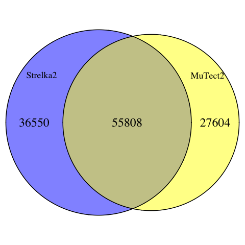
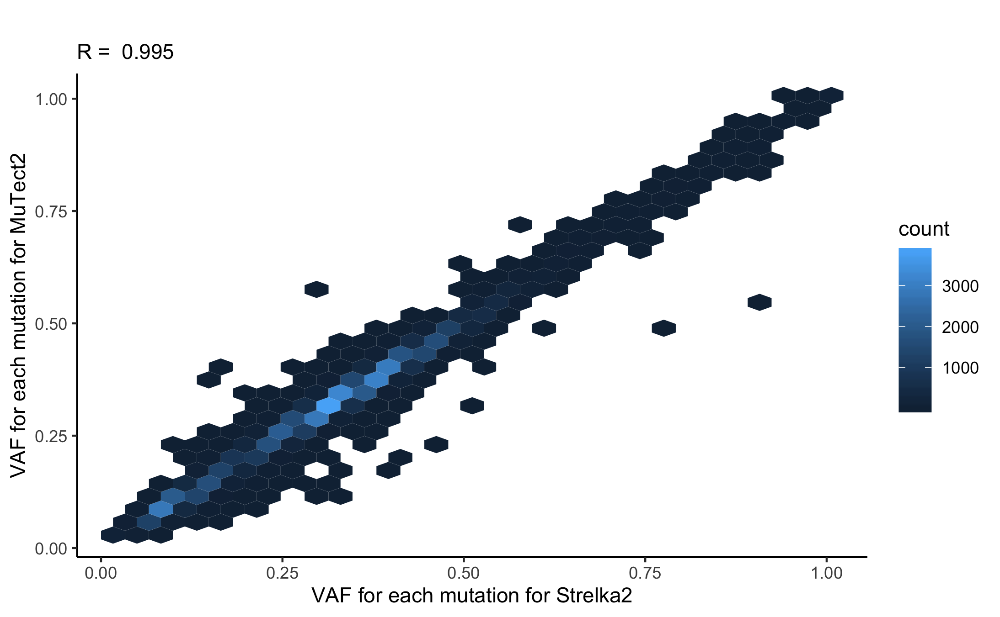
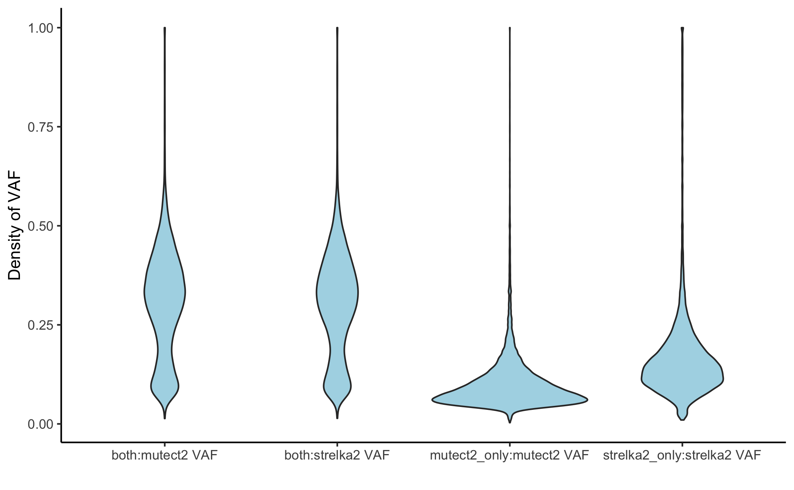
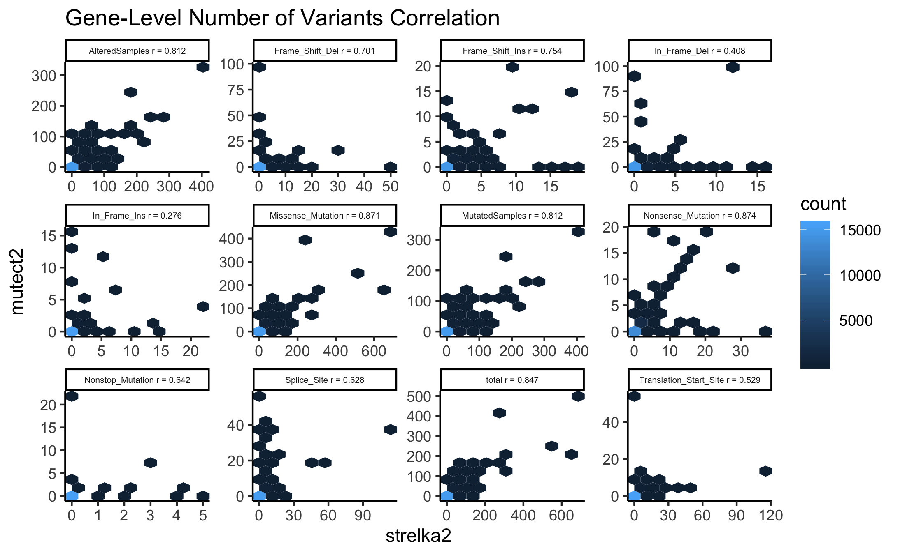
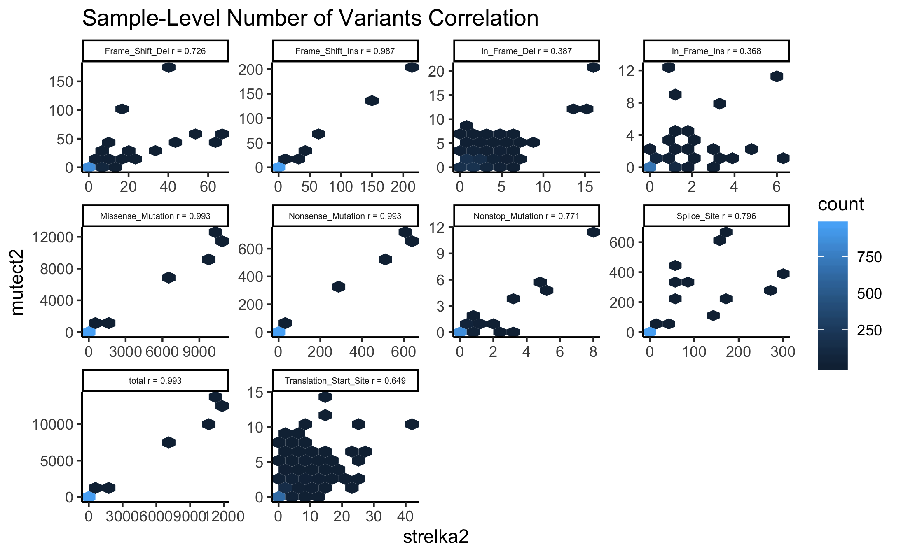

# DEPRECATED: Mutect2 vs Strelka2: SNV caller comparison analysis

This deprecated analysis evaluated Mutect2 and Strelka2 mutation calls by comparing their [MAF files](https://docs.gdc.cancer.gov/Data/File_Formats/MAF_Format/) but has since been superseded by the more [comprehensive analysis for all four SNV Callers](https://github.com/AlexsLemonade/OpenPBTA-analysis/tree/master/analyses/snv-callers).
The original issue for this analysis is [here](https://github.com/AlexsLemonade/OpenPBTA-analysis/issues/30).
The findings of this analysis led to the addition of two other mutation callers, [VarDict and Lancet](https://github.com/AlexsLemonade/OpenPBTA-analysis/issues/103).

Note that this analysis uses `maftools::read.maf` which by default only uses coding and nonsynonymous mutations. 

## Summary of findings:

- MuTect2 and Strelka2 detect [55,808 of the same variants](#venn-diagrams).
This as defined by having the same Hugo gene symbol, base change, chromosomal
start site, and sample of origin (see notebook [01-set-up.Rmd](https://github.com/AlexsLemonade/OpenPBTA-analysis/tree/master/analyses/mutect2-vs-strelka2/01-set-up.Rmd)
for more details).
If moving forward we want only the most reliably called variants, this set of
55,808 variants would give us plenty to work with.


- MuTect2 and Strelka2 highly agree in their Variant allele frequency (VAF) calculations.
This is good regardless of our choices moving forward.


- Variants detected only by MuTect2 have a particularly low VAF compared to
variants detected only by Strelka2.
These density plots suggest some of these MuTect2 calls may be noise.
Although these low-VAF of MuTect2 could be identifying true variants, our further
analyses would probably benefit from a more robust, higher confidence set of
variants.


- MuTect2 also registers dinucleotide and larger variants where Strelka2 seems
to break these variants into their single nucleotide changes.
In these analyses, these base changes have been grouped together and collectively
called `long_changes`.
The higher base resolution of Strelka2, and its ability to parse apart the SNVs
from each other, is more useful to us for this particular analyses, as the larger
structural variants are better detected in the Manta or LUMPY analyses.

### Gene Summary



### Sample summary



## Usage

This comparison consists of two notebooks.
To re-run this comparison from command line, run the following:
```
Rscript -e "rmarkdown::render('analyses/mutect2-vs-strelka2/01-set-up.Rmd', clean = TRUE)"
Rscript -e "rmarkdown::render('analyses/mutect2-vs-strelka2/02-analyze-concordance.Rmd', clean = TRUE)"
```
