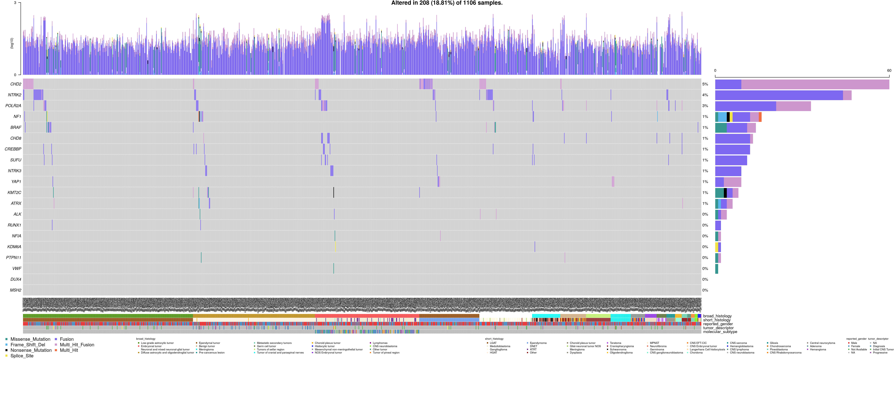

# OpenPBTA Oncoprint

## Usage

To run the Rscript in this module from the command line as intended, use:

```
bash run-oncoprint.sh
```

`run-oncoprint.sh` is designed to be run as if it was called from this module directory even when called from outside of this directory.

## Folder content

This folder contains a script tasked to produce an oncoprint displaying the lanscape of the genetic lesions in the PBTA dataset.

`01-plot-oncoprint.R` is a script written produce an oncoprint displaying the lanscape of the genetic lesions in the PBTA dataset (as discussed in [issue #6](https://github.com/AlexsLemonade/OpenPBTA-analysis/issues/6)).  
This script produces an oncoprint plot containing SNV information, as well as the optional CNV and fusion information.   

_The oncoprint can be viewed below:_


## Folder structure 

The structure of this folder is as follows:

```
oncoprint-landscape
├── README.md
├── run-oncoprint.sh
├── 01-plot-oncoprint.R
├── driver-lists
│   ├── brain-goi-list-long.txt
│   └── brain-goi-list-short.txt
├── plots
│   └── maf_oncoprint.png

```
