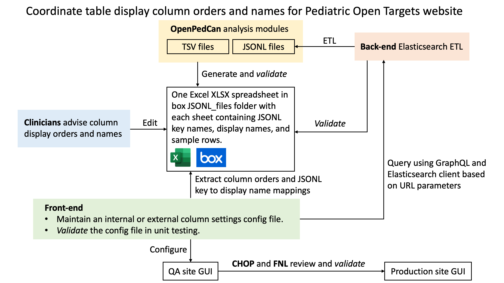

# Pediatric Open Targets website table column display order and name

**Module author:** Yuanchao Zhang ([@logstar](https://github.com/logstar))

## Purpose

The `pedot-table-column-display-order-name` analysis module generates and validates an Excel spreadsheet for Pediatric Open Targets (PedOT) website table display orders and names.

The Excel spreadsheet will be used to coordinate table column order and name changes on PedOT website table views, and the coordination plan is summarized in the following diagram.

The main consideration for this coordination plan is that the Excel spreadsheet allows clinicians to advise column display orders and names without any programming barrier, as suggested by @jharenza . Another consideration is that front-end GraphQL requires variable names to have no space or `/` (<http://spec.graphql.org/June2018/#sec-Names>), but such characters may be used in the display column names, so the display names may have to be implemented in the front-end. The Excel spreadsheet probably could also be converted to JSON objects by front-end developers using Python `pandas.read_excel` to reduce manual conversions. Additionally, multiple validation sub-tasks are suggested by @jonkiky to ensure that the front-end column configuration file aligns with the back-end database.

**Notes**:

- This analysis module is mainly based on the Slack discussions at <https://opentargetspediatrics.slack.com/archives/C021Z53SK98/p1628181091109300>.
- This analysis module addresses issue <https://github.com/PediatricOpenTargets/ticket-tracker/issues/157>.

## Methods

Generate the Excel spreadsheet using the TSV result files in the following modules.

- `cnv-frequencies`
- `fusion-frequencies`
- `rna-seq-expression-summary-stats`
- `snv-frequencies`

Each sheet in the Excel spreadsheet has name as the filename of the following JSONL files.

- `variant-level-snv-consensus-annotated-mut-freq.jsonl.gz`
- `gene-level-snv-consensus-annotated-mut-freq.jsonl.gz`
- `putative-oncogene-fusion-freq.jsonl.gz`
- `putative-oncogene-fused-gene-freq.jsonl.gz`
- `long_n_tpm_mean_sd_quantile_gene_wise_zscore.jsonl.gz`
- `long_n_tpm_mean_sd_quantile_group_wise_zscore.jsonl.gz`
- `gene-level-cnv-consensus-annotated-mut-freq.jsonl.gz`

Each sheet contains the following rows.

- Column names in the JSONL/TSV files.
- Column names for PedOT table view display.
- 10 sample rows of table values.

## Results

## Usage

1. Change working directory to local `OpenPedCan-analysis`.
2. Run this analysis module in the continuous integration (CI) docker image using `./scripts/run_in_ci.sh bash analyses/pedot-table-column-display-order-name/run-pedot-table-column-display-order-name.sh`.

## Module structure

## Analysis scripts

### 01-some-script

Usage:

Input:

Parameters:

Output:
