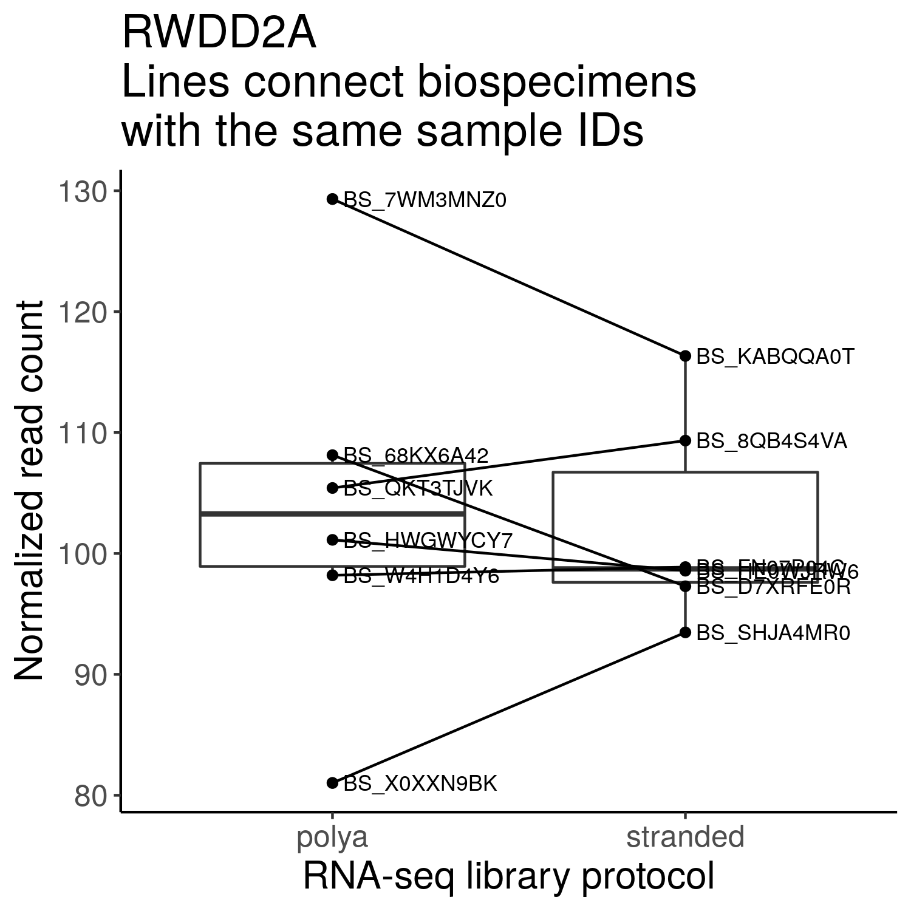
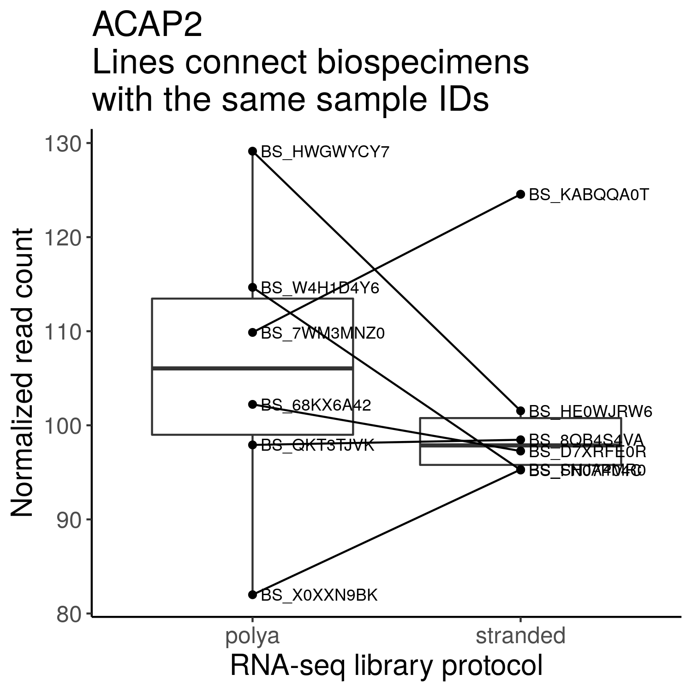
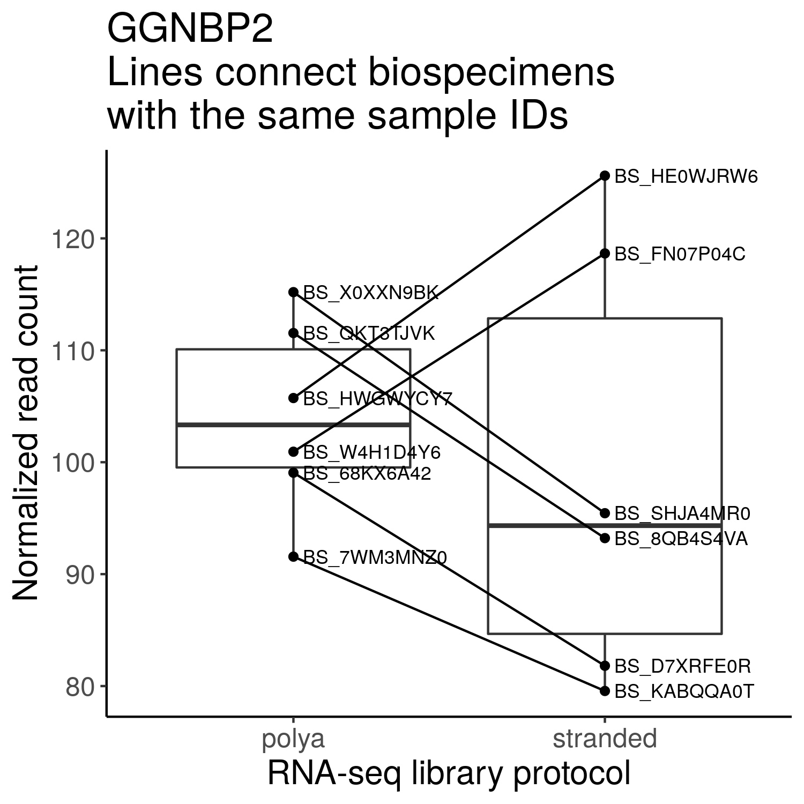

## Differential gene expression analysis comparing poly-A and ribodeplete-stranded RNA-seq protocols

**Module authors:** Yuanchao Zhang ([@logstar](https://github.com/logstar))

### Purpose

Perform differential gene expression (DGE) analysis to compare RNA-seq libraries that are prepared using poly-A or ribodeplete-stranded protocols from the same samples.

Check whether the p-values from DGE analysis follow a uniform distribution.

Select genes that are stably expressed in poly-A and stranded RNA-seq libraries.

### Methods

1. Collapse `pbta-gene-counts-rsem-expected_count` of stranded and poly-A libraries using the OpenPBTA-analysis/analyses/collapse-rnaseq module.
2. Select `Kids_First_Biospecimen`s with the same `sample_id`s and both stranded and poly-A `RNA_library`s.
    Index | Kids_First_Biospecimen_ID | sample_id | experimental_strategy | RNA_library | cohort
    ------|---------------------------|-----------|-----------------------|-------------|--------
    1     | BS_HE0WJRW6               | 7316-1455 | RNA-Seq               | stranded    | CBTN
    2     | BS_HWGWYCY7               | 7316-1455 | RNA-Seq               | poly-A      | CBTN
    3     | BS_SHJA4MR0               | 7316-161  | RNA-Seq               | stranded    | CBTN
    4     | BS_X0XXN9BK               | 7316-161  | RNA-Seq               | poly-A      | CBTN
    5     | BS_FN07P04C               | 7316-255  | RNA-Seq               | stranded    | CBTN
    6     | BS_W4H1D4Y6               | 7316-255  | RNA-Seq               | poly-A      | CBTN
    7     | BS_8QB4S4VA               | 7316-536  | RNA-Seq               | stranded    | CBTN
    8     | BS_QKT3TJVK               | 7316-536  | RNA-Seq               | poly-A      | CBTN
    9     | BS_7WM3MNZ0               | A16915    | RNA-Seq               | poly-A      | PNOC003
    10    | BS_KABQQA0T               | A16915    | RNA-Seq               | stranded    | PNOC003
    11    | BS_68KX6A42               | A18777    | RNA-Seq               | poly-A      | PNOC003
    12    | BS_D7XRFE0R               | A18777    | RNA-Seq               | stranded    | PNOC003
3. Run edgeR `exactTest`, edgeR `glmLRT`, edgeR `glmQLFTest`, and DESeq2 `nbinomWaldTest` comparing stranded and poly-A RNA-seq `rsem-expected_count`s, using an adapted workflow from the [OMPARE project](https://github.com/d3b-center/OMPARE/blob/master/code/patient_level_analyses/utils/rnaseq_edger_normalizations.R#L37-L41). RSEM expected read counts are normalized using either UQ-pgQ2 or TMM. The UQ-pgQ2 normalization method has lower false positive rate in DGE testing (<https://bmcgenomics.biomedcentral.com/articles/10.1186/s12864-020-6502-7>).
4. Run DESeq2 standard DGE analysis on RSEM expected read counts comparing stranded and poly-A RNA-seq `rsem-expected_count`s.

### Results

#### DGE QL F-test


DGE QL F-test result tables:

- UQ-pgQ2 normalized: `results/uqpgq2_normalized/stranded_vs_polya_dge_ql_ftest_res.csv`
- TMM normalized: `results/tmm_normalized/stranded_vs_polya_dge_ql_ftest_res.csv`

#### DGE LRT


DGE LRT result tables:

- UQ-pgQ2 normalized: `results/uqpgq2_normalized/stranded_vs_polya_dge_lrt_res.csv`
- TMM normalized: `results/tmm_normalized/stranded_vs_polya_dge_lrt_res.csv`

#### DGE exactTest


DGE exactTest result tables:

- UQ-pgQ2 normalized: `results/uqpgq2_normalized/stranded_vs_polya_dge_exact_test_res.csv`
- TMM normalized: `results/tmm_normalized/stranded_vs_polya_dge_exact_test_res.csv`

#### DGE DESeq2 nbinomWaldTest


DGE exactTest result tables:

- UQ-pgQ2 normalized: `results/uqpgq2_normalized/stranded_vs_polya_dge_deseq2_nbinom_wald_test_res.csv`
- TMM normalized: `results/tmm_normalized/stranded_vs_polya_dge_deseq2_nbinom_wald_test_res.csv`
- DESeq2 standard DGE analysis: `results/deseq2_rle_normalized/stranded_vs_polya_dge_deseq2_nbinom_wald_test_res.csv`

#### Stably expressed genes

The table of stably expressed genes are saved at `results/stranded_vs_polya_stably_exp_genes.csv`. The biospecimen ID columns are normalized read counts. Top 10 genes:

|    | gene     | stranded_over_polya_logFC | average_logCPM    | exact_test_pval   | lrt_pval          | qlft_pval         | normalized_count_cv | s1_stranded_BS_HE0WJRW6 | s2_stranded_BS_SHJA4MR0 | s3_stranded_BS_FN07P04C | s4_stranded_BS_8QB4S4VA | s5_stranded_BS_KABQQA0T | s6_stranded_BS_D7XRFE0R | s1_polya_BS_HWGWYCY7 | s2_polya_BS_X0XXN9BK | s3_polya_BS_W4H1D4Y6 | s4_polya_BS_QKT3TJVK | s5_polya_BS_7WM3MNZ0 | s6_polya_BS_68KX6A42 |
|----|----------|---------------------------|-------------------|-------------------|-------------------|-------------------|---------------------|-------------------------|-------------------------|-------------------------|-------------------------|-------------------------|-------------------------|----------------------|----------------------|----------------------|----------------------|----------------------|----------------------|
| 1  | RWDD2A   | 0.31052730947604          | 0.817638701061727 | 0.450343396373734 | 0.443197005872211 | 0.432143202790343 | 0.117432701352537   | 98.5724227163019        | 93.4722744948599        | 98.8750406289818        | 109.334361428431        | 116.334755287124        | 97.2868301199449        | 101.124959371018     | 81.0205513912342     | 98.1952228714756     | 105.415243370649     | 129.313288183907     | 108.131816238781     |
| 2  | ACAP2    | 0.286039244833777         | 0.823226678773232 | 0.485322448375019 | 0.479808153635017 | 0.465760060024693 | 0.128371226205274   | 101.537744094608        | 95.3005386494593        | 95.2469499123063        | 98.4622559053916        | 124.555017470019        | 97.2654243810351        | 129.133103374946     | 81.9943750295153     | 114.663731113546     | 97.9166576547255     | 109.872425613949     | 102.224252175259     |
| 3  | GGNBP2   | 0.329663598124671         | 0.80745164736423  | 0.418006034571438 | 0.4158043435069   | 0.416696665281689 | 0.141208481914      | 125.602843623685        | 95.4442372075758        | 118.654734961099        | 93.2178382110854        | 79.5600238339635        | 81.8114438128829        | 105.733855526787     | 115.196670931776     | 100.938153830114     | 111.541711243042     | 91.5616443746884     | 99.0618461698858     |
| 4  | OTUD5    | 0.288463847005116         | 0.849326611320618 | 0.480284783216089 | 0.47612433711661  | 0.48842994868148  | 0.141505347974141   | 96.2472281543185        | 103.991345561568        | 129.828441504685        | 86.8755132495449        | 98.4098930205831        | 91.6651475040876        | 91.3795848232265     | 109.742033847645     | 134.519709781113     | 98.5334608886258     | 110.276849382668     | 101.466539111374     |
| 5  | C12orf43 | 0.371523188120246         | 0.826587028683277 | 0.366193993963072 | 0.359022906247    | 0.355389725790081 | 0.160413557388809   | 108.33937495016         | 136.039776380483        | 112.956511435692        | 98.7703031598301        | 90.5721925934402        | 84.4432816964159        | 86.9080617941186     | 129.616773230905     | 110.514505694597     | 98.4966449964503     | 101.22969684017      | 86.6476892315547     |
| 6  | RPE      | 0.078385198866813         | 0.853860898226267 | 0.852184454602787 | 0.846338238001222 | 0.8453613021398   | 0.160664759347481   | 89.2642082651056        | 91.715047779357         | 112.803754116027        | 97.9548673676495        | 96.1890237932243        | 86.084001656622         | 143.491533811237     | 98.1689538181312     | 101.831046181869     | 118.183295533029     | 122.445214717753     | 121.586367673715     |
| 7  | SCMH1    | 0.387982837824399         | 0.839628940602521 | 0.342149963677619 | 0.338276077802226 | 0.365717889859283 | 0.161558794854447   | 132.290889944945        | 71.4911572920277        | 123.572955165515        | 88.986084225451         | 91.8212255342025        | 102.044350539559        | 95.9998288620704     | 110.629692306779     | 118.251085273673     | 95.259326818649      | 101.850082837969     | 98.1499171620314     |
| 8  | SNX18    | 0.458043829383883         | 0.834055191084491 | 0.263283214025904 | 0.258218118186122 | 0.233037482565116 | 0.16159501250967    | 94.3583095826727        | 133.339685208596        | 98.6012762063347        | 93.7269391883747        | 125.478912325797        | 118.318433845209        | 101.398723793665     | 128.515710429443     | 110.309525344471     | 79.2577361588071     | 91.1416439141446     | 95.307025369624      |
| 9  | MARCH7   | 0.238989296417255         | 0.826781418280371 | 0.557484830849324 | 0.554934878798105 | 0.547120075810475 | 0.161772154187698   | 106.746874634214        | 82.981660327047         | 121.15143432529         | 90.3640565051491        | 95.1197766018118        | 87.0258769464187        | 128.181254383786     | 97.9373663165881     | 97.7127104960241     | 102.062633683412     | 105.695771170892     | 138.328810214838     |
| 10 | TESK1    | 0.419968839049139         | 0.835084877251822 | 0.305550533889498 | 0.299766330554648 | 0.280676931287397 | 0.161780006645773   | 130.811668895061        | 119.356193174421        | 91.5613245431175        | 85.996756353673         | 100.986086181494        | 119.791658582607        | 114.858360081454     | 132.42275608695      | 95.4263464324683     | 85.3149187858372     | 90.954705292577      | 99.0139138185062     |

Top 30 stably expressed gene boxplots are at `plots/stably_exp_gene_protocol_diff_boxplot`. Top 3 stably expressed gene boxplots:







Histograms used for choosing stably expressed genes:


### Usage

1. Change working directory to local `OpenPBTA-analysis`.
2. Download data using `bash download-data.sh`. Make sure `data/pbta-gene-counts-rsem-expected_count.polya.rds` and `data/pbta-gene-counts-rsem-expected_count.stranded.rds` are downloaded.
3. Run this analysis module in the continuous integration (CI) docker image using `./scripts/run_in_ci.sh bash analyses/rna-seq-protocol-dge/run-rna-seq-protocol-dge.sh`.

Note on downloading data:

The presented results were generated using [AlexsLemonade/OpenPBTA-analysis](https://github.com/AlexsLemonade/OpenPBTA-analysis) release-v19-20210423. The release data can be downloaded by changing the `URL`, `RELEASE` and `PREVIOUS` variables in `download-data.sh` to:

```bash
URL=${OPENPBTA_URL:-https://s3.amazonaws.com/kf-openaccess-us-east-1-prd-pbta/data}
RELEASE=${OPENPBTA_RELEASE:-release-v19-20210423}
PREVIOUS=${OPENPBTA_RELEASE:-release-v18-20201123}
```

The [PediatricOpenTargets/OpenPBTA-analysis](https://github.com/PediatricOpenTargets/OpenPBTA-analysis) project has a separate data release, so the `download-data.sh` currently has the following variables:

```bash
URL=${OPENPBTA_URL:-https://s3.amazonaws.com/kf-openaccess-us-east-1-prd-pbta/open-targets}
RELEASE=${OPENPBTA_RELEASE:-v2}
PREVIOUS=${OPENPBTA_RELEASE:-v1}
```

The `data/pbta-gene-counts-rsem-expected_count.polya.rds` and `data/pbta-gene-counts-rsem-expected_count.stranded.rds` will be added to PediatricOpenTargets/OpenPBTA-analysis in future releases.

### Module structure

```text
.
├── 01-summarize_matrices.R # script to collapse genes in read count matrices, obtained from the OpenPBTA-analysis/analyses/collapse-rnaseq module
├── 02-analyze-drops.Rmd # script to analyze dropped genes after collapsing, obtained from the OpenPBTA-analysis/analyses/collapse-rnaseq module
├── 03-edger-protocol-dge.R # script to run edgeR DGE analysis to compare stranded and poly-A libraries
├── README.md
├── input
│   └── Housekeeping_GenesHuman.csv # housekeeping gene list downloaded from https://housekeeping.unicamp.br on 05/20/2021
├── plots
│   ├── edger_logfc_histogram.png # histogram of edgeR computed log fold changes
│   ├── normalized_count_gene_cv_histogram.png # histogram of coefficient of variations of normalized read counts
│   ├── stably_exp_gene_protocol_diff_boxplot/ # normalized read count boxplots
│   ├── stranded_vs_polya_dge_exact_test_pvals_histogram.png # histogram of edgeR exactTest p-values
│   ├── stranded_vs_polya_dge_lrt_pvals_histogram.png # histogram of edgeR LRT p-values
│   └── stranded_vs_polya_dge_ql_ftest_pvals_histogram.png # histogram of edgeR QL F-test p-values
├── results
│   ├── expected_count-collapse-gene-drops.nb.html # dropped gene report generated by 02-analyze-drops.Rmd
│   ├── pbta-gene-counts-rsem-expected_count-collapsed_table.polya.rds # collapsed_table generated by 01-summarize_matrices.R
│   ├── pbta-gene-counts-rsem-expected_count-collapsed_table.stranded.rds # collapsed_table generated by 01-summarize_matrices.R
│   ├── stranded_vs_polya_dge_exact_test_res.csv # edgeR exactTest result table generated by 03-edger-protocol-dge.R
│   ├── stranded_vs_polya_dge_lrt_res.csv # edgeR LRT result table generated by 03-edger-protocol-dge.R
│   ├── stranded_vs_polya_dge_ql_ftest_res.csv # edgeR QL F-test result table generated by 03-edger-protocol-dge.R
│   └── stranded_vs_polya_stably_exp_genes.csv # stably expressed gene table generated by 03-edger-protocol-dge.R
└── run-rna-seq-protocol-dge.sh
```

### Analysis scripts

#### 01-summarize_matrices.R

> this script generates the collapsed matrices as described above. In addition, this script calculates the average Pearson correlation between the values of the gene symbol that is kept and those duplicates that are discarded.

Obtained from the OpenPBTA-analysis/analyses/collapse-rnaseq module.

Input:

- `../../data/pbta-gene-counts-rsem-expected_count.polya.rds`
- `../../data/pbta-gene-counts-rsem-expected_count.stranded.rds`

Output:

- `results/pbta-gene-counts-rsem-expected_count-collapsed.polya.rds`: collapsed poly-A read count matrix
- `results/pbta-gene-counts-rsem-expected_count-collapsed.stranded.rds`: collapsed stranded read count matrix
- `results/pbta-gene-counts-rsem-expected_count-collapsed_table.polya.rds`
- `results/pbta-gene-counts-rsem-expected_count-collapsed_table.stranded.rds`

#### 02-analyze-drops.Rmd

> this is used to display tables from 01-summarize_matrices.R

Obtained from the OpenPBTA-analysis/analyses/collapse-rnaseq module.

Input:

- `results/pbta-gene-counts-rsem-expected_count-collapsed_table.polya.rds`
- `results/pbta-gene-counts-rsem-expected_count-collapsed_table.stranded.rds`

Output:

- `results/expected_count-collapse-gene-drops.nb.html`: dropped gene report

#### 03-protocol-dge-seg.R

This script performs edgeR DGE analysis to compare RNA-seq libraries that are prepared using poly-A or ribodeplete-stranded protocols from the same samples. This script also selects genes that are stably expressed in poly-A and ribodeplete-stranded RNA-seq libraries. The analysis code is adapted from the [OMPARE project](https://github.com/d3b-center/OMPARE/blob/master/code/patient_level_analyses/utils/rnaseq_edger_normalizations.R#L37-L41).

Example usage:

```bash
Rscript --vanilla '03-protocol-dge-seg.R' -n 'uqpgq2'
```

Input:

- `results/pbta-gene-counts-rsem-expected_count-collapsed.polya.rds`: collapsed RSEM expected count matrix of poly-A RNA-seq libraries generated by `01-summarize_matrices.R`.
- `results/pbta-gene-counts-rsem-expected_count-collapsed.stranded.rds`: collapsed RSEM expected count matrix of stranded RNA-seq libraries generated by `01-summarize_matrices.R`.

Parameters:

- normalization method: tmm or uqpgq2.

Output:

- `results/NORMALIZATION_METHOD/stranded_vs_polya_dge_exact_test_res.csv`: edgeR exactTest result table
- `results/NORMALIZATION_METHOD/stranded_vs_polya_dge_lrt_res.csv`: edgeR LRT result table
- `results/NORMALIZATION_METHOD/stranded_vs_polya_dge_ql_ftest_res.csv`: edgeR QL F-test result table
- `results/NORMALIZATION_METHOD/stranded_vs_polya_dge_deseq2_nbinom_wald_test_res.csv`: DESeq2 nbinomWaldTest result table
- `plots/NORMALIZATION_METHOD/stranded_vs_polya_dge_exact_test_pvals_histogram.png`: histogram of edgeR exactTest p-values
- `plots/NORMALIZATION_METHOD/stranded_vs_polya_dge_lrt_pvals_histogram.png`: histogram of edgeR LRT p-values
- `plots/NORMALIZATION_METHOD/stranded_vs_polya_dge_ql_ftest_pvals_histogram.png`: histogram of edgeR QL F-test p-values
- `plots/NORMALIZATION_METHOD/stranded_vs_polya_dge_deseq2_nbinom_wald_test_pvals_histogram.png`: histogram of DESeq2 nbinomWaldTest p-values

#### 04-edger-protocol-dge.R

This script performs DESeq2 standard DGE analysis to compare RNA-seq libraries that are prepared using poly-A or ribodeplete-stranded protocols from the same samples.

Usage:

```bash
Rscript --vanilla '04-deseq2-protocol-dge.R'
```

Input:

- `results/pbta-gene-counts-rsem-expected_count-collapsed.polya.rds`: collapsed RSEM expected count matrix of poly-A RNA-seq libraries generated by `01-summarize_matrices.R`.
- `results/pbta-gene-counts-rsem-expected_count-collapsed.stranded.rds`: collapsed RSEM expected count matrix of stranded RNA-seq libraries generated by `01-summarize_matrices.R`.

Output:

- `results/deseq2_rle_normalized/stranded_vs_polya_dge_deseq2_nbinom_wald_test_res.csv`: DESeq2 nbinomWaldTest result table
- `plots/deseq2_rle_normalized/stranded_vs_polya_dge_deseq2_nbinom_wald_test_pvals_histogram.png`: histogram of DESeq2 nbinomWaldTest p-values
