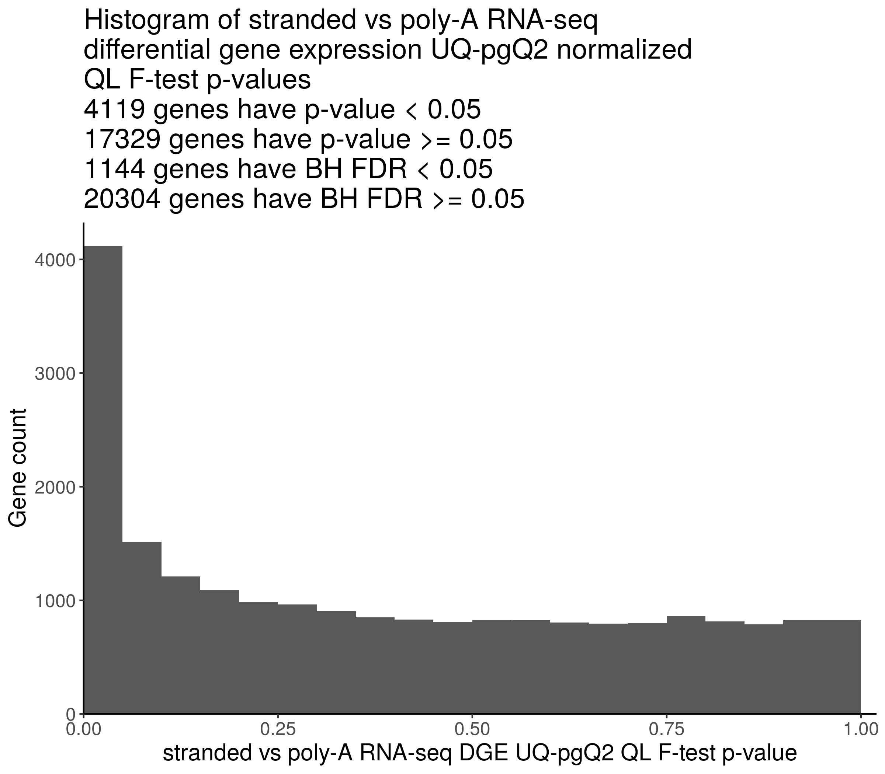
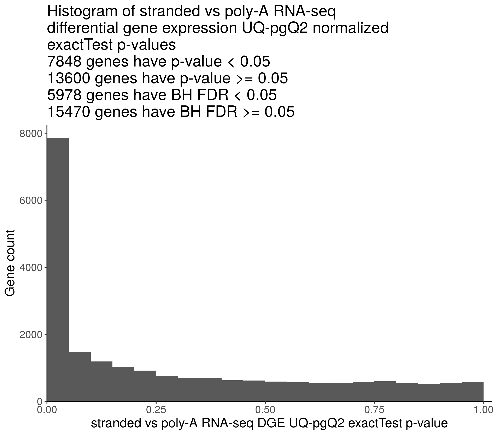

## Differential gene expression analysis comparing poly-A and ribodeplete-stranded RNA-seq protocols

**Module authors:** Yuanchao Zhang ([@logstar](https://github.com/logstar))

### Purpose

Perform differential gene expression (DGE) analysis to compare RNA-seq libraries that are prepared using poly-A or ribodeplete-stranded protocols from the same samples.

Check whether the p-values from DGE analysis follow a uniform distribution.

Select genes that are stably expressed in poly-A and stranded RNA-seq libraries.

### Methods

1. Collapse `pbta-gene-counts-rsem-expected_count` of stranded and poly-A libraries using the OpenPBTA-analysis/analyses/collapse-rnaseq module.
2. Select `Kids_First_Biospecimen`s with the same `sample_id`s and both stranded and poly-A `RNA_library`s.
    Index | Kids_First_Biospecimen_ID | sample_id | experimental_strategy | RNA_library | cohort
    ------|---------------------------|-----------|-----------------------|-------------|--------
    1     | BS_HE0WJRW6               | 7316-1455 | RNA-Seq               | stranded    | CBTN
    2     | BS_HWGWYCY7               | 7316-1455 | RNA-Seq               | poly-A      | CBTN
    3     | BS_SHJA4MR0               | 7316-161  | RNA-Seq               | stranded    | CBTN
    4     | BS_X0XXN9BK               | 7316-161  | RNA-Seq               | poly-A      | CBTN
    5     | BS_FN07P04C               | 7316-255  | RNA-Seq               | stranded    | CBTN
    6     | BS_W4H1D4Y6               | 7316-255  | RNA-Seq               | poly-A      | CBTN
    7     | BS_8QB4S4VA               | 7316-536  | RNA-Seq               | stranded    | CBTN
    8     | BS_QKT3TJVK               | 7316-536  | RNA-Seq               | poly-A      | CBTN
    9     | BS_7WM3MNZ0               | A16915    | RNA-Seq               | poly-A      | PNOC003
    10    | BS_KABQQA0T               | A16915    | RNA-Seq               | stranded    | PNOC003
    11    | BS_68KX6A42               | A18777    | RNA-Seq               | poly-A      | PNOC003
    12    | BS_D7XRFE0R               | A18777    | RNA-Seq               | stranded    | PNOC003
3. Run edgeR `exactTest`, `glmLRT`, and `glmQLFTest` comparing stranded and poly-A RNA-seq `rsem-expected_count`s, using an adapted workflow from the [OMPARE project](https://github.com/d3b-center/OMPARE/blob/master/code/patient_level_analyses/utils/rnaseq_edger_normalizations.R#L37-L41). RSEM expected read counts are normalized using the UQ-pgQ2 method, because UQ-pgQ2 normalization method has lower false positive rate in DGE testing (<https://bmcgenomics.biomedcentral.com/articles/10.1186/s12864-020-6502-7>). The edgeR `common.dispersion` is estimated using the house keeping gene table `input/Housekeeping_GenesHuman.csv` downloaded from [Housekeeping Transcript Atlas](https://housekeeping.unicamp.br).

### Results

#### DGE QL F-test



The DGE QL F-test results are saved at `results/stranded_vs_polya_dge_ql_ftest_res.csv`. Top 10 genes:

| Gene       | stranded_over_polya_logFC | average_logCPM    | F                | PValue               | BH FDR               |
|------------|---------------------------|-------------------|------------------|----------------------|----------------------|
| AC069282.1 | -8.94770553613536         | 1.04092378574575  | 155.173429467538 | 1.37081347373166e-10 | 2.20434940947988e-06 |
| AC018635.1 | -9.32227548347707         | 1.17794774705544  | 137.834897912473 | 3.73540711189631e-10 | 2.20434940947988e-06 |
| AC011472.3 | -8.45574644024753         | 1.07625522761466  | 135.01646589952  | 4.44284722400455e-10 | 2.20434940947988e-06 |
| LRRC37A16P | -9.31332794333937         | 1.2421773861728   | 134.655435936069 | 4.54370568289393e-10 | 2.20434940947988e-06 |
| AC005062.1 | -8.86235238993956         | 1.09652039321652  | 132.690982175254 | 5.13882275615414e-10 | 2.20434940947988e-06 |
| AC009630.3 | -9.39128981976768         | 1.19836102905047  | 128.50417853266  | 6.71667272978177e-10 | 2.31637251178155e-06 |
| SPDYE3     | -10.253932243042          | 1.1970766728581   | 126.69213721385  | 7.55996250581447e-10 | 2.31637251178155e-06 |
| HNRNPKP2   | -4.67517831221911         | 0.689526710806876 | 123.199308270462 | 9.53614285325902e-10 | 2.55663989895874e-06 |
| SCARNA2    | 10.2283427294431          | 1.45253189074806  | 118.534427758791 | 1.31230551833247e-09 | 3.12736986191054e-06 |
| AP001001.1 | -6.57994217054503         | 0.988304059348571 | 110.08696605371  | 2.40799875424576e-09 | 4.2733858866773e-06  |

#### DGE LRT


The DGE LRT results are saved at `results/stranded_vs_polya_dge_lrt_res.csv`. Top 10 genes:

| Gene       | stranded_over_polya_logFC | average_logCPM   | LR               | PValue               | BH FDR               |
|------------|---------------------------|------------------|------------------|----------------------|----------------------|
| AL355075.4 | 12.8990840511929          | 9.16396819893905 | 391.423666372019 | 4.05456996331516e-87 | 8.69624165731835e-83 |
| AC124312.3 | 11.8237542550665          | 7.45342206579805 | 346.636333146097 | 2.28894676423196e-77 | 2.45466650996235e-73 |
| FP236383.3 | -14.944165042021          | 5.11645156055786 | 337.031821661635 | 2.82680112980099e-75 | 2.02097435439905e-71 |
| FP671120.3 | -14.1455062025565         | 4.31891320804649 | 307.721853093826 | 6.84714424124858e-69 | 3.63984998559515e-65 |
| TGFB2-OT1  | -12.452001082831          | 4.76404125568972 | 307.294229988612 | 8.48528997014908e-69 | 3.63984998559515e-65 |
| FP236383.2 | -13.6565782220909         | 3.83116748312749 | 289.805665270971 | 5.48150912504012e-65 | 1.95945679523101e-61 |
| AL133415.1 | -11.5962439954466         | 4.42335295252847 | 288.481632625463 | 1.06511810583723e-64 | 3.26352187628528e-61 |
| HEPN1      | -9.88812345648804         | 8.22150336814349 | 287.387615210858 | 1.84408126609548e-64 | 4.94398187440198e-61 |
| RPL17P19   | 10.4961567536891          | 4.15048375343856 | 274.428810516142 | 1.22941297712541e-61 | 2.92982772593175e-58 |
| PCF11-AS1  | 10.8777103894711          | 3.42867446605022 | 264.559638072342 | 1.74042955120375e-59 | 3.7328733014218e-56  |

#### DGE exactTest



The DGE exactTest results are saved at `results/stranded_vs_polya_dge_exact_test_res.csv`. Top 10 genes:

| Gene       | stranded_over_polya_logFC | average_logCPM   | PValue               | BH FDR               |
|------------|---------------------------|------------------|----------------------|----------------------|
| AL355075.4 | 12.8990840511929          | 9.16396819893905 | 1.52073788299611e-86 | 3.26167861145005e-82 |
| AC124312.3 | 11.8237542550665          | 7.45342206579805 | 1.92899506011685e-76 | 2.06865430246931e-72 |
| FP236383.3 | -14.944165042021          | 5.11645156055786 | 4.35337817433007e-74 | 3.11237516943438e-70 |
| FP671120.3 | -14.1455062025565         | 4.31891320804649 | 1.01302582746511e-67 | 5.43184448686794e-64 |
| TGFB2-OT1  | -12.452001082831          | 4.76404125568972 | 1.91543030189268e-67 | 8.21642982299884e-64 |
| HEPN1      | -9.88812345648804         | 8.22150336814349 | 3.47903028208344e-64 | 1.24363735816876e-60 |
| AL133415.1 | -11.5962439954466         | 4.42335295252847 | 5.42552475345517e-64 | 1.66238078445866e-60 |
| FP236383.2 | -13.6565782220909         | 3.83116748312749 | 7.92656132657317e-64 | 2.12511109165427e-60 |
| RPL17P19   | 10.4961567536891          | 4.15048375343856 | 1.62621950157631e-60 | 3.87546176331208e-57 |
| AC091564.5 | -9.96226091474127         | 4.32419453309921 | 2.63041230454506e-58 | 5.64170831078824e-55 |

### Usage

1. Change working directory to local `OpenPBTA-analysis`.
2. Download data using `bash download-data.sh`. Make sure `data/pbta-gene-counts-rsem-expected_count.polya.rds` and `data/pbta-gene-counts-rsem-expected_count.stranded.rds` are downloaded.
3. Run this analysis module in the continuous integration (CI) docker image using `./scripts/run_in_ci.sh bash analyses/rna-seq-protocol-dge/run-rna-seq-protocol-dge.sh`.

Note on downloading data:

The presented results were generated using [AlexsLemonade/OpenPBTA-analysis](https://github.com/AlexsLemonade/OpenPBTA-analysis) release-v19-20210423. The release data can be downloaded by changing the `URL`, `RELEASE` and `PREVIOUS` variables in `download-data.sh` to:

```bash
URL=${OPENPBTA_URL:-https://s3.amazonaws.com/kf-openaccess-us-east-1-prd-pbta/data}
RELEASE=${OPENPBTA_RELEASE:-release-v19-20210423}
PREVIOUS=${OPENPBTA_RELEASE:-release-v18-20201123}
```

The [PediatricOpenTargets/OpenPBTA-analysis](https://github.com/PediatricOpenTargets/OpenPBTA-analysis) project has a separate data release, so the `download-data.sh` currently has the following variables:

```bash
URL=${OPENPBTA_URL:-https://s3.amazonaws.com/kf-openaccess-us-east-1-prd-pbta/open-targets}
RELEASE=${OPENPBTA_RELEASE:-v2}
PREVIOUS=${OPENPBTA_RELEASE:-v1}
```

The `data/pbta-gene-counts-rsem-expected_count.polya.rds` and `data/pbta-gene-counts-rsem-expected_count.stranded.rds` will be added to PediatricOpenTargets/OpenPBTA-analysis in future releases.

### Analysis scripts

#### 01-summarize_matrices.R

> this script generates the collapsed matrices as described above. In addition, this script calculates the average Pearson correlation between the values of the gene symbol that is kept and those duplicates that are discarded.

Obtained from the OpenPBTA-analysis/analyses/collapse-rnaseq module.

Input:

- `../../data/pbta-gene-counts-rsem-expected_count.polya.rds`
- `../../data/pbta-gene-counts-rsem-expected_count.stranded.rds`

Output:

- `results/pbta-gene-counts-rsem-expected_count-collapsed.polya.rds`: collapsed poly-A read count matrix
- `results/pbta-gene-counts-rsem-expected_count-collapsed.stranded.rds`: collapsed stranded read count matrix
- `results/pbta-gene-counts-rsem-expected_count-collapsed_table.polya.rds`
- `results/pbta-gene-counts-rsem-expected_count-collapsed_table.stranded.rds`

#### 02-analyze-drops.Rmd

> this is used to display tables from 01-summarize_matrices.R

Obtained from the OpenPBTA-analysis/analyses/collapse-rnaseq module.

Input:

- `results/pbta-gene-counts-rsem-expected_count-collapsed_table.polya.rds`
- `results/pbta-gene-counts-rsem-expected_count-collapsed_table.stranded.rds`

Output:

- `results/expected_count-collapse-gene-drops.nb.html`: dropped gene report

#### 03-edger-protocol-dge.R

This script performs edgeR DGE analysis to compare RNA-seq libraries that are prepared using poly-A or ribodeplete-stranded protocols from the same samples. The analysis code is adapted from the [OMPARE project](https://github.com/d3b-center/OMPARE/blob/master/code/patient_level_analyses/utils/rnaseq_edger_normalizations.R#L37-L41).

Input:

- `input/Housekeeping_GenesHuman.csv`: housekeeping gene table downloaded from <https://housekeeping.unicamp.br>.
- `results/pbta-gene-counts-rsem-expected_count-collapsed.polya.rds`: collapsed RSEM expected count matrix of poly-A RNA-seq libraries generated by `01-summarize_matrices.R`.
- `results/pbta-gene-counts-rsem-expected_count-collapsed.stranded.rds`: collapsed RSEM expected count matrix of stranded RNA-seq libraries generated by `01-summarize_matrices.R`.

Output:

- `results/stranded_vs_polya_dge_exact_test_res.csv`: edgeR exactTest result table
- `results/stranded_vs_polya_dge_lrt_res.csv`: edgeR LRT result table
- `results/stranded_vs_polya_dge_ql_ftest_res.csv`: edgeR QL F-test result table
- `plots/stranded_vs_polya_dge_exact_test_pvals_histogram.png`: histogram of edgeR exactTest p-values
- `plots/stranded_vs_polya_dge_lrt_pvals_histogram.png`: histogram of edgeR LRT p-values
- `plots/stranded_vs_polya_dge_ql_ftest_pvals_histogram.png`: histogram of edgeR QL F-test p-values
