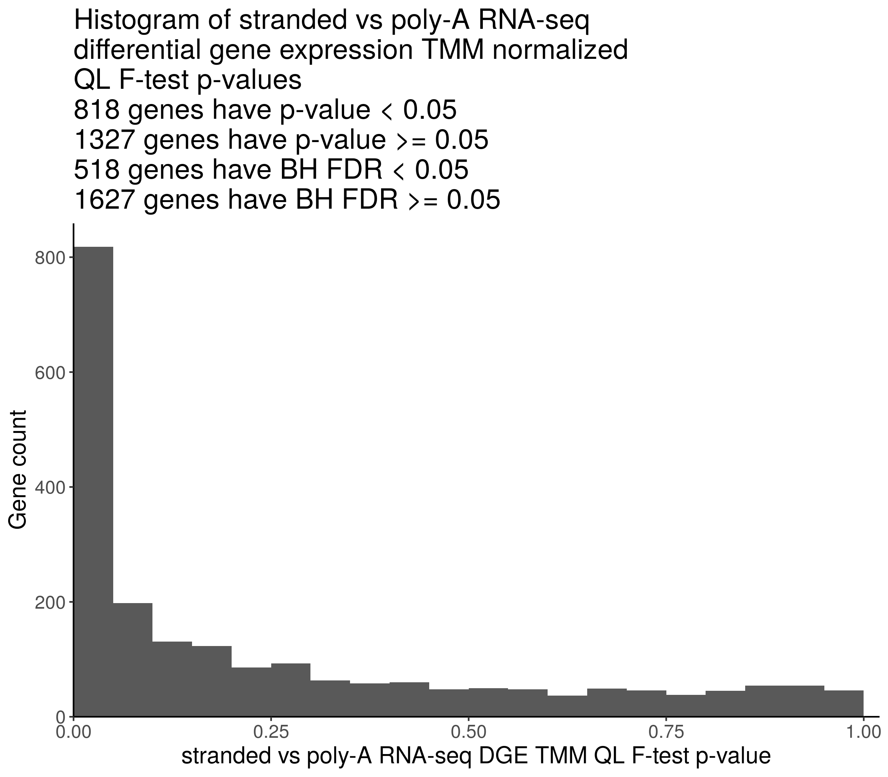
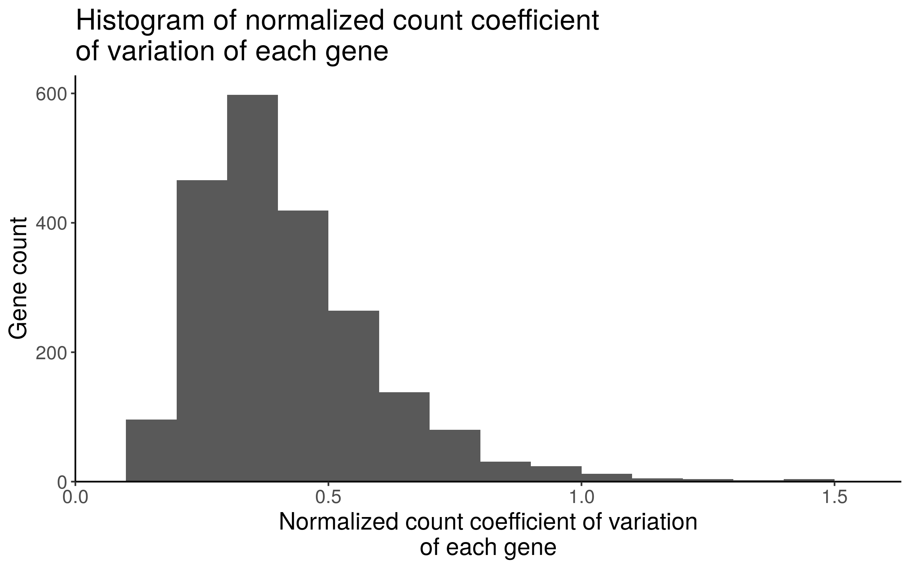
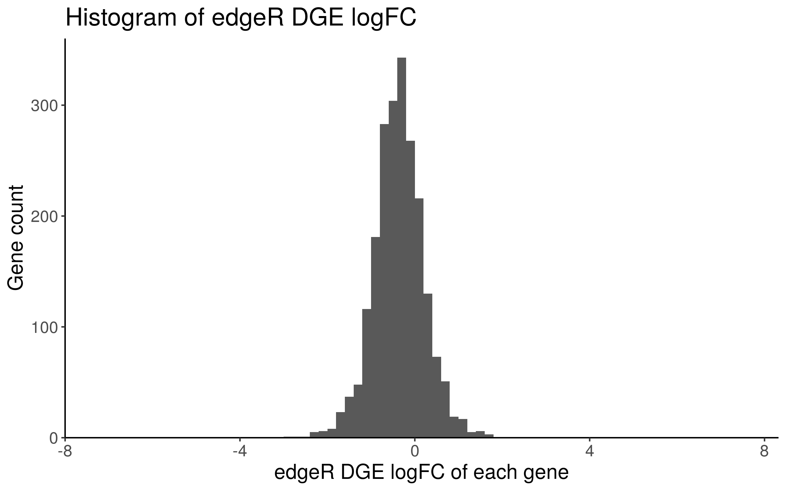
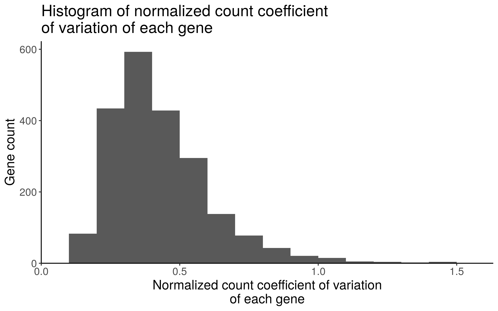

## Differential gene expression analysis comparing poly-A and ribodeplete-stranded RNA-seq protocols

**Module authors:** Yuanchao Zhang ([@logstar](https://github.com/logstar)) and Adam Kraya ([@aadamk](https://github.com/aadamk))

### Purpose

Perform a first-pass differential gene expression (DGE) analysis (as described in the [RUVSeq vignette](https://bioconductor.riken.jp/packages/3.0/bioc/vignettes/RUVSeq/inst/doc/RUVSeq.pdf)) among samples prepared using both poly-A and ribodeplete-stranded protocols. Using housekeeping genes identified as part of the Housekeeping Transcript Atlas, the goal of first-pass DGE is to identify empirical negative control genes in a paired poly-A vs ribo-deplete comparison to identify stably expressed genes that would be suitable to inform batch corrections for other DGE comparisons whose samples vary by RNA-seq library enrichment method. Housekeeping gene list (HRT Atlas v1.0 database; PMID: 32663312) - <https://housekeeping.unicamp.br/?download> .

Evaluate the p-value distribution from first-pass DGE analysis, which will likely exhibit rightward skew.

Select genes that are stably expressed in poly-A and stranded RNA-seq libraries as empirical negative control genes for use in other DGE analyses varying by library enrichment method.

### Methods

1. Collapse `pbta-gene-counts-rsem-expected_count` of stranded and poly-A libraries using the OpenPBTA-analysis/analyses/collapse-rnaseq module.
2. Select `Kids_First_Biospecimen`s with the same `sample_id`s and both stranded and poly-A `RNA_library`s.
    Index | Kids_First_Biospecimen_ID | sample_id | experimental_strategy | RNA_library | cohort
    ------|---------------------------|-----------|-----------------------|-------------|--------
    1     | BS_HE0WJRW6               | 7316-1455 | RNA-Seq               | stranded    | CBTN
    2     | BS_HWGWYCY7               | 7316-1455 | RNA-Seq               | poly-A      | CBTN
    3     | BS_SHJA4MR0               | 7316-161  | RNA-Seq               | stranded    | CBTN
    4     | BS_X0XXN9BK               | 7316-161  | RNA-Seq               | poly-A      | CBTN
    5     | BS_FN07P04C               | 7316-255  | RNA-Seq               | stranded    | CBTN
    6     | BS_W4H1D4Y6               | 7316-255  | RNA-Seq               | poly-A      | CBTN
    7     | BS_8QB4S4VA               | 7316-536  | RNA-Seq               | stranded    | CBTN
    8     | BS_QKT3TJVK               | 7316-536  | RNA-Seq               | poly-A      | CBTN
    9     | BS_7WM3MNZ0               | A16915    | RNA-Seq               | poly-A      | PNOC003
    10    | BS_KABQQA0T               | A16915    | RNA-Seq               | stranded    | PNOC003
    11    | BS_68KX6A42               | A18777    | RNA-Seq               | poly-A      | PNOC003
    12    | BS_D7XRFE0R               | A18777    | RNA-Seq               | stranded    | PNOC003
3. Run edgeR `exactTest`, edgeR `glmLRT`, edgeR `glmQLFTest`, and DESeq2 `nbinomWaldTest` comparing stranded and poly-A RNA-seq `rsem-expected_count`s, using an adapted workflow from the [OMPARE project](https://github.com/d3b-center/OMPARE/blob/master/code/patient_level_analyses/utils/rnaseq_edger_normalizations.R#L37-L41). RSEM expected read counts are normalized using either UQ-pgQ2 or TMM. The UQ-pgQ2 normalization method has lower false positive rate in DGE testing (<https://bmcgenomics.biomedcentral.com/articles/10.1186/s12864-020-6502-7>).
4. Select genes that are stably expressed in poly-A and stranded RNA-seq libraries by the following criteria, and the filtered output `results/NORMALIZATION_METHOD/stranded_vs_polya_stably_exp_genes.csv` is ordered by the coefficient of variations. 
   - `coefficient of variation < quantile(coefficient of variation, 0.25)`
   - `exactTest`, `glmLRT`, `glmQLFTest`, and `nbinomWaldTest` p-values all > 0.05
   - `abs(logFC) < median(abs(logFC)`
   - `quantile(average_logCPM, 0.25) < average_logCPM < quantile(average_logCPM, 0.75)`
5. Run DESeq2 standard DGE analysis on RSEM expected read counts comparing stranded and poly-A RNA-seq `rsem-expected_count`s.

### Results

#### DGE QL F-test




DGE QL F-test result tables:

- UQ-pgQ2 normalized: `results/uqpgq2_normalized/stranded_vs_polya_dge_ql_ftest_res.csv`
- TMM normalized: `results/tmm_normalized/stranded_vs_polya_dge_ql_ftest_res.csv`

#### DGE LRT


DGE LRT result tables:

- UQ-pgQ2 normalized: `results/uqpgq2_normalized/stranded_vs_polya_dge_lrt_res.csv`
- TMM normalized: `results/tmm_normalized/stranded_vs_polya_dge_lrt_res.csv`

#### DGE exactTest


DGE exactTest result tables:

- UQ-pgQ2 normalized: `results/uqpgq2_normalized/stranded_vs_polya_dge_exact_test_res.csv`
- TMM normalized: `results/tmm_normalized/stranded_vs_polya_dge_exact_test_res.csv`

#### DGE DESeq2 nbinomWaldTest


DGE exactTest result tables:

- UQ-pgQ2 normalized: `results/uqpgq2_normalized/stranded_vs_polya_dge_deseq2_nbinom_wald_test_res.csv`
- TMM normalized: `results/tmm_normalized/stranded_vs_polya_dge_deseq2_nbinom_wald_test_res.csv`
- DESeq2 standard DGE analysis: `results/deseq2_rle_normalized/stranded_vs_polya_dge_deseq2_nbinom_wald_test_res.csv`

#### Stably expressed genes

##### UQ-pgQ2 normalization

The table of stably expressed genes are saved at `results/uqpgq2_normalized/stranded_vs_polya_stably_exp_genes.csv`. The biospecimen ID columns are normalized counts.

Top 30 stably expressed gene boxplots are at `plots/uqpgq2_normalized/stably_exp_gene_protocol_diff_boxplot`. Top 3 stably expressed gene boxplots:


Histograms used for choosing stably expressed genes:





##### TMM normalization

The table of stably expressed genes are saved at `results/tmm_normalized/stranded_vs_polya_stably_exp_genes.csv`. The biospecimen ID columns are normalized counts.

Top 30 stably expressed gene boxplots are at `plots/tmm_normalized/stably_exp_gene_protocol_diff_boxplot`. Top 3 stably expressed gene boxplots:


Histograms used for choosing stably expressed genes:




### Usage

1. Change working directory to local `OpenPBTA-analysis`.
2. Download data using `bash download-data.sh`. Make sure `data/gene-counts-rsem-expected_count-collapsed.rds` is downloaded.
3. Run this analysis module in the continuous integration (CI) docker image using `./scripts/run_in_ci.sh bash analyses/rna-seq-protocol-dge/run-rna-seq-protocol-dge.sh`.

### Analysis scripts

#### 01-protocol-dge-seg.R

This script performs edgeR DGE analysis to compare RNA-seq libraries that are prepared using poly-A or ribodeplete-stranded protocols from the same samples. This script also selects genes that are stably expressed in poly-A and ribodeplete-stranded RNA-seq libraries. The analysis code is adapted from the [OMPARE project](https://github.com/d3b-center/OMPARE/blob/master/code/patient_level_analyses/utils/rnaseq_edger_normalizations.R#L37-L41).

Example usage:

```bash
Rscript --vanilla '01-protocol-dge-seg.R' -n 'uqpgq2'
```

Input:

- `../../data/gene-counts-rsem-expected_count-collapsed.rds`: collapsed RSEM expected count matrix of poly-A RNA-seq libraries.

Parameters:

- normalization method: tmm or uqpgq2.

Output:

- `results/NORMALIZATION_METHOD/stranded_vs_polya_dge_exact_test_res.csv`: edgeR exactTest result table
- `results/NORMALIZATION_METHOD/stranded_vs_polya_dge_lrt_res.csv`: edgeR LRT result table
- `results/NORMALIZATION_METHOD/stranded_vs_polya_dge_ql_ftest_res.csv`: edgeR QL F-test result table
- `results/NORMALIZATION_METHOD/stranded_vs_polya_dge_deseq2_nbinom_wald_test_res.csv`: DESeq2 nbinomWaldTest result table
- `results/NORMALIZATION_METHOD/stranded_vs_polya_stably_exp_genes.csv`: stably expressed gene table
- `plots/NORMALIZATION_METHOD/stranded_vs_polya_dge_exact_test_pvals_histogram.png`: histogram of edgeR exactTest p-values
- `plots/NORMALIZATION_METHOD/stranded_vs_polya_dge_lrt_pvals_histogram.png`: histogram of edgeR LRT p-values
- `plots/NORMALIZATION_METHOD/stranded_vs_polya_dge_ql_ftest_pvals_histogram.png`: histogram of edgeR QL F-test p-values
- `plots/NORMALIZATION_METHOD/stranded_vs_polya_dge_deseq2_nbinom_wald_test_pvals_histogram.png`: histogram of DESeq2 nbinomWaldTest p-values
- `plots/NORMALIZATION_METHOD/edger_logfc_histogram.png`: histogram of edgeR computed log fold changes
- `plots/NORMALIZATION_METHOD/normalized_count_gene_cv_histogram.png`: histogram of coefficient of variations of normalized read counts
- `plots/NORMALIZATION_METHOD/stably_exp_gene_protocol_diff_boxplot/*.png`: normalized read count boxplots

#### 02-deseq2-protocol-dge.R

This script performs DESeq2 standard DGE analysis to compare RNA-seq libraries that are prepared using poly-A or ribodeplete-stranded protocols from the same samples.

Usage:

```bash
Rscript --vanilla '02-deseq2-protocol-dge.R'
```

Input:

- `../../data/gene-counts-rsem-expected_count-collapsed.rds`: collapsed RSEM expected count matrix of poly-A RNA-seq libraries.

Output:

- `results/deseq2_rle_normalized/stranded_vs_polya_dge_deseq2_nbinom_wald_test_res.csv`: DESeq2 nbinomWaldTest result table
- `plots/deseq2_rle_normalized/stranded_vs_polya_dge_deseq2_nbinom_wald_test_pvals_histogram.png`: histogram of DESeq2 nbinomWaldTest p-values
