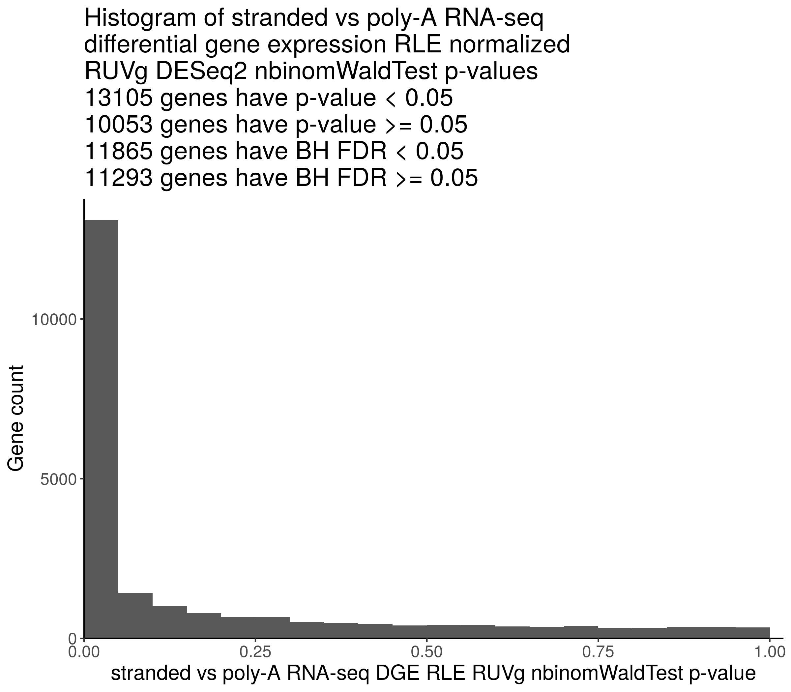
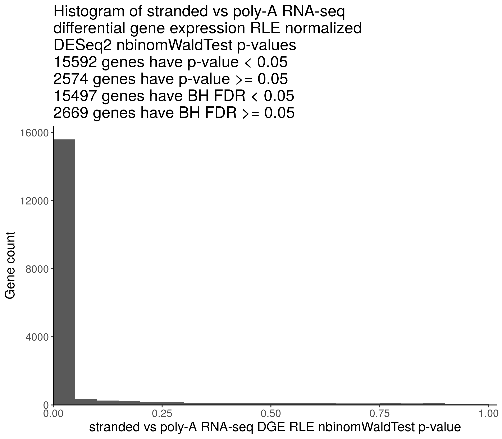
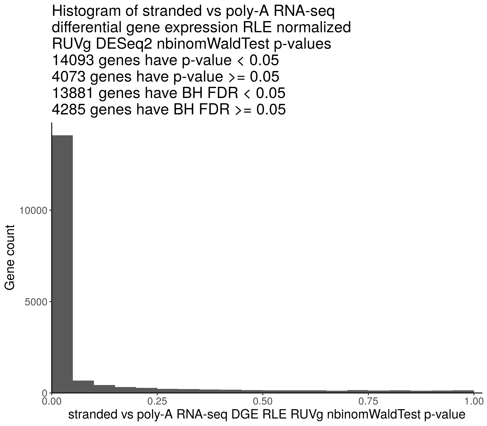

## Evaluate the use of empirical negative control genes for batch correction

### Purpose

Evaluate the effectiveness of using empirically defined negative control housekeeping genes for batch effect correction. The empirically defined negative control housekeeping genes show stable expression levels in poly-A and ribo-deplete-stranded RNA-seq libraries prepared from the same biological samples, which are selected in the [PR 11](https://github.com/PediatricOpenTargets/OpenPedCan-analysis/pull/11).

### Methods

1. Select ribo-deplete-stranded and poly-A RNA-seq libraries that are expected to have no significant differences in gene expression profiles.
    1. RNA-seq libraries with matching `sample_id`s:
        | Kids_First_Biospecimen_ID | sample_id | experimental_strategy | RNA_library | cohort|
        |---------------------------|-----------|-----------------------|-------------|--------|
        | BS_HE0WJRW6               | 7316-1455 | RNA-Seq               | stranded    | CBTN|
        | BS_HWGWYCY7               | 7316-1455 | RNA-Seq               | poly-A      | CBTN|
        | BS_SHJA4MR0               | 7316-161  | RNA-Seq               | stranded    | CBTN|
        | BS_X0XXN9BK               | 7316-161  | RNA-Seq               | poly-A      | CBTN|
        | BS_FN07P04C               | 7316-255  | RNA-Seq               | stranded    | CBTN|
        | BS_W4H1D4Y6               | 7316-255  | RNA-Seq               | poly-A      | CBTN|
        | BS_8QB4S4VA               | 7316-536  | RNA-Seq               | stranded    | CBTN|
        | BS_QKT3TJVK               | 7316-536  | RNA-Seq               | poly-A      | CBTN|
        | BS_7WM3MNZ0               | A16915    | RNA-Seq               | poly-A      | PNOC003|
        | BS_KABQQA0T               | A16915    | RNA-Seq               | stranded    | PNOC003|
        | BS_68KX6A42               | A18777    | RNA-Seq               | poly-A      | PNOC003|
        | BS_D7XRFE0R               | A18777    | RNA-Seq               | stranded    | PNOC003|
    2. Diffuse intrinsic pontine glioma (DIPG) libraries without matching `sample_id`s, as suggested by [@jharenza](https://github.com/jharenza) at <https://github.com/PediatricOpenTargets/ticket-tracker/issues/39#issuecomment-859751927>.
    3. Neuroblastoma (NBL) libraries, as suggested by [@jharenza](https://github.com/jharenza) at <https://github.com/PediatricOpenTargets/ticket-tracker/issues/39#issuecomment-859751927>.
2. Run DESeq2 default differential gene expression (DGE) analysis to compare ribo-deplete-stranded and poly-A RNA-seq `rsem-expected_count`s.
3. Run DESeq2 DGE analysis with RUVSeq estimated batch effect in the design to compare ribo-deplete-stranded and poly-A RNA-seq `rsem-expected_count`s. The batch effect is estimated using [empirically defined negative control housekeeping genes](https://github.com/logstar/OpenPedCan-analysis/blob/rna-seq-protocol-dge-fourth/analyses/rna-seq-protocol-dge/results/uqpgq2_normalized/stranded_vs_polya_stably_exp_genes.csv) selected in the [PR 11](https://github.com/PediatricOpenTargets/OpenPedCan-analysis/pull/11), using the RUVg workflow demonstrated in the section "2.4 Empirical control genes" in the [RUVSeq vignette](https://bioconductor.riken.jp/packages/3.0/bioc/vignettes/RUVSeq/inst/doc/RUVSeq.pdf).
4. Plot the distributions of DGE p-values computed from step 2 and 3.

### Results

#### RNA-seq libraries with matching `sample_id`s

**DGE without RUVSeq estimated batch effect:**


The DGE result table is at `results/matched_sample_ids/stranded_vs_polya_dge_deseq2_nbinom_wald_test_res.csv`.

**DGE with RUVSeq estimated batch effect:**


The DGE result table is at `results/matched_sample_ids/stranded_vs_polya_dge_ruvg_k1_deseq2_nbinom_wald_test_res.csv`.

#### DIPG RNA-seq libraries without matching `sample_id`s

**DGE without RUVSeq estimated batch effect:**


The DGE result table is at `results/dipg_rm_matched_sample_ids/stranded_vs_polya_dge_deseq2_nbinom_wald_test_res.csv`.

**DGE with RUVSeq estimated batch effect:**



The DGE result table is at `results/dipg_rm_matched_sample_ids/stranded_vs_polya_dge_ruvg_k1_deseq2_nbinom_wald_test_res.csv`.

#### NBL RNA-seq libraries

**DGE without RUVSeq estimated batch effect:**



The DGE result table is at `results/nbl/stranded_vs_polya_dge_deseq2_nbinom_wald_test_res.csv`.

**DGE with RUVSeq estimated batch effect:**



The DGE result table is at `results/nbl/stranded_vs_polya_dge_ruvg_k1_deseq2_nbinom_wald_test_res.csv`.

### Usage

1. Change working directory to local `OpenPBTA-analysis`.
2. Download data using `bash download-data.sh`. Make sure the following files are downloaded:
   - `histologies.tsv`
   - `gene-counts-rsem-expected_count-collapsed.rds`
   - `gtex_target_tcga-gene-counts-rsem-expected_count-collapsed.rds`
3. Run this analysis module in the continuous integration (CI) docker image using `./scripts/run_in_ci.sh bash analyses/rna-seq-protocol-ruvseq/run-rna-seq-protocol-ruvseq.sh`.

### Module structure

```text
.
├── 00-prepare-data.R
├── 01-protocol-ruvseq.R
├── README.md
├── input
│   ├── gtex_mapping.txt
│   ├── target_mapping.txt
│   ├── tcga_mapping.txt
│   └── uqpgq2_normalized_stranded_vs_polya_stably_exp_genes.csv
├── plots
│   ├── dipg_rm_matched_sample_ids
│   │   ├── stranded_vs_polya_dge_deseq2_nbinom_wald_test_pvals_histogram.png
│   │   └── stranded_vs_polya_dge_ruvg_k1_deseq2_nbinom_wald_test_pvals_histogram.png
│   ├── matched_sample_ids
│   │   ├── stranded_vs_polya_dge_deseq2_nbinom_wald_test_pvals_histogram.png
│   │   └── stranded_vs_polya_dge_ruvg_k1_deseq2_nbinom_wald_test_pvals_histogram.png
│   └── nbl
│       ├── stranded_vs_polya_dge_deseq2_nbinom_wald_test_pvals_histogram.png
│       └── stranded_vs_polya_dge_ruvg_k1_deseq2_nbinom_wald_test_pvals_histogram.png
├── results
│   ├── dipg_rm_matched_sample_ids
│   │   ├── stranded_vs_polya_dge_deseq2_nbinom_wald_test_res.csv
│   │   └── stranded_vs_polya_dge_ruvg_k1_deseq2_nbinom_wald_test_res.csv
│   ├── matched_sample_ids
│   │   ├── stranded_vs_polya_dge_deseq2_nbinom_wald_test_res.csv
│   │   └── stranded_vs_polya_dge_ruvg_k1_deseq2_nbinom_wald_test_res.csv
│   └── nbl
│       ├── stranded_vs_polya_dge_deseq2_nbinom_wald_test_res.csv
│       └── stranded_vs_polya_dge_ruvg_k1_deseq2_nbinom_wald_test_res.csv
└── run-rna-seq-protocol-ruvseq.sh
```

### Analysis scripts

#### 00-prepare-data.R

This script cleans up data for RUVSeq DGE analysis.

Usage:

```bash
Rscript --vanilla '00-prepare-data.R'
```

Input:

- `../../data/histologies.tsv`
- `../../data/gene-counts-rsem-expected_count-collapsed.rds`
- `../../data/gtex_target_tcga-gene-counts-rsem-expected_count-collapsed.rds`
- Mapping files shared by [@komalsrathi](https://github.com/komalsrathi) at <https://github.com/PediatricOpenTargets/ticket-tracker/issues/22#issuecomment-854901528>:
  - `input/gtex_mapping.txt`
  - `input/target_mapping.txt`
  - `input/tcga_mapping.txt`

Output:

- `../../scratch/pbta_kf_gtex_target_tcga_histology_df.rds`
- `../../scratch/pbta_kf_gtex_target_tcga_rsem_expected_cnt_df.rds`

#### 01-protocol-ruvseq.R

This analysis script runs DESeq2 DGE analysis, with or without RUVSeq estimated batch effect in the design, to compare RNA-seq libraries that are prepared using poly-A or ribodeplete-stranded protocols from the same samples.

Example usage:

```bash
Rscript --vanilla '01-protocol-ruvseq.R' -d 'match'
```

Parameters:

- `-d` or `--dataset`: Dataset for running differential gene expression analysis: match, dipg, and nbl.

Input:

- `../../data/gene-counts-rsem-expected_count-collapsed.rds`: collapsed RSEM expected count matrix of poly-A RNA-seq libraries.
- `input/uqpgq2_normalized_stranded_vs_polya_stably_exp_genes.csv`: the empirically defined negative control housekeeping genes show stable expression levels in poly-A and ribo-deplete-stranded RNA-seq libraries prepared from the same biological samples, which are selected in the [PR 11](https://github.com/PediatricOpenTargets/OpenPedCan-analysis/pull/11).

Output:

- `plots/DATASET/stranded_vs_polya_dge_deseq2_nbinom_wald_test_pvals_histogram.png`: DESeq2 DGE p-value histogram without RUVSeq estimated batch effect in the design.
- `plots/DATASET/stranded_vs_polya_dge_ruvg_k1_deseq2_nbinom_wald_test_pvals_histogram.png`: DESeq2 DGE p-value histogram with RUVSeq estimated batch effect in the design.
- `results/DATASET/stranded_vs_polya_dge_deseq2_nbinom_wald_test_res.csv`: DESeq2 DGE result table without RUVSeq estimated batch effect in the design.
- `results/DATASET/stranded_vs_polya_dge_ruvg_k1_deseq2_nbinom_wald_test_res.csv`: DESeq2 DGE result table with RUVSeq estimated batch effect in the design.
