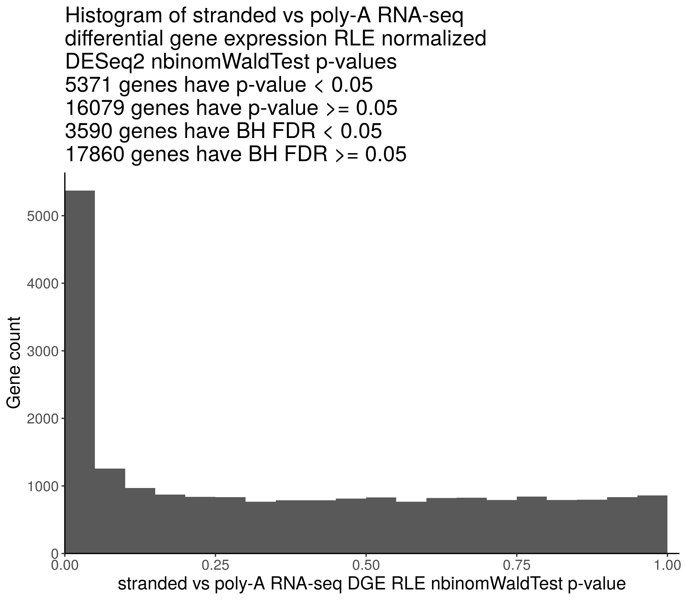

## Evaluate the use of empirical negative control genes for batch correction

### Purpose

Evaluate the effectiveness of using empirically defined negative control housekeeping genes for batch effect correction. The empirically defined negative control housekeeping genes show stable expression levels in poly-A and ribo-deplete-stranded RNA-seq libraries prepared from the same biological samples, which are selected in the [PR 11](https://github.com/PediatricOpenTargets/OpenPedCan-analysis/pull/11).

### Methods

1. Select `Kids_First_Biospecimen`s with the same `sample_id`s and both ribo-deplete-stranded and poly-A `RNA_library`s.
    Index | Kids_First_Biospecimen_ID | sample_id | experimental_strategy | RNA_library | cohort
    ------|---------------------------|-----------|-----------------------|-------------|--------
    1     | BS_HE0WJRW6               | 7316-1455 | RNA-Seq               | stranded    | CBTN
    2     | BS_HWGWYCY7               | 7316-1455 | RNA-Seq               | poly-A      | CBTN
    3     | BS_SHJA4MR0               | 7316-161  | RNA-Seq               | stranded    | CBTN
    4     | BS_X0XXN9BK               | 7316-161  | RNA-Seq               | poly-A      | CBTN
    5     | BS_FN07P04C               | 7316-255  | RNA-Seq               | stranded    | CBTN
    6     | BS_W4H1D4Y6               | 7316-255  | RNA-Seq               | poly-A      | CBTN
    7     | BS_8QB4S4VA               | 7316-536  | RNA-Seq               | stranded    | CBTN
    8     | BS_QKT3TJVK               | 7316-536  | RNA-Seq               | poly-A      | CBTN
    9     | BS_7WM3MNZ0               | A16915    | RNA-Seq               | poly-A      | PNOC003
    10    | BS_KABQQA0T               | A16915    | RNA-Seq               | stranded    | PNOC003
    11    | BS_68KX6A42               | A18777    | RNA-Seq               | poly-A      | PNOC003
    12    | BS_D7XRFE0R               | A18777    | RNA-Seq               | stranded    | PNOC003
2. Run DESeq2 default differential gene expression (DGE) analysis to compare ribo-deplete-stranded and poly-A RNA-seq `rsem-expected_count`s.
3. Run DESeq2 DGE analysis with RUVSeq estimated batch effect in the design to compare ribo-deplete-stranded and poly-A RNA-seq `rsem-expected_count`s. The batch effect is estimated using [empirically defined negative control housekeeping genes](https://github.com/logstar/OpenPedCan-analysis/blob/rna-seq-protocol-dge-fourth/analyses/rna-seq-protocol-dge/results/uqpgq2_normalized/stranded_vs_polya_stably_exp_genes.csv) selected in the [PR 11](https://github.com/PediatricOpenTargets/OpenPedCan-analysis/pull/11), using the RUVg workflow demonstrated in the section "2.4 Empirical control genes" in the [RUVSeq vignette](https://bioconductor.riken.jp/packages/3.0/bioc/vignettes/RUVSeq/inst/doc/RUVSeq.pdf).
4. Plot the distributions of DGE p-values computed from step 2 and 3.

### Results

#### DGE without RUVSeq estimated batch effect



The DGE result table is at `results/stranded_vs_polya_dge_deseq2_nbinom_wald_test_res.csv`.

#### DGE with RUVSeq estimated batch effect


The DGE result table is at `results/stranded_vs_polya_dge_ruvg_k1_deseq2_nbinom_wald_test_res.csv`.

### Usage

1. Change working directory to local `OpenPBTA-analysis`.
2. Download data using `bash download-data.sh`. Make sure `data/gene-counts-rsem-expected_count-collapsed.rds` is downloaded.
3. Run this analysis module in the continuous integration (CI) docker image using `./scripts/run_in_ci.sh bash analyses/rna-seq-protocol-ruvseq/run-rna-seq-protocol-ruvseq.sh`.

### Module structure

```text
.
├── 01-protocol-ruvseq.R
├── README.md
├── input
│   └── uqpgq2_normalized_stranded_vs_polya_stably_exp_genes.csv
├── plots
│   ├── stranded_vs_polya_dge_deseq2_nbinom_wald_test_pvals_histogram.png
│   └── stranded_vs_polya_dge_ruvg_k1_deseq2_nbinom_wald_test_pvals_histogram.png
├── results
│   ├── stranded_vs_polya_dge_deseq2_nbinom_wald_test_res.csv
│   └── stranded_vs_polya_dge_ruvg_k1_deseq2_nbinom_wald_test_res.csv
└── run-rna-seq-protocol-ruvseq.sh
```

### Analysis scripts

#### 01-protocol-ruvseq.R

This analysis script runs DESeq2 DGE analysis, with or without RUVSeq estimated batch effect in the design, to compare RNA-seq libraries that are prepared using poly-A or ribodeplete-stranded protocols from the same samples.

Usage:

```bash
Rscript --vanilla '01-protocol-ruvseq.R'
```

Input:

- `../../data/gene-counts-rsem-expected_count-collapsed.rds`: collapsed RSEM expected count matrix of poly-A RNA-seq libraries.

Output:

- `plots/stranded_vs_polya_dge_deseq2_nbinom_wald_test_pvals_histogram.png`: DESeq2 DGE p-value histogram without RUVSeq estimated batch effect in the design.
- `plots/plots/stranded_vs_polya_dge_ruvg_k1_deseq2_nbinom_wald_test_pvals_histogram.png`: DESeq2 DGE p-value histogram with RUVSeq estimated batch effect in the design.
- `results/stranded_vs_polya_dge_deseq2_nbinom_wald_test_res.csv`: DESeq2 DGE result table without RUVSeq estimated batch effect in the design.
- `results/stranded_vs_polya_dge_ruvg_k1_deseq2_nbinom_wald_test_res.csv`: DESeq2 DGE result table with RUVSeq estimated batch effect in the design.
