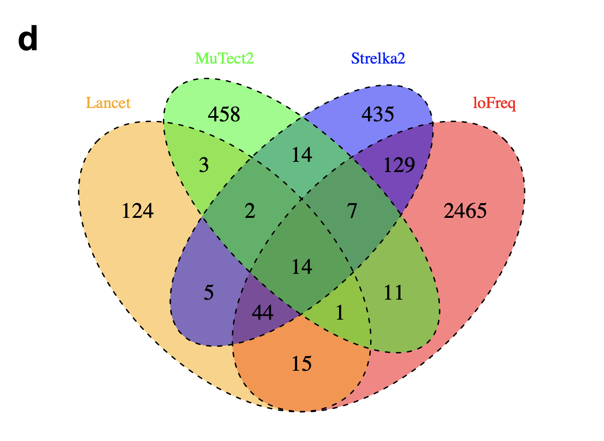

# SNV caller comparison analysis

This analysis evaluates [MAF files](https://docs.gdc.cancer.gov/Data/File_Formats/MAF_Format/) from different SNV callers, compares their output, and creates a consensus mutation file.
This consensus mutation file is [MAF-like](#consensus-mutation-call) meaning it is TSV file that contains the fields of a [MAF file](https://docs.gdc.cancer.gov/Data/File_Formats/MAF_Format/) but adds [VAF](#variant-allele-fraction-calculation), but does not contain a starting comment line with a version number.

The resulting MAF and TMB files from this analysis are saved to `snv-callers/results/consensus/` folder and used by downstream analyses.

Consensus mutations saved to `pbta-snv-consensus-mutation.maf.tsv.gz` are decided from agreement of [3 out of 3 of the snv callers used](#02-merge_callersr).
Four callers were originally run but VarDict was dropped from downstream analysis because it called a large number (~39 million) of very low VAF mutations that were unique to it, suggesting that most of these were likely to be false positive calls.
~1.2 million mutations were called by all three of Mutect2, Strelka2, and Lancet and ended up in the consensus file.
~5 million calls would be in the consensus set if we loosened the inclusion criteria to be identified by 2 out of 3 of these callers.

These three callers' performances (Mutect2, Strelka2, and Lancet) were compared in [Narzisi et al](https://www.nature.com/articles/s42003-018-0023-9.pdf).
The overlap of all three was used for the consensus calls since their [data](https://static-content.springer.com/esm/art%3A10.1038%2Fs42003-018-0023-9/MediaObjects/42003_2018_23_MOESM1_ESM.pdf) suggested that overlapping more callers would reduce the number of false positives (Supplementary Figure 13, panel d):



> d) Venn diagrams of the number of false positive indels within STRs for Lancet, MuTect2, Strelka2, and LoFreq. Short tandem repeats are defined as sequences composed of at least 7bp (total length), where the repeat sequence is between 1bp and 4bp, and is repeated at least 3 times. Homopolymers are reported separately for each base pair (A,C,G,T), while other STRs whose motif is composed of more than one single base are	grouped together.

(Narzisi, G., et al. 2018, _Commun Biol_)

Their use of medulloblastoma in their investigation further led us to believe this would be generalizable to this use case.
This diagram here shows Short Tandem Repeats (STRs) which according to Narzisi et al, were the regions with the worst false positive rates for each of the callers.
We expect that the reduction in false positive rates with the combinations of more callers might also hold true in non-STR regions.

Tumor Mutation Burden calculations only used Mutect2 and Strelka2 agreement due to [Lancet's calling particularly low VAF mutations for WXS sample data](https://github.com/AlexsLemonade/OpenPBTA-analysis/tree/master/analyses/snv-callers/lancet-wxs-tests) and [its apparent coding region bias](https://alexslemonade.github.io/OpenPBTA-analysis/analyses/snv-callers/compare_snv_callers_plots.nb.html#mutation_region_barplot) compared to the other callers.

See comparison of the performances of all four original callers used [here for PBTA data](https://alexslemonade.github.io/OpenPBTA-analysis/analyses/snv-callers/compare_snv_callers_plots.nb.html) and [here for TCGA data](https://alexslemonade.github.io/OpenPBTA-analysis/analyses/snv-callers/compare_snv_callers_plots-tcga.nb.html).

<!-- START doctoc generated TOC please keep comment here to allow auto update -->
<!-- DON'T EDIT THIS SECTION, INSTEAD RE-RUN doctoc TO UPDATE -->
**Table of Contents**  *generated with [DocToc](https://github.com/thlorenz/doctoc)*

- [How to run the caller consensus analysis](#how-to-run-the-caller-consensus-analysis)
- [Summary of Methods](#summary-of-methods)
  - [Variant Allele Fraction Calculation](#variant-allele-fraction-calculation)
  - [Mutation Comparisons](#mutation-comparisons)
  - [Tumor Mutation Burden Calculation](#tumor-mutation-burden-calculation)
    - [All mutations TMB](#all-mutations-tmb)
    - [Coding only TMB](#coding-only-tmb)
- [General usage of scripts](#general-usage-of-scripts)
  - [01-setup_db.py](#01-setup_dbpy)
  - [02-merge_callers.R](#02-merge_callersr)
  - [03-calculate_tmb.R](#03-calculate_tmbr)

<!-- END doctoc generated TOC please keep comment here to allow auto update -->

## How to run the caller consensus analysis

To run the evaluations and comparisons of all the SNV callers for the PBTA data, call the bash script:

```
bash run_caller_consensus_analysis-pbta.sh
```

The TCGA data is processed by its own script to run the same methods:

```
bash run_caller_consensus_analysis-tcga.sh
```

**Note** All file paths set in these bash scripts are based on finding the root directory of this Git repository and therefore are given relative to `OpenPBTA-analysis`.

This bash script will return:

- Comparison plots in a notebook: [`compare_snv_callers_plots.nb.html`](https://alexslemonade.github.io/OpenPBTA-analysis/analyses/snv-callers/compare_snv_callers_plots.nb.html) and [`compare_snv_callers_plots-tcga.nb.html`](https://alexslemonade.github.io/OpenPBTA-analysis/analyses/snv-callers/compare_snv_callers_plots-tcga.nb.html).
- A zip file containing:
- `(pbta|tcga)-snv-consensus-mutation.maf.tsv` - [MAF-like files](#consensus-mutation-call) that contain the snvs that were called by all callers described below for a given sample.
  These files combine the [MAF file data](https://docs.gdc.cancer.gov/Data/File_Formats/MAF_Format/) from 3 different SNV callers: [Mutect2](https://software.broadinstitute.org/cancer/cga/mutect), [Strelka2](https://github.com/Illumina/strelka), and [Lancet](https://github.com/nygenome/lancet).
  See the methods on the callers' settings [here](https://github.com/AlexsLemonade/OpenPBTA-manuscript/blob/master/content/03.methods.md#somatic-single-nucleotide-variant-calling) and see [the methods of this caller analysis and comparison below](#summary-of-methods).  
  - `pbta/tcga-snv-mutation-tmb-coding.tsv` - Tumor Mutation burden calculations using *coding only* mutations identified by both Mutect2 and Strelka2 only within coding sequence regions of the genome.
  - `pbta/tcga-snv-mutation-tmb-all.tsv` - Tumor Mutation burden calculations using *all* mutations identified by both of Mutect2 and Strelka2 throughout the genome.

## Summary of Methods

### Variant Allele Fraction Calculation

Calculate variant allele fraction (VAF) for each variant.
This is done in `01-setup_db.py`.

```
vaf = (t_alt_count) / (t_ref_count + t_alt_count)
```
This is following the [code used in
`maftools`](https://github.com/PoisonAlien/maftools/blob/1d0270e35c2e0f49309eba08b62343ac0db10560/R/plot_vaf.R#L39).

### Mutation Comparisons

The consensus mutations called are those that are shared among all of Strelka2, Mutect2, and Lancet.
Mutations were considered to be the same if they were identical in the following field: `Chromosome`, `Start_Position`, `Reference_Allele`,  `Allele`, and `Tumor_Sample_Barcode`.
As Strelka2 does not call multinucleotide variants (MNV), but instead calls each component SNV as a separate mutation, MNV calls from Mutect2 and Lancet were separated into consecutive SNVs before comparison with Strelka2.

### Tumor Mutation Burden Calculation

For each experimental strategy and TMB calculation, the intersection of the genomic regions effectively being surveyed are used.
Only Strelka2 and Mutect2 agreement were used for TMB calculations.
This is because of some [complications identified with Lancet's performance on WXS data](https://github.com/AlexsLemonade/OpenPBTA-analysis/tree/master/analyses/snv-callers/lancet-wxs-tests).
Only Strelka2 and Mutect2 agreement was used for TMB calculations. This is because of some [complications identified with Lancet's performance on WXS data](https://github.com/AlexsLemonade/OpenPBTA-analysis/tree/master/analyses/snv-callers/lancet-wxs-tests).
These genomic regions are used for first filtering mutations to these regions and then for using the size in bp of the genomic regions surveyed as the TMB denominator.

#### All mutations TMB

For all mutation TMBs, Lancet is not used because of the [coding bias in the way it was run.](https://github.com/AlexsLemonade/OpenPBTA-manuscript/blob/master/content/03.methods.md#snv-and-indel-calling)
For WGS samples, the size of the genome covered by the intersection of Strelka2 and Mutect2's surveyed areas is used for the denominator.
```
WGS_all_mutations_TMB = (total # snvs called by Strelka2 and Mutect) / intersection_strelka_mutect_genome_size
```
For WXS samples, the size of the genome the WXS bed region file is used for the denominator.
```
WXS_all_mutations_TMB = (total # snvs called by Strelka2 and Mutect2 ) / wxs_genome_size
```
#### Coding only TMB

Coding only TMB uses all three callers: Strelka2, Mutect2, and Lancet and the intersection demoninators are calculated by using coding sequence ranges in the gtf from Gencode 27.
This file is included in the data download.
SNVs outside of these coding sequences are filtered out before being summed and used for TMB calculations as follows:

```
WGS_coding_only_TMB = (total # coding sequence snvs called both Strelka and Mutect2 ) / intersection_wgs_strelka_mutect_CDS_genome_size
```
Because the same WXS BED file applies to all callers, that file is intersected with the coding sequences for filtering and for determining the denominator.
```
WXS_coding_only_TMB = (total # coding sequence snvs called by Strelka and Mutect2 ) /
intersection_wxs_strelka_mutect_CDS_genome_size
```

## General usage of scripts

**Overall notes about these scripts:**
- All file paths are based on finding the root directory of this Git repository and therefore are given relative to `OpenPBTA-analysis`.
- The scripts are sequential as noted by their number.
- By default, the scripts will not overwrite existing files of the same name. However,
this can be overridden with `--overwrite` option.

### 01-setup_db.py

Creates and/or fills an SQLite database of variant calls that will be used by subsequent steps to find consensus mutations.
Note: requires `pandas` to be installed, and expects python3
All arguments are optional; only the included tables will be affected.

**Argument descriptions**
```
  -d DB_FILE, --db-file DB_FILE
     Path of the database file to use or create. Defaults to `data.sqlite`.
   --strelka-file STRELKA_FILE
     Path of the MAF formatted data file from the strelka2 caller(TSV).
   --mutect-file MUTECT_FILE
     Path of the MAF formatted data file from the mutect2 caller(TSV).
   --lancet-file LANCET_FILE
     Path of the MAF formatted data file from the lancet caller(TSV).
   --vardict-file VARDICT_FILE
     Path of the MAF formatted data file from the vardict caller(TSV).
   --meta-file META_FILE, --hist-file META_FILE
     Path of the metadata/histology data file(TSV).
   --overwrite           Overwrite tables that may already exist.
```

### 02-merge_callers.R

Using the database created by `01-setup_db.py`, merge callers' data files into consensus [MAF-like file](#snv-caller-comparison-analysis).

**Argument descriptions**
```
 --db_file : Path to sqlite database file made from 01-setup_db.py
 --output_file : File path and file name of where you would like the MAF-like
                 output from this script to be stored.
 --vaf_filter: Optional Variant Allele Fraction filter. Specify a number; any
               mutations with a VAF that are NA or below this number will be
               removed from the vaf data.frame before it is saved to a TSV file.
 --overwrite : If TRUE, will overwrite any reports of the same name. Default is
              FALSE
```
### 03-calculate_tmb.R

Using the consensus file created in `02-merge_callers.R`, calculate TMB for all
WGS and WXS samples.
Two TMB files are created, one including *all snv* and a *coding snvs only*, these both are made using mutations called by both Strelka2 and Mutect2.

**Argument descriptions**
```
 --db_file : Path to sqlite database file made from 01-setup_db.py
 --metadata : Relative file path to MAF file to be analyzed. Can be .gz compressed.
 --all_bed_wgs : File path that specifies the BED regions file to be used for the
                 denominator for all mutations TMB for WGS samples.
 --all_bed_wxs : File path that specifies the BED regions file to be used for the
                 denominator for all mutations TMB for WXS samples.
 --coding_bed_wgs : File path that specifies the BED regions file to be used for the
                 denominator for coding only TMB for WGS samples.
 --coding_bed_wxs : File path that specifies the BED regions file to be used for the
                 denominator for coding only TMB for WXS samples.
 --overwrite : If specified, will overwrite any files of the same name. Default is FALSE.
 --tcga: If used will skip PBTA metadata specific steps and do TCGA metadata steps.
 --nonsynfilter_maf: If used will filter out synonymous mutations, keep
                     non-synonymous mutations, according to maftools definition.
 --nonsynfilter_focr: If used will filter out synonymous mutations, keep
                      non-synonymous mutations, according to Friends of Cancer
                       Research definition.
```
