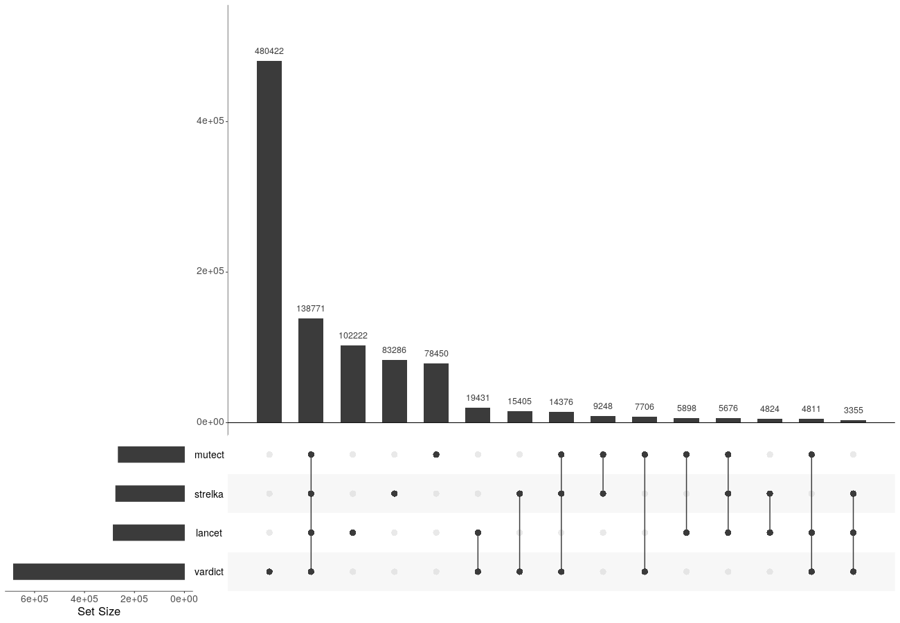
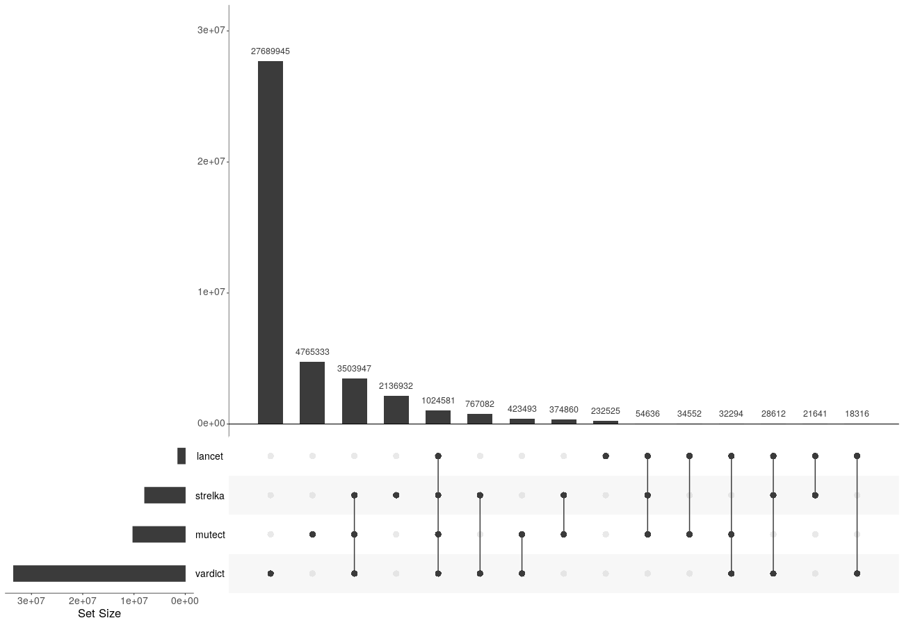

Purpose: After creating a consensus file with `02-merge_callers.R`, this notebook 
plots these data in a series of plots to compare the consensus calls to the individual 
callers. 

*Notable Findings:*  

- [VarDict calls more mutations](#upset-graph) than any of the other callers. 
Many of these have [very low ](#vaf-distributions) suggesting that some may be sequencing errors. 

- Mutect2, Strelka2, and Lancet do have [plenty of mutations in common](#upset-graph). 

<!-- START doctoc generated TOC please keep comment here to allow auto update -->
<!-- DON'T EDIT THIS SECTION, INSTEAD RE-RUN doctoc TO UPDATE -->
**Table of Contents**  *generated with [DocToc](https://github.com/thlorenz/doctoc)*

- [Setup](#setup)
- [Connect to database](#connect-to-database)
- [Get consensus numbers](#get-consensus-numbers)
- [Upset graphs](#upset-graphs)
- [VAF distribution for each caller](#vaf-distribution-for-each-caller)
- [VAF correlations](#vaf-correlations)
- [Base changes](#base-changes)
- [Mutation region barplot](#mutation-region-barplot)
- [Session Info](#session-info)

<!-- END doctoc generated TOC please keep comment here to allow auto update -->

### Usage

To run this from the command line, use:
```
Rscript -e "rmarkdown::render('analyses/snv-callers/compare_snv_callers_plots.Rmd', 
                              clean = TRUE)"
```

_This assumes you are in the top directory of the repository._

## Setup

Read in set up script.

```{r}
# Magrittr pipe
`%>%` <- dplyr::`%>%`
```

Set up directories. 

```{r}
scratch_dir <- file.path("..", "..", "scratch")
plots_dir <- file.path("plots", "pbta-caller-comparison")

if (!dir.exists(plots_dir)) {
  dir.create(plots_dir)
}
```

Import custom function for upset plot. 

```{r}
source(file.path("util", "upset_plot.R"))
```

## Connect to database

Connect to SQLite database.

```{r}
# Start up connection
con <- DBI::dbConnect(RSQLite::SQLite(), 
                      file.path(scratch_dir, "snv_db.sqlite"))
```

Note what columns we will join by.

```{r}
join_cols = c("Chromosome",
              "Start_Position",
              "Reference_Allele",
              "Allele",
              "Tumor_Sample_Barcode", 
              "Variant_Classification")
```

Set up tables from the database but only call the columns we need.

```{r}
strelka <- dplyr::tbl(con, "strelka") %>% 
  dplyr::select(join_cols, "VAF")

lancet <- dplyr::tbl(con, "lancet") %>% 
  dplyr::select(join_cols, "VAF")

mutect <- dplyr::tbl(con, "mutect") %>% 
  dplyr::select(join_cols, "VAF")

vardict <- dplyr::tbl(con, "vardict") %>% 
  dplyr::select(join_cols, "VAF")
```

Because `DBI` does not support full_join, we had to use a series of `left_join` and
`union_all` calls in order to get a full join of all the callers. 

```{r}
# This script will do the full join of the data for us
source(file.path("util", "full_join_callers.R"))

# Bring out the data.frame
all_caller_df <- all_caller %>% 
  as.data.frame() %>% 
  tibble::rowid_to_column("index")

# Take a peek at what this looks like
head(all_caller_df)
```

## Get consensus numbers

Make a data.frame with only the VAFs and turn into detected or not. 

```{r}
detect_mat <- all_caller_df %>% 
 # Bring over VAF columns and the index
 dplyr::select(dplyr::starts_with("VAF_")) %>% 
 as.matrix()

# Store the indices as dimnames
dimnames(detect_mat)[[1]] <- all_caller_df$index

# Turn into detected or not
detect_mat <- !is.na(detect_mat)
```

Count up how many callers call each mutation but ignore VarDict. 

```{r}
# Add up how many callers identify each mutation, but ignore VarDict
consensus_count <- rowSums(detect_mat[, colnames(detect_mat) != "VAF_vardict"])

# Remove the 0's
consensus_count <- consensus_count[which(consensus_count != 0)]
```

Print out the numbers for the three callers' consensus.

```{r}
cat(" At least 1 out of 3:", length(consensus_count), "\n",
    "At least 2 out of 3:", sum(consensus_count >= 2), "\n",
    "3 out of 3:", sum(consensus_count == 3))
```

## Upset graphs

Make the upset plot. 

```{r}
upset_png(detect_mat, 
          plot_file_path = file.path(plots_dir, "pbta-upset-plot.png"))
```


Transcripts only upset plot. 

```{r}
transcripts <- !(all_caller_df$Variant_Classification %in% c("5'Flank", "3'Flank", "IGR", "Intron"))

upset_png(detect_mat, 
          plot_file_path = file.path(plots_dir, "pbta-upset-plot-transcipts-only.png"), 
          subset_vector = transcripts)
```



Non transcript upset plot. 

```{r}
not_transcripts <- all_caller_df$Variant_Classification %in% c("5'Flank", "3'Flank", "IGR", "Intron") 

upset_png(detect_mat,
          plot_file_path = file.path(plots_dir, "pbta-upset-plot-not-transcipts-only.png"), 
          subset_vector = transcripts)
```



## VAF distribution for each caller

Create consensus VAF based on strelka's VAFs and which mutations would be included

```{r}
# Make new VAF column based on strelka's VAFs
all_caller_df$VAF_consensus <- all_caller_df$VAF_strelka

# Figure out which mutations are not in the consensus
not_consensus <- dimnames(consensus_count)[[1]][which(consensus_count < 3)]

# Make non consensus mutations in consensus)VAF an NA
all_caller_df$VAF_consensus[not_consensus] <- NA
```

Make a long form VAF data.frame for exploring mutations VAFs from each caller. 

```{r}
vaf_df <- all_caller_df %>% 
  dplyr::select(index, dplyr::starts_with("VAF_"), Variant_Classification) %>%
  # Make long format
  tidyr::gather(key = "caller", value = "vaf", -index, -Variant_Classification) %>% 
  # Drop the `VAF_`
  dplyr::mutate(caller = gsub("VAF_", "", caller)) %>% 
  dplyr::filter(!is.na(vaf))
```

```{r}
# Make this plot
vaf_plot <- vaf_df %>%
  ggplot2::ggplot(ggplot2::aes(x = caller, y = vaf, color = caller)) +
  ggplot2::geom_violin() +
  ggplot2::theme_classic() +
  ggplot2::xlab("") +
  ggplot2::ylab("VAF") + 
  ggplot2::theme(legend.position = "none")

# Print out
vaf_plot
```

```{r}
# Save this plot
ggplot2::ggsave(plot = vaf_plot, 
                file.path(plots_dir, "pbta-vaf_distribution_plot.png"))
```

## VAF correlations

Correlate VAF's across callers.

```{r}
cor_vaf <- all_caller_df %>% 
  dplyr::select(dplyr::starts_with("VAF_"), -VAF_consensus) %>% 
  GGally::ggpairs(mapping = ggplot2::aes(alpha = 0.05)) 

# Print out without progress bar
cor_vaf %>%
  print(progress = FALSE)
``` 

VAF's are pretty related across callers. 

```{r}
ggplot2::ggsave(filename = file.path(plots_dir, "pbta-vaf_cor_matrix.png"), 
                plot = cor_vaf)
```

## Base changes 

Summarize base change information per caller. 

```{r}
# Summarize by the number of times each base change shows up in each category.
frac_change_df <- all_caller_df %>% 
  # Select only the columns we need
  dplyr::select(index, Allele, Reference_Allele) %>% 
  # Make change variable
  dplyr::mutate(base_change = paste0(Allele, ">", Reference_Allele)) %>% 
  dplyr::mutate(
    # From the base_change variable, summarize insertions, deletions, and
    # changes that are more than one base into their own groups.
    change = dplyr::case_when(
      grepl("^-", base_change) ~ "ins",
      grepl("-$", base_change) ~ "del",
      nchar(base_change) > 3 ~ "long_change",
      TRUE ~ base_change
    )
  ) %>%
  # Join data by indices
  dplyr::inner_join(vaf_df, by = "index") %>%
  # Summarize the number of mutations per caller
  dplyr::count(caller, change, name = "count") %>%
  dplyr::add_count(caller, wt = count) %>%
  # Calculate the percent of each 
  dplyr::mutate(percent = count / n) %>%
  # Drop nonsensical changes
  dplyr::filter(!grepl("N>*|*>N|C>C|T>T|A>A|G>G", change), 
                !is.na(change)) %>%
  dplyr::mutate(
    change = as.factor(change),
    # Change factor level order so ins and del are at the end
    change = forcats::fct_relevel(change, "ins", "del", "long_change", after = Inf)
  ) 
```

Make a barplot illustrating the percent of the mutations for each caller that 
that are each type of change. 

```{r}
frac_change_df %>%
  ggplot2::ggplot(ggplot2::aes(x = change, y = percent)) +
  ggplot2::theme_classic() +
  ggplot2::geom_bar(
    position = "dodge", stat = "identity",
    ggplot2::aes(fill = caller)
  ) +
  ggplot2::theme(axis.text.x = ggplot2::element_text(angle = 45, hjust = 1)) +
  ggplot2::xlab("") +
  ggplot2::ylab("Percent of callers' mutations") +
  colorblindr::scale_fill_OkabeIto()
```

```{r}
# Save this plot
ggplot2::ggsave(file.path(plots_dir, "pbta-frac_base_change_plot.png"))
```

## Mutation region barplot

Summarize `Variant_Classification` information per caller. 

```{r}
# Summarize by the number of times each base change shows up in each category.
frac_var_df <- vaf_df %>% 
  # Summarize the number of mutations per caller
  dplyr::count(caller, Variant_Classification, name = "count") %>%
  dplyr::add_count(caller, wt = count) %>%
  # Calculate the percent of each 
  dplyr::mutate(percent = count / n)
```

Make a barplot illustrating the percent of the mutations for each caller that 
that are each type of change. 

```{r}
frac_var_df %>%
  ggplot2::ggplot(ggplot2::aes(x = caller, y = percent)) +
  ggplot2::theme_classic() +
  ggplot2::geom_bar(
    position = "stack", stat = "identity",
    ggplot2::aes(fill = Variant_Classification)
  ) +
  ggplot2::theme(axis.text.x = ggplot2::element_text(angle = 45, hjust = 1)) +
  ggplot2::xlab("") +
  ggplot2::ylab("Fraction of callers' mutations")
```

```{r}
# Save this plot
ggplot2::ggsave(file.path(plots_dir, "pbta-variant_classification_plot.png"))
```

## Session Info

```{r}
sessionInfo()
```
