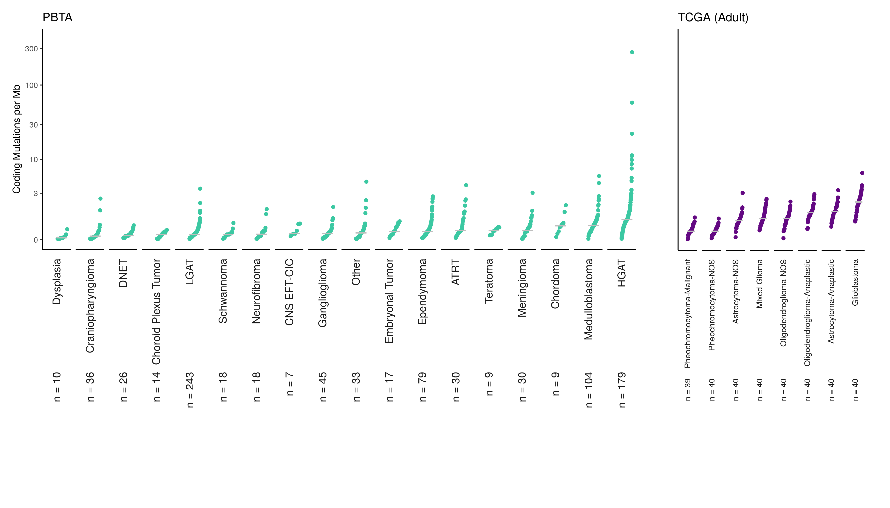

### Summary of Findings:

This was an exploration of how TMB is affected by using nonsynonymous filters. 
It addresses part 1 of [this OpenPBTA issue](https://github.com/AlexsLemonade/OpenPBTA-analysis/issues/729)
As far as the TMB comparisons go, it doesn't matter if we use `Variant_Classification` filters or not. 
They are highly correlated no matter what and the same general TCGA to PBTA differences seem to persist. 

### Usage

If both `run_caller_consensus_analysis-tcga.sh` and `run_caller_consensus_analysis-pbta.sh` have been run, you can run this command. 
This will prepare the files needed for this notebook and run this notebook:

```
# bash run_explorations.sh
```

<!-- START doctoc generated TOC please keep comment here to allow auto update -->
<!-- DON'T EDIT THIS SECTION, INSTEAD RE-RUN doctoc TO UPDATE -->
**Table of Contents**  *generated with [DocToc](https://github.com/thlorenz/doctoc)*

- [Read in the TMB files](#read-in-the-tmb-files)
  - [Read in PBTA data](#read-in-pbta-data)
  - [Read in TCGA data](#read-in-tcga-data)
- [Does the filter change a participant's TMB?](#does-the-filter-change-a-participants-tmb)
  - [Plot PBTA data](#plot-pbta-data)
  - [Plot TCGA data](#plot-tcga-data)
- [Are some histologies affected more than others?](#are-some-histologies-affected-more-than-others)
- [Does the filter affect the TCGA-PBTA comparison change?](#does-the-filter-affect-the-tcga-pbta-comparison-change)
- [Plot the ratio of the nonfilter/filter tmb](#plot-the-ratio-of-the-nonfilterfilter-tmb)
- [Plot the TMB plot with no filter data](#plot-the-tmb-plot-with-no-filter-data)
  - [No filter TMB Plot](#no-filter-tmb-plot)
  - [With filter TMB Plot](#with-filter-tmb-plot)
- [Session Info](#session-info)

<!-- END doctoc generated TOC please keep comment here to allow auto update -->

## Setup

```{r}
# Magrittr pipe
`%>%` <- dplyr::`%>%`
```

```{r}
source(file.path("..", "..", "tmb-compare", "util", "cdf-plot-function.R"))
```

```{r}
dir.create("plots", showWarnings = FALSE)
```

## Read in the TMB files

### Read in PBTA data

Import the tmb calculations that are not filtered by nonsynonymous classifications.

```{r}
tmb_pbta_no_filter <- data.table::fread(file.path(
  "..",
  "results",
  "no_filter",
  "pbta-snv-mutation-tmb-coding.tsv"
)) %>%
  dplyr::filter(experimental_strategy != "Panel") %>%
  dplyr::mutate(filter = "no filter")
```

Repeat same steps for original tmb calculations (with filter).

```{r}
tmb_pbta_with_filter <- data.table::fread(file.path(
  "..",
  "results",
  "consensus",
  "pbta-snv-mutation-tmb-coding.tsv"
)) %>%
  dplyr::filter(experimental_strategy != "Panel") %>%
  dplyr::mutate(filter = "filter")
```

Combine the unfilter and filtered data sets into one. 

```{r}
tmb_pbta <- dplyr::inner_join(tmb_pbta_no_filter,
  dplyr::select(tmb_pbta_with_filter, Tumor_Sample_Barcode, tmb),
  by = "Tumor_Sample_Barcode",
  suffix = c("_no_filter", "_filter")
)
```

### Read in TCGA data

Repeat the same steps for the TCGA data. 

```{r}
tmb_tcga_no_filter <- data.table::fread(file.path(
  "..",
  "results",
  "no_filter",
  "tcga-snv-mutation-tmb-coding.tsv"
)) %>%
  dplyr::mutate(filter = "no filter")
```

```{r}
tmb_tcga_with_filter <- data.table::fread(file.path(
  "..",
  "results",
  "consensus",
  "tcga-snv-mutation-tmb-coding.tsv"
)) %>%
  dplyr::mutate(filter = "filter")
```

Join these together. 

```{r}
tmb_tcga <- dplyr::inner_join(tmb_tcga_no_filter,
  dplyr::select(tmb_tcga_with_filter, Tumor_Sample_Barcode, tmb),
  by = "Tumor_Sample_Barcode",
  suffix = c("_no_filter", "_filter")
)
```

## Does the filter change a participant's TMB?

### Plot PBTA data

Correlate first with Pearson's. 

```{r}
cor.test(tmb_pbta$tmb_filter, tmb_pbta$tmb_no_filter)
```

```{r}
pbta_cor_plot <- ggplot2::ggplot(
  tmb_pbta,
  ggplot2::aes(x = tmb_no_filter, y = tmb_filter, color = short_histology)
) +
  ggplot2::geom_point() +
  ggplot2::theme_classic() +
  ggplot2::theme(legend.position = "none")

pbta_cor_plot
```

This data is very skewed, let's try a nonparametric correlation. 

```{r}
cor.test(tmb_pbta$tmb_filter, tmb_pbta$tmb_no_filter, method = "spearman")
```

Still pretty good. 

### Plot TCGA data

```{r}
cor.test(tmb_tcga$tmb_filter, tmb_tcga$tmb_no_filter)
```

```{r}
tcga_cor_plot <- ggplot2::ggplot(
  tmb_tcga,
  ggplot2::aes(x = tmb_no_filter, y = tmb_filter, color = short_histology)
) +
  ggplot2::geom_point() +
  ggplot2::xlim(0, 5) +
  ggplot2::ylim(0, 5) +
  ggplot2::theme_classic() +
  ggplot2::theme(legend.position = "none")

tcga_cor_plot
```

Correlate with nonparametric correlation since we did that for PBTA. 

```{r}
cor.test(tmb_tcga$tmb_filter, tmb_tcga$tmb_no_filter, method = "spearman")
```

## Are some histologies affected more than others? 

Let's make the same plots but by  `short_histology`. 

Plotting PBTA data, but setting the scales to "free" since the histologies have very different tmb ranges. 

```{r}
pbta_cor_plot + 
  ggplot2::facet_wrap(~short_histology, scales = "free")
```

Make the same plot for TCGA. 

```{r}
tcga_cor_plot + 
  ggplot2::facet_wrap(~short_histology)
```

## Does the filter affect the TCGA-PBTA comparison change?

Put PBTA and TCGA data into one long format data frame. 

```{r}
all_data <- dplyr::bind_rows(list(tcga = tmb_tcga, pbta = tmb_pbta), .id = "dataset") %>%
  dplyr::select(tmb_filter, tmb_no_filter, dataset, Tumor_Sample_Barcode, short_histology) %>%
  tidyr::gather("filter", "tmb", -Tumor_Sample_Barcode, -dataset, -short_histology)
```

Plot the data overall. 

```{r}
ggplot2::ggplot(all_data, ggplot2::aes(x = dataset, y = tmb)) +
  ggforce::geom_sina() +
  ggplot2::theme_classic() +
  ggplot2::ylim(0, 10) +
  ggplot2::theme(legend.position = "none") +
  ggplot2::facet_wrap(~"filter") 
```

## Plot the ratio of the nonfilter/filter tmb

We'll plot this by `short_histology`. 

```{r}
all_data %>% 
  tidyr::spread("filter","tmb") %>% 
  dplyr::mutate(ratio = tmb_filter/tmb_no_filter) %>% 
ggplot2::ggplot(ggplot2::aes(x = short_histology, y = ratio, color = short_histology)) + 
  ggplot2::geom_violin() + 
  ggplot2::theme_classic() + 
  ggplot2::theme(axis.text.x = ggplot2::element_text(angle = 45, hjust = 1), 
                 legend.position = "none") + 
  ggplot2::xlab("") + 
  ggplot2::ylab("tmb_filter/tmb_no_filter")
```


## Plot the TMB plot with no filter data

This code is directly copied from `tmb-compare-tcga/tmb-compare-tcga.Rmd`.

```{r}
pbta_plot <- cdf_plot(
  df = tmb_pbta_no_filter,
  plot_title = "PBTA",
  num_col = "tmb",
  group_col = "short_histology",
  color = "#3BC8A2",
  n_group = 5,
  x_lim = c(-1.2, 1.2),
  y_lim = c(0, 400),
  x_lab = "",
  y_lab = "Coding Mutations per Mb", 
  breaks = c(0, 3, 10, 30, 100, 300)
) +
  ggplot2::theme(
    strip.text.x = ggplot2::element_text(size = 12), 
    plot.margin = grid::unit(c(0.5, 0, 0.6, 0.5), "cm")
  )
```

```{r}
tcga_plot <- cdf_plot(
  df = tmb_tcga_no_filter,
  plot_title = "TCGA (Adult)",
  num_col = "tmb",
  group_col = "short_histology",
  color = "#630882",
  n_group = 5,
  x_lim = c(-1.2, 1.2),
  y_lim = c(0, 400),
  x_lab = "",
  y_lab = "Coding Mutations per Mb",
  breaks = c()
) +
  ggplot2::theme(
    axis.title.y = ggplot2::element_blank(),
    axis.text.y = ggplot2::element_blank(),
    axis.ticks.y = ggplot2::element_blank(),
    strip.text.x = ggplot2::element_text(size = 9), 
    plot.margin = grid::unit(c(0.5, 1, 0.1, 0), "cm")
  )
```

```{r}
# Put the plots together
tmb_plot <- cowplot::plot_grid(pbta_plot, tcga_plot,
  align = "v",
  axis = "left",
  rel_widths = c(2.5, 1),
  label_size = 12
)
```

```{r}
# Save the plot to a png
cowplot::save_plot(file.path("plots", "no_filter_tmb-cdf-pbta-tcga.png"),
  plot = tmb_plot, base_width = 35, base_height = 20, unit = "cm"
)
```

Print from png

### No filter TMB Plot


### With filter TMB Plot

## Session Info

```{r}
sessionInfo()
```
