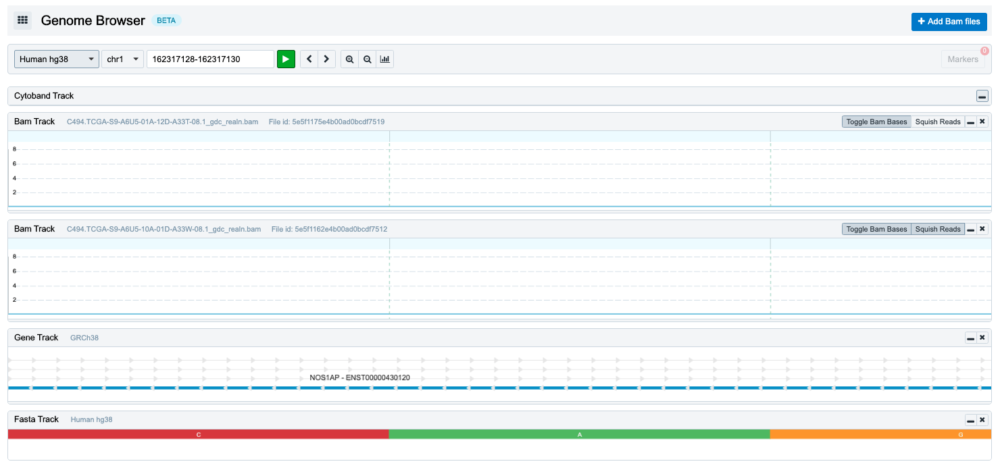
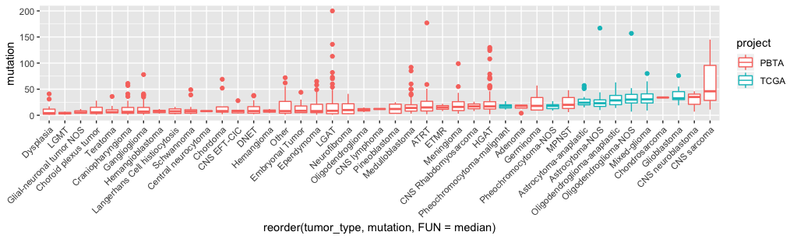

# TCGA brain tumor WXS capture kit investigation
This is an investigation of the TMB discrepancy between PBTA and TCGA data. 

## Background
To perform the analysis of [Tumor Mutation Burden Compare to TCGA](https://github.com/AlexsLemonade/OpenPBTA-analysis/tree/master/analyses/tmb-compare-tcga), 160 tumor/normal paired TCGA WXS had been found and processed data. The input BAM file manifest is on the `pbta-tcga-manifest.tsv` which is available in both V14 and V15 release. The MC3 WXS BED file `gencode.v19.basic.exome.bed` was used as the capture kit region for both mutation calling and TMB calculation. It turns out the adult-based TCGA has overall lower TMB compared to pediatric-based PBTA data while the Lancet somatic results shows an much more low VAF calls. To better figure out those issue, we started this investigation.

We started by looking only the "codon impact mutation" where we only selected the `Mutation|Splice|Silent` mutations.
- plot: https://github.com/AlexsLemonade/OpenPBTA-analysis/pull/548#issuecomment-590813383
- pseudocode: https://github.com/AlexsLemonade/OpenPBTA-analysis/pull/548#issuecomment-590873867

It does look like PBTA MAF has lower mutation counts than TCGA for "codon impact mutations". However the overall PBTA has more mutation counts than TCGA, that means, PBTA has a lot somatic mutations located in Intron and UTR regions than TCGA. We randomly picked one intron mutation from sample `BS_VVD8TJNE`, it is located at `chr1:162317128` which is the intron of gene NOS1AP, and covered by 57 reads for tumor and 21 reads for normal. Then we checked the TCGA BAM for the same loci, and found there're not reads covering there at all. Hence we decided to investigate more on the actual capture region for TCGA data.

Genome Browser screen shot around chr1:162317128 for two TCGA samples.

## TCGA WXS capture kit query and preparation
### 01. get-tcga-capture_kit-info
Since we got the TCGA data manifest from the [GDC portal](https://portal.gdc.cancer.gov/) by querying all the brain tumor data, and GDC actually has the capture kit name and its downloadable URL for each BAM files as part of the file metadata, so we created the python script to retrieve the actual BED files by hitting the [GDC file API endpoint](https://docs.gdc.cancer.gov/API/Users_Guide/Search_and_Retrieval/).

- script: `scripts/get-tcga-capture_kit-info.py`
- notebook: `01-get-tcga-capture_kit-info.ipynb`
- output: `results/tcga-capture_kit-info.csv`

### 02. prepare-tcga-capture_kit
By checking the `results/tcga-capture_kit-info.csv`, it turns out there are BAMs with `|` in the returned capture kit name and url which are those with more than one capture kit which neither the GDC nor its origin data center could retrieve/figure out what the actual capture kit had been applied. We should just generate intersec BED for those samples and used that for our analysis. We created scripts to download all uniq BED files and added prefix `chr` for [UCSC liftover](https://genome.ucsc.edu/cgi-bin/hgLiftOver) and saved the liftover'd BED under the using the same BED filename root with prefix of `hg38lft-`

- script: `scripts/prepare-tcga-capture_kit.sh`
- notebook: `02-prepare-tcga-capture_kit.ipynb`
- output: `results/hg38lft-*.bed`

## Check the intersection region for the existing TCGA and PBTA MAF
Ideally, we should re-run the TCGA data with the new `hg38lft-*.bed` and re-do the TMB comparison using each sample's actual calling region. But to double check the new BED files, we wanted to intersect all the regions and use the overlapping region to check all the mutations counts before re-run everything.
### 03. intersect-bed-maf
We created script to prepare the input dataframe for the boxplot script. This script intersects all the BED and then use that to intersect with released PBTA and TCGA MAF and then counted all the mutation number within that intersection region, and then mapped that counts to the project(TCGA/PBTA) and tumor type for each sample.
- script: `scripts/intersect-bed-maf.sh`
- notebook: `03-intersect-bed-maf.ipynb`
- output: `scratch/somatic-count_with-histologies.tsv`

### 04. mutation-counts-boxplot
- notebook: `04-mutation-counts-boxplot.ipynb`
- output: `plots/boxplot-*.png`

### (WIP) coverage-comparison
### (Planned) rerun-tcga-with-new-bed