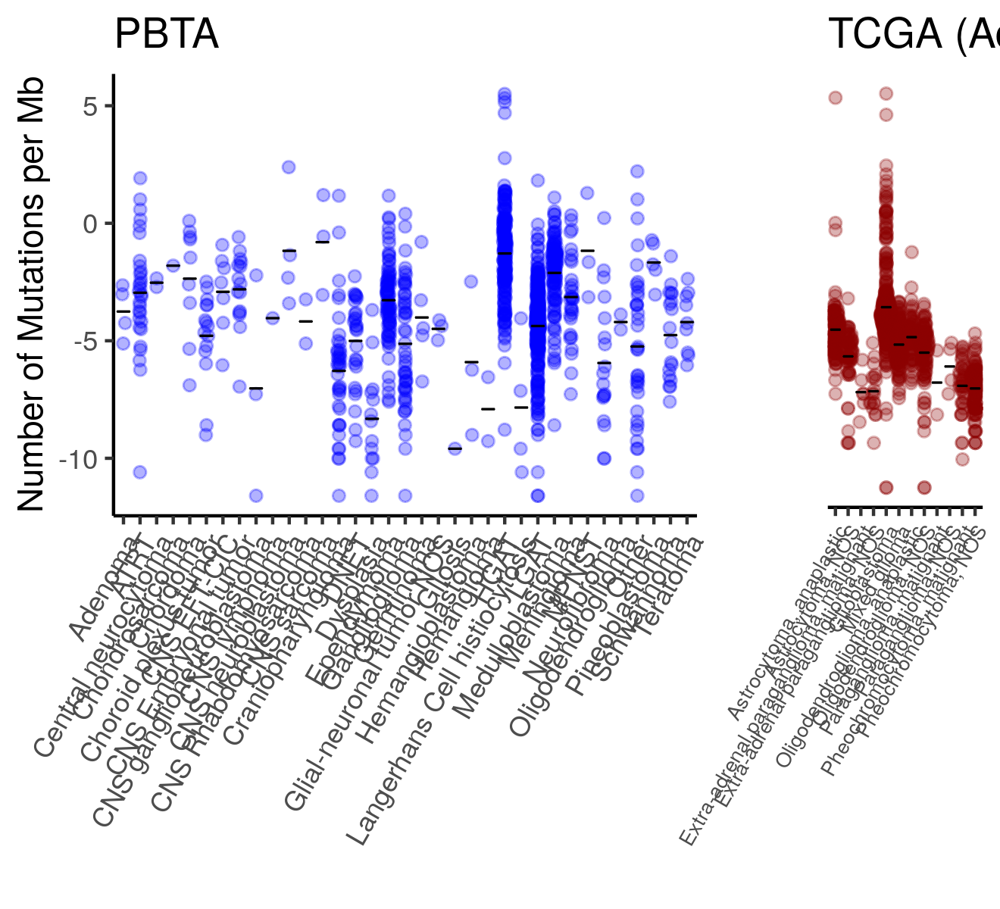

#### Purpose

Plot the consensus tumor mutation burden statistics for PBTA in comparison to TCGA brain-related data. 

#### Usage

To run this from the command line, use:
```
Rscript -e "rmarkdown::render('analyses/tmb-compare-tcga/compare-tmb.Rmd', 
                              clean = TRUE)"
```

_This assumes you are in the top directory of the repository._

## Setup

#### Packages and functions

```{r}
if (!("TCGAbiolinks" %in% installed.packages())) {
  install.packages("TCGAbiolinks")
}

# magrittr pipe
`%>%` <- dplyr::`%>%`

# Load in these functions so we can use `maf_to_granges`
source(file.path("..", "snv-callers", "util", "tmb_functions.R"))
```

Declare names of input and output directories.

```{r}
data_dir <- file.path("..", "..", "data")
scratch_dir <- file.path("..", "..", "scratch")
results_dir <- "results"
plots_dir <- "plots"
```

Create output directories for this analysis. 

```{r}
if (!dir.exists(results_dir)) {
  dir.create(results_dir)
}
if (!dir.exists(plots_dir)) {
  dir.create(plots_dir)
}
```

Custom function for plotting the TMB. 

```{r}
sina_plot <- function(data, colour = NULL, x_axis = "short_histology", title) {
  # Given a data.frame with metadata and `tmb` information, make a sina plot from it
  #
  # Args:
  #
  # data : a data.frame with `tmb` as columns
  # x_axis : A name of a column in data that you would like to make the x_axis from
  #           Given as a character string. 
  # colour: the color you would like the points to be
  # title: The title for the plot. To be passed to `ggtitle`
  #
  # Returns:
  #   A sina plot by histology group
  data %>%
    # eval parse bit will treat the variable as the text it has stored
    ggplot2::ggplot(ggplot2::aes(x = reorder(eval(parse(text = x_axis)), tmb, mean), 
                                 y = log10(tmb))) +
    ggforce::geom_sina(color = colour, alpha = 0.3, maxwidth = 0.9) +
    ggplot2::stat_summary(
      fun.y = mean, fun.ymin = mean, fun.ymax = mean,
      geom = "crossbar",
      width = 0.95, size = 0.15
    ) +
    ggplot2::theme_classic() +
    ggplot2::ylab("log10 (Number of Mutations per Mb)") +
    ggplot2::xlab("") +
    ggplot2::ylim(c(-3, 3)) +
    ggplot2::theme(
      axis.text.x = ggplot2::element_text(angle = 60, hjust = 1),
      legend.position = "none"
    ) +
    ggplot2::ggtitle(title) + 
    ggplot2::theme(
    panel.grid.major.x = ggplot2::element_line(colour = c("gray93", "white"), size = 9)
)
}
```

## Set up consensus SNV PBTA data

Download consensus SNV files. 

```{r}
# Declare file path for consensus file
consensus_file <- file.path(data_dir, 
                            "pbta-snv-consensus-mutation-tmb-coding.tsv")
```

Read in the consensus TMB file. 

```{r include=FALSE}
# Read in the file
tmb_pbta <- data.table::fread(consensus_file)
```

## Set up the TCGA data. 

We will only use the brain related TCGA projects, so we are setting up a file using the MC3 data but subset 
that to only the brain-related TCGA projects: LGG GBM, and PCPG. 
The MC3 data can be obtained [here](https://gdc.cancer.gov/about-data/publications/mc3-2017). 

```{r}
# Designate the name of the brain related TCGA file
mc3_brain_maf_file <- file.path(scratch_dir, "tcga_mc3_brain_related.RDS")

if (file.exists(mc3_brain_maf_file)) {
  # Read in the file if it already exists
  mc3_maf_brain <- readr::read_rds(mc3_brain_maf_file)
    
} else { # Only run this if it hasn't been set up yet
  # Designate the file path to the original MC3 file
  mc3_maf_file <- file.path(scratch_dir, "mc3.v0.2.8.PUBLIC.maf.gz")
  
  # Download the original MC3 maf file 
  if (!file.exists(mc3_maf_file)) {
    download.file("https://api.gdc.cancer.gov/data/1c8cfe5f-e52d-41ba-94da-f15ea1337efc", 
                  destfile = mc3_maf_file)
  }

  # Read in data and set up sample ID from the Tumor Sample Barcode info
  mc3_maf <- data.table::fread(mc3_maf_file) %>% 
    # The patient ID information is the first 12 character of the sample ID so we
    # can link this information to the clinical data if we make a new variable from it. 
    dplyr::mutate(sample_id = substr(Tumor_Sample_Barcode, 0, 12))

  # Get the TCGA metadata for these brain related projects.
  tcga_datasets <- c("LGG", "GBM", "PCPG")

  # Download the clinical info for these projects  
  clinical <- lapply(tcga_datasets, function(dataset) {
    TCGAbiolinks::GDCquery_clinic(project = paste0("TCGA-", dataset), type = "clinical") %>%
      dplyr::select(primary_diagnosis, bcr_patient_barcode)
  })
  
  # Bind the clinical data together
  clinical <- dplyr::bind_rows(clinical)
  
  # Do a inner join so we append the diagnosis info but only keep samples that are in the 
  # brain-related clinical information
  mc3_maf_brain <- mc3_maf %>% 
    dplyr::inner_join(clinical, by = c("sample_id" = "bcr_patient_barcode"))
  
  # Save this to RDS
  readr::write_rds(mc3_maf_brain, mc3_brain_maf_file)
}
```

Download the Target BED region file for these data. 
Although not shown, all mutations are within these ranges so no filtering was needed. 

```{r}
wgs_bed_file <- file.path(scratch_dir, "gencode.v19.basic.exome.bed")

if (!file.exists(wgs_bed_file)) {
  download.file("https://api.gdc.cancer.gov/data/7f0d3ab9-8bef-4e3b-928a-6090caae885b", 
              destfile = wgs_bed_file)
}

# Set up BED region files for TMB calculations
wgs_bed <- readr::read_tsv(wgs_bed_file, col_names = FALSE, col_types = list(readr::col_character(), 
                                                                             readr::col_double(), 
                                                                             readr::col_double()))

# Calculate size of genome surveyed
# The second and third column of the bed file have the Start and End coordinates of the genome window
wgs_genome_size <- sum(wgs_bed[, 3] - wgs_bed[, 2])
```

## Calculate TCGA tumor mutation burden

```{r}
# Calculate the TMB for TCGA samples
tmb_tcga <- mc3_maf_brain %>%
  dplyr::group_by(Tumor_Sample_Barcode, primary_diagnosis) %>%

  # Count number of mutations for that sample
  dplyr::summarize(mutation_count = dplyr::n()) %>%

  # Calculate TMB
  dplyr::mutate(tmb = mutation_count / (wgs_genome_size / 1000000))
```

Set up TCGA TMB data with its histology. 

```{r}
# Get the patient barcode from the Tumor Sample Barcode category
tmb_tcga <- tmb_tcga %>%
  # Rename so it matches PBTA data
  dplyr::rename(short_histology = primary_diagnosis) %>%

  # If there is no information for this, for TCGA, we will get rid of these rows
  dplyr::filter(!is.na(short_histology)) %>%
  readr::write_tsv(file.path(results_dir, "brain_related_tcga_tmb.tsv"))
```

## Plot the TMB as a sina plot

Plot the TCGA data. 

```{r}
# Make TCGA plot and get rid of y axis
tcga_plot <- sina_plot(tmb_tcga, colour = "#3BC8A2", title = "TCGA (Adult)") +
  ggplot2::theme(
    axis.title.y = ggplot2::element_blank(),
    axis.text.y = ggplot2::element_blank(),
    axis.ticks.y = ggplot2::element_blank(),
    axis.text.x = ggplot2::element_text(size = 7),
    panel.grid.major.x = ggplot2::element_line(colour = c("gray93", "white"), size = 9)
  )
```

Plot the PBTA data. 

```{r}
# Make the plot for PBTA
pbta_plot <- sina_plot(tmb_pbta, colour = "#630882", title = "PBTA")
```

Use cowplot to put them together. 

```{r}
# Put the plots together
tmb_plot <- cowplot::plot_grid(pbta_plot, tcga_plot,
  align = "v",
  axis = "left",
  rel_widths = c(2.5, 1),
  label_size = 12
)
```

Save this final plot to a png file.

```{r}
# Save the plot to a png
cowplot::save_plot(file.path(plots_dir, "tmb_tcga_and_pbta_plot.png"), 
                   plot = tmb_plot, base_width = 35, base_height = 20, unit = "cm")
```

Print from png so rendering is smoother


## Session Info

```{r}
sessionInfo()
```
