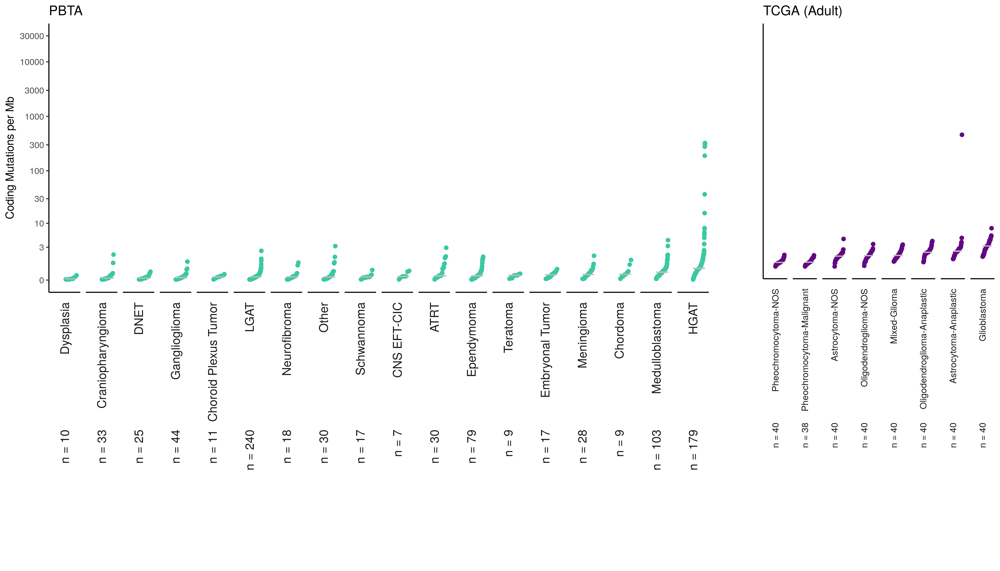

#### Purpose

Plot the consensus tumor mutation burden statistics for PBTA in comparison to TCGA brain-related data. 

#### Usage

To run this from the command line, use:
```
Rscript -e "rmarkdown::render('analyses/tmb-compare-tcga/compare-tmb.Rmd', 
                              clean = TRUE)"
```

_This assumes you are in the top directory of the repository._

## Setup

#### Packages and functions

```{r}
# magrittr pipe
`%>%` <- dplyr::`%>%`
```

Declare names of input and output directories.

```{r}
data_dir <- file.path("..", "..", "data")
scratch_dir <- file.path("..", "..", "scratch")
results_dir <- "results"
plots_dir <- "plots"
```

Create output directories for this analysis. 

```{r}
if (!dir.exists(results_dir)) {
  dir.create(results_dir)
}
if (!dir.exists(plots_dir)) {
  dir.create(plots_dir)
}
```

Custom function for plotting the TMB. 

```{r}
source(file.path("util", "cdf-plot-function.R"))
```

## Set up consensus data

Read in the consensus TMB file. 

```{r}
# TODO: update if the this tmb consensus file gets updated in a future data release
tmb_pbta <- data.table::fread(file.path(
  "..",
  "snv-callers",
  "results",
  "consensus",
  "pbta-snv-mutation-tmb-coding.tsv"
)) %>%
  # This variable is weird when binding but we don't need it for the plot so we'll just remove it.
  dplyr::select(-region_size) %>%
  dplyr::filter(experimental_strategy != "Panel")
```


```{r}
# TODO: update if this tmb consensus file gets updated in a future data release
tmb_tcga <- data.table::fread(file.path(
  "..",
  "snv-callers",
  "results",
  "consensus",
  "tcga-snv-mutation-tmb-coding.tsv"
)) %>%
  dplyr::select(-region_size)
```

## Plot the TMB as a CDF plot

Plot each dataset as its own CDF plot. 

```{r}
pbta_plot <- cdf_plot(
  df = tmb_pbta,
  plot_title = "PBTA",
  num_col = "tmb",
  group_col = "short_histology",
  color = "#3BC8A2",
  n_group = 5,
  x_lim = c(-1.2, 1.2),
  y_lim = c(0, 400),
  x_lab = "",
  y_lab = "Coding Mutations per Mb", 
  breaks = c(0, 3, 10, 30, 100, 300)
) +
  ggplot2::theme(
    strip.text.x = ggplot2::element_text(size = 12), 
    plot.margin = grid::unit(c(0.5, 0, 0.6, 0.5), "cm")
  )
```

```{r}
tcga_plot <- cdf_plot(
  df = tmb_tcga,
  plot_title = "TCGA (Adult)",
  num_col = "tmb",
  group_col = "short_histology",
  color = "#630882",
  n_group = 5,
  x_lim = c(-1.2, 1.2),
  y_lim = c(0, 400),
  x_lab = "",
  y_lab = "Coding Mutations per Mb",
  breaks = c()
) +
  ggplot2::theme(
    axis.title.y = ggplot2::element_blank(),
    axis.text.y = ggplot2::element_blank(),
    axis.ticks.y = ggplot2::element_blank(),
    strip.text.x = ggplot2::element_text(size = 9), 
    plot.margin = grid::unit(c(0.5, 1, 0.1, 0), "cm")
  )
```

Combine both TMB data.frames into one plot

```{r}
# Put the plots together
tmb_plot <- cowplot::plot_grid(pbta_plot, tcga_plot,
  align = "v",
  axis = "left",
  rel_widths = c(2.5, 1),
  label_size = 12
)
```

Save this final plot to a png file.

```{r}
# Save the plot to a png
cowplot::save_plot(file.path(plots_dir, "tmb-cdf-pbta-tcga.png"),
  plot = tmb_plot, base_width = 35, base_height = 20, unit = "cm"
)
```

Print from png so rendering is smoother


## Session Info

```{r}
sessionInfo()
```
