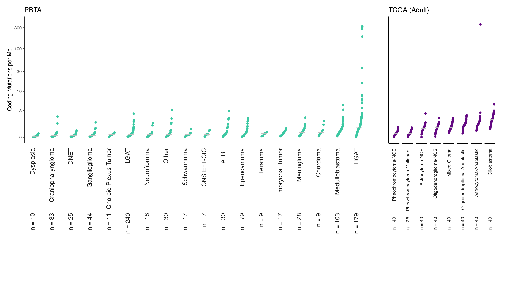

# Tumor Mutation Burden Compare to TCGA

⚠️ **This module is deprecated.**

This analysis compares the Pediatric Brain Tumor samples of this dataset to the adult brain tumor samples from [The Cancer Genome Atlas](https://www.cancer.gov/about-nci/organization/ccg/research/structural-genomics/tcga).

<!-- START doctoc generated TOC please keep comment here to allow auto update -->
<!-- DON'T EDIT THIS SECTION, INSTEAD RE-RUN doctoc TO UPDATE -->
**Table of Contents**  *generated with [DocToc](https://github.com/thlorenz/doctoc)*

- [Usage](#usage)
- [Results](#results)
- [Summary of Methods](#summary-of-methods)
  - [PBTA Tumor Mutation Burden](#pbta-tumor-mutation-burden)
  - [TCGA Tumor Mutation Burden](#tcga-tumor-mutation-burden)

<!-- END doctoc generated TOC please keep comment here to allow auto update -->

## Usage

To run this from the command line, first, the [`snv-callers`](https://github.com/AlexsLemonade/OpenPBTA-analysis/tree/master/analyses/snv-callers#usage) scripts must be run with a machine that has at least 256 GB of RAM.

```
bash analyses/snv-callers/run_caller_consensus_analysis-pbta.sh

bash analyses/snv-callers/run_caller_consensus_analysis-tcga.sh
```

The results from those scripts are saved to `snv-callers/results/consensus/` folder and used here.
Some versions of these files are incorporated into the data release and saved to `data` folder so this module could be altered to use the file versions in the `data` folder.  
Then you can run this module's analysis by the following command to create the plot:
```
Rscript -e "rmarkdown::render('analyses/tmb-compare/compare-tmb.Rmd',
                              clean = TRUE)"
```
These steps are also run soup to nuts in the [figures](https://github.com/AlexsLemonade/OpenPBTA-analysis/tree/master/figures) script: [`figures/scripts/fig2-mutational-landscape.R`](https://github.com/AlexsLemonade/OpenPBTA-analysis/blob/master/figures/scripts/fig2-mutational-landscape.R).

## Results

The results of this analysis are the TMB calculations for PBTA and TCGA datasets plotted side by side:



Additionally, the resulting TCGA TMB calculations used are saved to `results/brain_related_tcga_tmb.tsv` in this folder.

## Summary of Methods

Overall, tumor mutation burden for both brain tumor datasets are calculated using mutations from exonic regions of the genome only.  

### PBTA Tumor Mutation Burden

The TMB calculations for the pediatric brain tumor set were carried out in [snv-callers analysis](https://github.com/AlexsLemonade/OpenPBTA-analysis/tree/master/analyses/snv-callers) in this repository.
In brief, tumor mutation burden is calculated using all SNV calls found by both
[Mutect2](https://software.broadinstitute.org/cancer/cga/mutect) and [Strelka2](https://github.com/Illumina/strelka) found in coding sequences.
The total number coding sequence consensus SNVs were used for the numerator and the effective size of the genome surveyed is used as the denominator.

```
TMB = (total # coding sequence consensus snvs) / (size of effectively surveyed genome)
```

For more details, see [snv-callers README](https://github.com/AlexsLemonade/OpenPBTA-analysis/tree/master/analyses/snv-callers).

### TCGA Tumor Mutation Burden

For calculating TCGA tumor mutation burden, TCGA brain-related tumor projects only were used:

- [LGG (Lower-grade Glioma)](https://www.nejm.org/doi/full/10.1056/NEJMoa1402121)
- [GBM (Glioblastoma Multiforme)](https://www.ncbi.nlm.nih.gov/pmc/articles/PMC3910500/)

The size of the [exome BED regions file included with the MC3 project](https://api.gdc.cancer.gov/data/7f0d3ab9-8bef-4e3b-928a-6090caae885b) overlapped with the same coding sequences used for PBTA data.
